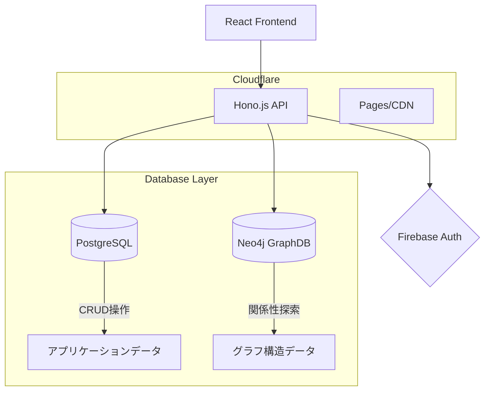
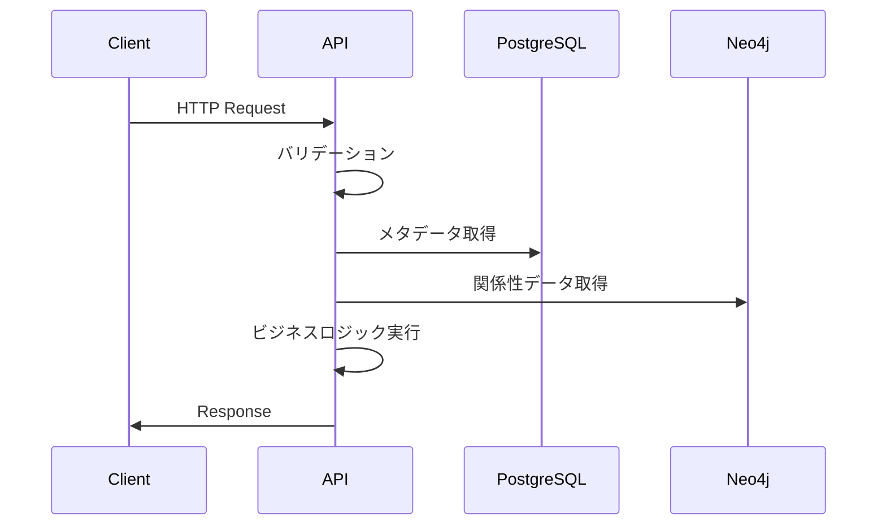

# システムアーキテクチャ

Odyssage のシステム全体設計・技術選定・アーキテクチャパターンについて

## 📋 概要

本ディレクトリは、Odyssage システムの設計思想と技術的な実装指針を提供します。

### 設計原則
1. **ドメイン駆動設計（DDD）**: ビジネスロジックを中心とした設計
2. **ハイブリッドDB**: 用途に応じたデータストア使い分け
3. **API駆動**: OpenAPI仕様書によるコントラクト定義
4. **スケーラビリティ**: Cloudflare Workers + Edge Computing

## 🏗️ システム構成

### 全体アーキテクチャ


### 技術スタック詳細
- [[overview]] - システム全体像・技術選定理由
- [[database-design]] - ハイブリッドDB設計思想
- [[api-design]] - REST API + OpenAPI仕様

## 📚 主要ドキュメント

### [[database-design]] - データベース設計
**PostgreSQL + Neo4j ハイブリッド構成**の設計思想と使い分け戦略

#### 設計ポイント
- **PostgreSQL**: 確実性・整合性が重要なデータ（ユーザー、認証、課金）
- **Neo4j**: 複雑な関係性・探索が重要なデータ（物語構造、キャラクター関係）
- **同期戦略**: リアルタイム同期とイベント駆動アーキテクチャ

### [[environment-variables]] - 環境変数仕様
アプリケーション設定・機密情報管理・環境別設定戦略

#### 設計ポイント
- **命名規約**: UPPERCASE_SNAKE_CASE統一・カテゴリ別接頭辞
- **セキュリティ**: 機密情報のCloudflare Secrets管理
- **環境分離**: 開発・ステージング・本番の設定分離

### [[api-design]] - API設計指針
**OpenAPI First** アプローチによるAPI設計・実装戦略

#### 設計ポイント
- **仕様書駆動**: 実装前のOpenAPI定義必須
- **RESTful**: HTTP メソッド・ステータスコードの適切な活用
- **バリデーション**: Valibotによるリクエスト・レスポンス検証

### [[overview]] - システム概要
技術選定・アーキテクチャパターン・将来展望の包括的説明

#### カバー範囲
- **フロントエンド**: React + TypeScript + Feature-Sliced Design
- **バックエンド**: Hono.js + Cloudflare Workers + Edge Computing
- **インフラ**: Cloudflare Pages + Firebase + マネージドDB

## 🔧 実装パターン

### ドメイン駆動設計（DDD）
```
Domain Layer (ビジネスロジック)
    ↓
Application Layer (ユースケース)
    ↓  
Infrastructure Layer (技術的実装)
```

### CQRS (Command Query Responsibility Segregation)
- **Command**: データ変更操作（PostgreSQL中心）
- **Query**: データ参照操作（用途に応じてDB使い分け）

### Event Sourcing（部分適用）
- **重要な状態変化**: イベントストリームとして記録
- **監査ログ**: 操作履歴の完全な追跡可能性

## 🚀 パフォーマンス戦略

### キャッシュ階層
```
CDN (Cloudflare) → API Cache → Database
```

### 最適化手法
- **Edge Computing**: ユーザーに近い場所での処理実行
- **データベース分散**: 読み取り・書き込みの負荷分散
- **非同期処理**: 重い処理のバックグラウンド実行

## 🔄 データフロー

### 典型的なリクエスト処理


### データ同期戦略
- **Write-Through**: 書き込み時の即座同期
- **Eventual Consistency**: 結果整合性による非同期同期
- **Conflict Resolution**: 競合時の解決戦略

## 📊 監視・可観測性

### メトリクス収集
- **API応答時間**: エンドポイント別パフォーマンス監視
- **データベース負荷**: クエリ実行時間・スループット
- **エラー率**: HTTP ステータス・例外発生頻度

### ログ戦略
- **構造化ログ**: JSON形式での統一ログ出力
- **分散トレーシング**: リクエスト跨ぎの処理追跡
- **アラート**: 閾値超過時の自動通知

## 🔐 セキュリティ

### 認証・認可
- **Firebase Authentication**: ユーザー認証基盤
- **JWT**: API アクセストークン
- **RBAC**: ロールベースアクセス制御

### データ保護
- **暗号化**: 保存時・転送時の暗号化
- **入力検証**: 全てのユーザー入力の厳格なバリデーション
- **SQL Injection対策**: パラメータ化クエリの徹底

## 🏗️ 将来の拡張

### スケールアウト戦略
- **マイクロサービス**: ドメイン境界でのサービス分割
- **イベント駆動**: 非同期メッセージングによる疎結合
- **CQRS拡張**: 読み書き完全分離・専用最適化

### 技術進化対応
- **GraphQL検討**: より柔軟なAPI提供
- **WebAssembly**: 高性能計算処理のクライアント実行
- **AI統合**: 物語生成・推薦システムの導入

---

## 📖 関連リソース

### 設計書
- [[database-design]] - ハイブリッドDB詳細設計
- [[environment-variables]] - 環境変数・設定管理仕様
- [[api-design]] - REST API仕様・設計原則
- [[overview]] - システム全体像・技術選定

### 実装ガイド
- [[../03-development/process]] - 開発プロセス・TDD実践
- [[../03-development/sprints/README]] - アジャイル開発運用

### 運用・デプロイ
- [[../04-deployment/local-environment]] - 開発環境構築
- [[../04-deployment/production]] - 本番環境運用

#architecture #design #system #technical