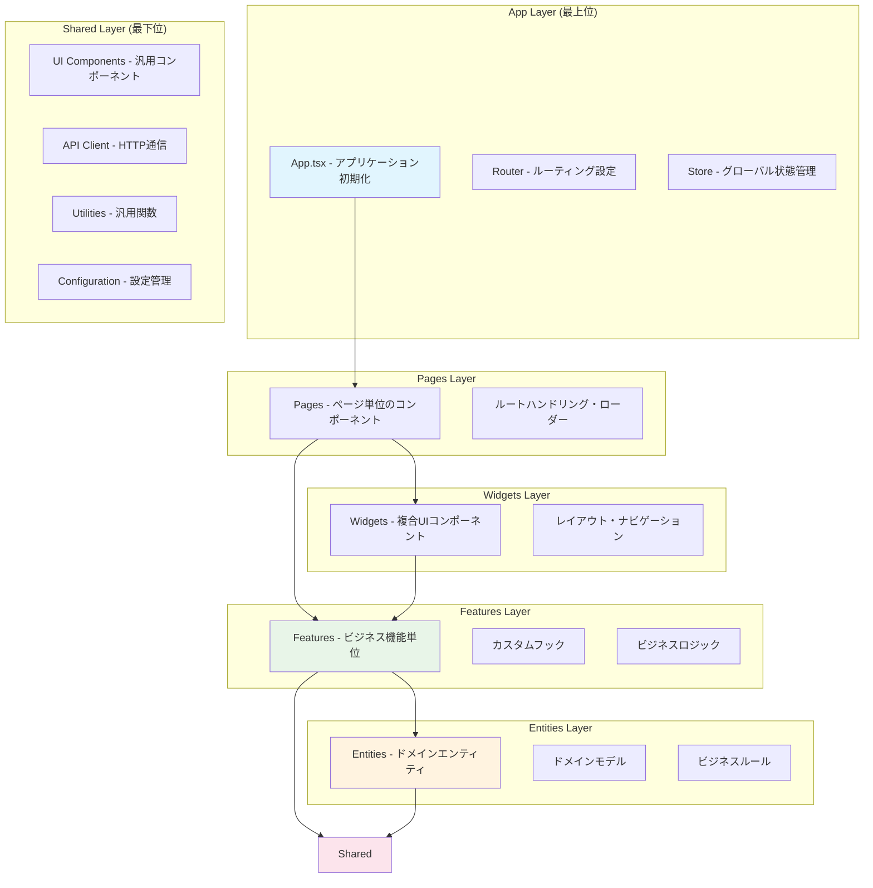
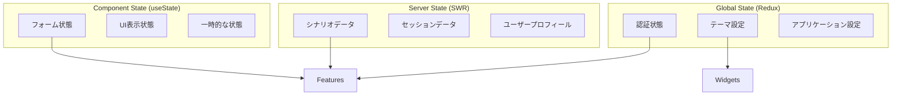

# フロントエンドアーキテクチャ設計

## 🎯 設計理念

### 核となる価値
- **複雑性の管理**: TRPGドメインの複雑なビジネスロジックを適切に構造化
- **開発生産性**: チーム開発でのコード理解・保守の容易性
- **ユーザー体験**: 応答性の高いインタラクティブUI
- **長期保守性**: 変更に強く、拡張しやすいアーキテクチャ

### アーキテクチャ原則
1. **レイヤー間依存の単方向性**: 下位層から上位層への依存のみ許可
2. **責務の明確分離**: 各層で扱う関心事の明確化
3. **再利用性の向上**: 共通コンポーネント・ロジックの適切な抽象化
4. **テスタビリティ**: 各層でのテストしやすい構造

## 🏗️ アーキテクチャ概要

### Clean Architecture + Feature-Sliced Design



## 📁 ディレクトリ構造

### 理想的なディレクトリ構成
```
src/
├── app/                    # アプリケーション層
│   ├── App.tsx            # アプリケーション初期化
│   ├── router/            # ルーティング設定
│   └── store/             # グローバル状態管理
│
├── pages/                 # ページ層
│   ├── scenario/          # シナリオ関連ページ
│   │   ├── create/        # シナリオ作成ページ
│   │   ├── list/          # シナリオ一覧ページ
│   │   └── detail/        # シナリオ詳細ページ
│   ├── session/           # セッション関連ページ
│   └── auth/              # 認証関連ページ
│
├── widgets/               # ウィジェット層
│   ├── navigation/        # ナビゲーション
│   ├── layout/           # レイアウト
│   └── header/           # ヘッダー
│
├── features/             # フィーチャー層
│   ├── scenario/         # シナリオ機能
│   │   ├── create/       # シナリオ作成機能
│   │   │   ├── api/      # API通信
│   │   │   ├── model/    # ビジネスロジック
│   │   │   ├── ui/       # UIコンポーネント
│   │   │   └── index.ts  # 公開インターフェース
│   │   ├── edit/         # シナリオ編集機能
│   │   └── list/         # シナリオ一覧機能
│   ├── session/          # セッション機能
│   └── auth/             # 認証機能
│
├── entities/             # エンティティ層
│   ├── scenario/         # シナリオドメイン
│   │   ├── model.ts      # ドメインモデル
│   │   ├── validation.ts # バリデーションルール
│   │   └── types.ts      # 型定義
│   ├── session/          # セッションドメイン
│   └── user/             # ユーザードメイン
│
└── shared/               # 共有層
    ├── ui/               # 汎用UIコンポーネント
    │   ├── Button/       # ボタンコンポーネント
    │   ├── Input/        # 入力コンポーネント
    │   └── Modal/        # モーダルコンポーネント
    ├── api/              # API関連
    │   ├── client.ts     # HTTPクライアント
    │   └── types.ts      # API型定義
    ├── lib/              # ライブラリ・ユーティリティ
    │   ├── auth/         # 認証関連
    │   ├── storage/      # ストレージ操作
    │   └── validation/   # 汎用バリデーション
    └── config/           # 設定管理
        └── constants.ts  # 定数定義
```

## 🔧 各層の責務と設計原則

### App Layer（アプリケーション層）
**責務**: アプリケーション全体の初期化・設定

```typescript
// app/App.tsx - アプリケーション初期化
export function App() {
  return (
    <Provider store={store}>
      <ErrorBoundary>
        <Router />
      </ErrorBoundary>
    </Provider>
  );
}

// app/router/index.ts - ルート設定
export const router = createBrowserRouter([
  {
    path: "/scenario",
    children: [
      { path: "create", Component: ScenarioCreatePage },
      { path: ":id", Component: ScenarioDetailPage }
    ]
  }
]);
```

**設計原則**:
- アプリケーション全体の設定のみを担当
- ビジネスロジックは含まない
- プロバイダーの設定・エラーハンドリングに集中

### Pages Layer（ページ層）
**責務**: ルート単位でのページ構成・データローディング

```typescript
// pages/scenario/create/index.tsx
export function ScenarioCreatePage() {
  return (
    <PageLayout title="シナリオ作成">
      <ScenarioCreateWidget />
    </PageLayout>
  );
}

// pages/scenario/detail/loader.ts
export async function scenarioDetailLoader({ params }: LoaderArgs) {
  const scenario = await fetchScenario(params.id);
  return { scenario };
}
```

**設計原則**:
- ルーティングとページレベルの状態管理
- Widgets・Featuresの組み合わせによる画面構築
- ローダーによるデータ取得の抽象化

### Widgets Layer（ウィジェット層）
**責務**: 複数のFeatureを組み合わせた複合UIコンポーネント

```typescript
// widgets/scenario-editor/ui/ScenarioEditor.tsx
export function ScenarioEditor() {
  return (
    <div className="scenario-editor">
      <ScenarioBasicInfo />      {/* features/scenario/basic-info */}
      <SceneManagement />        {/* features/scenario/scene */}
      <ScenarioActions />        {/* features/scenario/actions */}
    </div>
  );
}
```

**設計原則**:
- 複数機能の統合・レイアウト責任
- 独自のビジネスロジックは持たない
- Features層のコンポーネントを組み合わせ

### Features Layer（フィーチャー層）
**責務**: ビジネス機能単位での実装

```typescript
// features/scenario/create/model/useCreateScenario.ts
export function useCreateScenario() {
  const repository = useScenarioRepository();
  
  return {
    createScenario: async (input: ScenarioInput) => {
      // 1. ドメインエンティティの作成
      const scenario = ScenarioEntity.create(input);
      
      // 2. バリデーション
      const validation = scenario.validate();
      if (!validation.isValid) return validation;
      
      // 3. リポジトリ経由での永続化
      return await repository.save(scenario);
    }
  };
}

// features/scenario/create/ui/CreateScenarioForm.tsx
export function CreateScenarioForm() {
  const { createScenario, loading } = useCreateScenario();
  
  const handleSubmit = (data: FormData) => {
    createScenario({
      title: data.get('title'),
      overview: data.get('overview')
    });
  };
  
  return (
    <form onSubmit={handleSubmit}>
      <Input name="title" label="タイトル" />
      <TextArea name="overview" label="概要" />
      <Button loading={loading}>作成</Button>
    </form>
  );
}
```

**設計原則**:
- 単一機能に特化した責任範囲
- ドメインエンティティとの協調
- APIアクセスの抽象化（Repository パターン）

### Entities Layer（エンティティ層）
**責務**: ビジネスドメインのモデル・ルール

```typescript
// entities/scenario/model.ts
export class ScenarioEntity {
  constructor(
    private readonly id: UUID,
    private readonly title: string,
    private readonly overview: string,
    private readonly authorId: UUID,
    private readonly visibility: 'private' | 'public'
  ) {}
  
  static create(input: ScenarioInput): ScenarioEntity {
    return new ScenarioEntity(
      generateUUID(),
      input.title,
      input.overview,
      input.authorId,
      input.visibility ?? 'private'
    );
  }
  
  validate(): ValidationResult {
    const errors: string[] = [];
    
    if (!this.title || this.title.length < 1) {
      errors.push('タイトルは必須です');
    }
    
    if (this.title.length > 100) {
      errors.push('タイトルは100文字以内で入力してください');
    }
    
    return {
      isValid: errors.length === 0,
      errors
    };
  }
  
  canBeEditedBy(userId: UUID): boolean {
    return this.authorId === userId;
  }
  
  publish(): ScenarioEntity {
    return new ScenarioEntity(
      this.id,
      this.title,
      this.overview,
      this.authorId,
      'public'
    );
  }
}
```

**設計原則**:
- ビジネスルールの明示的実装
- 不変オブジェクトとしての設計
- ドメイン知識の中央集約

### Shared Layer（共有層）
**責務**: 汎用的なコンポーネント・ユーティリティ

```typescript
// shared/ui/Button/Button.tsx
export interface ButtonProps {
  variant?: 'primary' | 'secondary' | 'danger';
  size?: 'sm' | 'md' | 'lg';
  loading?: boolean;
  disabled?: boolean;
  children: React.ReactNode;
  onClick?: () => void;
}

export function Button({ variant = 'primary', size = 'md', loading, ...props }: ButtonProps) {
  return (
    <button 
      className={cn(
        'btn',
        `btn-${variant}`,
        `btn-${size}`,
        { 'btn-loading': loading }
      )}
      disabled={loading || props.disabled}
      {...props}
    />
  );
}

// shared/api/client.ts
export class ApiClient {
  constructor(private baseURL: string) {}
  
  async get<T>(path: string): Promise<T> {
    const response = await fetch(`${this.baseURL}${path}`, {
      headers: this.getHeaders()
    });
    return response.json();
  }
  
  private getHeaders() {
    return {
      'Content-Type': 'application/json',
      'Authorization': `Bearer ${getToken()}`
    };
  }
}
```

**設計原則**:
- ドメインに依存しない汎用性
- 他の層から安全に利用できる設計
- 十分なテストカバレッジ

## 🔄 状態管理戦略

### 責任範囲の明確化


### 状態管理ガイドライン

```typescript
// ✅ グローバル状態: アプリケーション全体で必要な状態
const authSlice = createSlice({
  name: 'auth',
  initialState: { user: null, isAuthenticated: false },
  reducers: {
    login: (state, action) => {
      state.user = action.payload;
      state.isAuthenticated = true;
    }
  }
});

// ✅ サーバー状態: キャッシュ・同期が必要なデータ
function useScenarios() {
  return useSWR('/api/scenarios', fetcher);
}

// ✅ コンポーネント状態: 局所的なUI状態
function CreateScenarioForm() {
  const [title, setTitle] = useState('');
  const [isSubmitting, setIsSubmitting] = useState(false);
  
  // ...
}
```

## 🧪 テスト戦略

### テストレベル別責務
```typescript
// Unit Tests - ドメインロジック・ユーティリティ
describe('ScenarioEntity', () => {
  it('should validate title correctly', () => {
    const scenario = ScenarioEntity.create({
      title: '',
      overview: 'test',
      authorId: 'user-1'
    });
    
    const result = scenario.validate();
    expect(result.isValid).toBe(false);
    expect(result.errors).toContain('タイトルは必須です');
  });
});

// Component Tests - UIコンポーネント
describe('CreateScenarioForm', () => {
  it('should submit form with correct data', async () => {
    const mockCreate = vi.fn();
    render(<CreateScenarioForm onSubmit={mockCreate} />);
    
    await user.type(screen.getByRole('textbox', { name: 'タイトル' }), 'テストシナリオ');
    await user.click(screen.getByRole('button', { name: '作成' }));
    
    expect(mockCreate).toHaveBeenCalledWith({
      title: 'テストシナリオ',
      overview: ''
    });
  });
});

// Integration Tests - フィーチャー単位
describe('Scenario Creation Flow', () => {
  it('should create scenario successfully', async () => {
    const { result } = renderHook(() => useCreateScenario());
    
    await act(async () => {
      const response = await result.current.createScenario({
        title: 'テストシナリオ',
        overview: 'テスト概要'
      });
      
      expect(response.success).toBe(true);
    });
  });
});
```

## 📚 コード規約・ベストプラクティス

### インポートルール
```typescript
// ✅ 推奨: エイリアスパスの使用
import { Button } from '~/shared/ui';
import { useCreateScenario } from '~/features/scenario/create';
import { ScenarioEntity } from '~/entities/scenario';

// ❌ 非推奨: 相対パスの多階層
import { Button } from '../../../shared/ui/Button';
```

### ファイル命名規則
```
features/scenario/create/
├── api/
│   └── scenarioRepository.ts      # Repository実装
├── model/
│   └── useCreateScenario.ts       # ビジネスロジック
├── ui/
│   └── CreateScenarioForm.tsx     # UIコンポーネント
└── index.ts                       # 公開インターフェース
```

### コンポーネント設計パターン
```typescript
// Container/Presentation分離
// Container: ロジック担当
export function CreateScenarioContainer() {
  const { createScenario, loading } = useCreateScenario();
  
  const handleSubmit = (data: ScenarioInput) => {
    createScenario(data);
  };
  
  return (
    <CreateScenarioForm 
      onSubmit={handleSubmit}
      loading={loading}
    />
  );
}

// Presentation: 表示担当
interface CreateScenarioFormProps {
  onSubmit: (data: ScenarioInput) => void;
  loading: boolean;
}

export function CreateScenarioForm({ onSubmit, loading }: CreateScenarioFormProps) {
  // UI実装のみ
}
```

## 🚀 パフォーマンス最適化

### コード分割戦略
```typescript
// ルートレベルでの動的インポート
const ScenarioCreatePage = lazy(() => import('~/pages/scenario/create'));
const SessionManagePage = lazy(() => import('~/pages/session/manage'));

// フィーチャーレベルでの分割
export const ScenarioEditor = lazy(() => import('./ui/ScenarioEditor'));
```

### メモ化戦略
```typescript
// 計算コストの高い処理のメモ化
const expensiveCalculation = useMemo(() => {
  return calculateScenarioComplexity(scenario);
}, [scenario.id, scenario.scenes]);

// コンポーネントのメモ化
export const ScenarioCard = memo(({ scenario, onSelect }: ScenarioCardProps) => {
  // ...
}, (prevProps, nextProps) => {
  return prevProps.scenario.id === nextProps.scenario.id;
});
```

## 📈 今後の進化方針

### Phase 1: 基盤整備（1-2週）
- パスエイリアスの設定
- ESLintルールの追加（レイヤー間依存チェック）
- 基本的なディレクトリ構造の構築

### Phase 2: 段階的移行（3-6週）
- 既存コードの新アーキテクチャへの移行
- 各層の責務に応じたリファクタリング
- テストの追加・改善

### Phase 3: 最適化（7-8週）
- パフォーマンス最適化
- コード品質の向上
- ドキュメント整備

## 🔗 関連ドキュメント

- [[overview]] - システム全体アーキテクチャ
- [[../03-development/sprints/sprint_003/frontend-refactoring/]] - 実装計画詳細
- [[../03-development/testing-strategy]] - テスト戦略
- [[api-design]] - API設計指針

#architecture #frontend #react #design #clean-architecture #feature-sliced-design