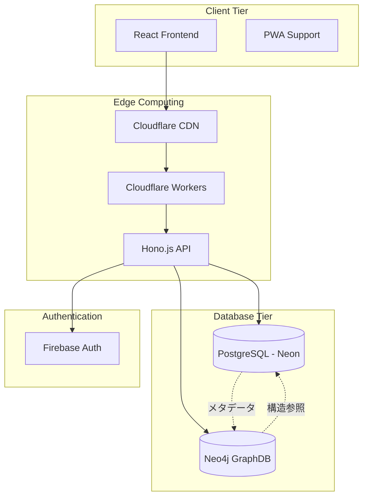

# システム概要

## 🎯 プロジェクト概要

Odyssageは**非同期型ゲームブック風TRPG**のためのWebアプリケーションです。未知を辿る冒険の記録として、各プレイヤーが自分だけの旅路を白い手帳に刻んでいくコンセプトを持っています。

### 核となる価値提案
- **非同期プレイ**: リアルタイムでなく、各自のペースで進行可能
- **ゲームブック形式**: 分岐選択による物語体験
- **TRPG要素**: GMによるセッション管理と物語進行
- **デジタル手帳**: 個人の冒険記録の蓄積

## 🏗️ システムアーキテクチャ

### 全体構成


### 技術スタック詳細

#### フロントエンド
- **React 18**: コンポーネントベースUI構築
- **TypeScript**: 型安全な開発環境
- **Vite**: 高速なビルドシステム
- **Feature-Sliced Design**: スケーラブルなアーキテクチャ
- **PWA対応**: オフライン機能・ネイティブ風UI

#### バックエンド
- **Hono.js**: 軽量で高速なWebフレームワーク
- **Cloudflare Workers**: Edge Computing実行環境
- **TypeScript**: フロント・バック統一言語
- **Valibot**: 型安全なバリデーション

#### データベース（ハイブリッド構成）
- **PostgreSQL (Neon)**: メタデータ・ユーザー情報・権限管理
- **Neo4j**: シナリオ構造・関係性・フロー管理
- **UUID統一**: 両DB間での一意性確保

#### 認証・セキュリティ
- **Firebase Authentication**: ユーザー認証基盤
- **JWT**: API アクセストークン
- **RBAC**: ロールベースアクセス制御

## 🔄 アーキテクチャパターン

### ドメイン駆動設計（DDD）
```
Domain Layer (ビジネスロジック)
    ↓ 依存関係の逆転
Application Layer (ユースケース実装)
    ↓
Infrastructure Layer (技術的実装)
```

### CQRS（読み書き分離）
- **Command**: データ変更操作 → PostgreSQL中心
- **Query**: データ参照操作 → 用途に応じてDB使い分け

### ハイブリッドDB戦略
```
PostgreSQL               Neo4j
┌─────────────────┐     ┌──────────────────┐
│ ユーザー管理     │     │ シナリオ構造     │
│ 権限・認証       │     │ フロー・分岐     │
│ セッション状態   │     │ 関係性データ     │
│ 在庫・お気入り   │     │ パス検索         │
└─────────────────┘     └──────────────────┘
         │                        │
         └─────── UUID統一 ─────────┘
```

## 🚀 主要機能

### 現在実装済み
- **ユーザー認証**: Firebase連携ログイン・ログアウト
- **シナリオ管理**: 作成・編集・公開設定・削除
- **セッション管理**: GM/プレイヤー参加・進行状態管理
- **在庫機能**: シナリオブックマーク・お気に入り
- **基本GraphDB連携**: シナリオ構造データのNeo4j格納

### 開発中・計画中
- **Scene/Event/Message階層**: 詳細なシナリオ構造管理
- **分岐フロー**: 複雑な物語分岐の可視化・管理
- **非同期進行**: プレイヤー個別ペースでの物語進行
- **リアルタイム通知**: 重要イベントの即座通知

## 📊 スケーラビリティ戦略

### Edge Computing活用
```
ユーザー → 最寄りEdge → Cloudflare Workers → Database
```
- **低レイテンシ**: 地理的に近いサーバーでの処理
- **高可用性**: グローバル分散による障害耐性
- **自動スケール**: トラフィック増加に応じた自動拡張

### データベース分散
- **読み取り分散**: GraphDBでの高速関係性検索
- **書き込み集中**: PostgreSQLでの確実なデータ整合性
- **キャッシュ活用**: CDNレベルでの静的コンテンツ配信

### パフォーマンス最適化
- **バンドル最適化**: Viteによるモダンな最適化
- **コード分割**: 動的インポートによる初期ロード軽減
- **画像最適化**: WebP・AVIF形式対応

## 🔐 セキュリティ設計

### 多層防御
1. **CDN層**: DDoS攻撃防御・WAF
2. **API層**: JWT検証・Rate Limiting  
3. **DB層**: パラメータ化クエリ・権限分離
4. **アプリ層**:入力検証・XSS対策

### データ保護
- **暗号化**: 保存時・転送時の暗号化
- **権限分離**: 最小権限原則の適用
- **監査ログ**: 全操作の記録・追跡

## 📈 監視・可観測性

### メトリクス収集
- **応答時間**: エンドポイント別パフォーマンス
- **エラー率**: HTTP ステータス別集計
- **リソース使用量**: メモリ・CPU・DB接続数
- **ユーザー行動**: 機能利用状況・UX改善指標

### ログ戦略
```typescript
interface StructuredLog {
  timestamp: string;
  level: 'info' | 'warn' | 'error';
  service: string;
  userId?: string;
  action: string;
  metadata: Record<string, any>;
}
```

### アラート設定
- **パフォーマンス劣化**: 応答時間閾値超過
- **エラー急増**: エラー率異常検知
- **リソース枯渇**: DB接続数上限接近

## 🔄 今後の進化計画

### Phase 2: 機能拡張（3-6ヶ月）
- **WebSocket**: リアルタイム機能強化
- **PWA完全対応**: オフライン機能・プッシュ通知
- **高度な分析**: ユーザー行動分析・推薦システム

### Phase 3: エンタープライズ化（6-12ヶ月）  
- **マイクロサービス**: ドメイン境界での分割
- **イベント駆動**: 非同期メッセージング導入
- **マルチテナント**: 組織別データ分離

### Phase 4: AI統合（12ヶ月以降）
- **物語生成**: AIによるシナリオ自動生成
- **推薦システム**: パーソナライズド体験
- **自然言語処理**: ゲーム内チャット解析・支援

## 🎯 技術選定理由

### React + TypeScript
- **学習コスト**: 豊富な情報・人材確保容易
- **エコシステム**: 豊富なライブラリ・ツール
- **型安全性**: 大規模開発での保守性確保

### Cloudflare Workers
- **パフォーマンス**: Edge Computing による低レイテンシ
- **運用コスト**: サーバーレスによる運用負荷軽減
- **スケーラビリティ**: トラフィック増加への自動対応

### ハイブリッドDB
- **PostgreSQL**: 確実性が重要なデータの信頼性
- **Neo4j**: 複雑な関係性データの高速処理
- **適材適所**: データ特性に応じた最適技術選択

---

## 📖 関連リソース

### 設計詳細
- [[database-design]] - ハイブリッドDB設計思想
- [[api-design]] - REST API設計原則
- [[environment-variables]] - 環境設定・セキュリティ管理

### 開発・運用
- [[../03-development/process]] - 開発プロセス・品質保証
- [[../04-deployment/current-deployment]] - 現在のデプロイ構成
- [[../04-deployment/production-roadmap]] - 運用改善計画

### プロジェクト情報
- [[../01-getting-started/README]] - プロジェクト入門
- [[../00-index]] - ドキュメント全体インデックス

#architecture #overview #system #technical #design