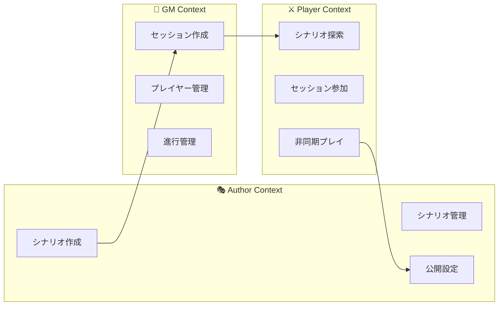
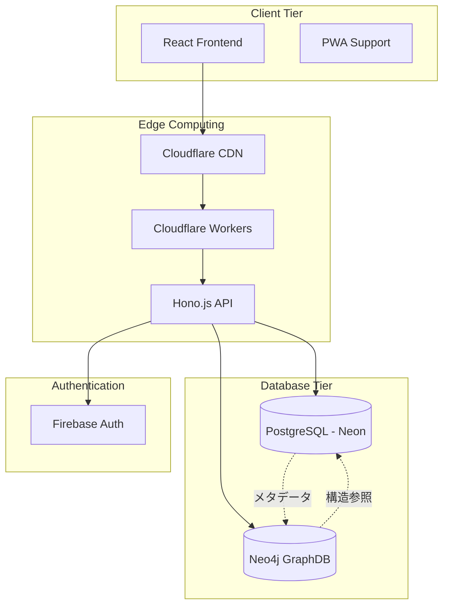
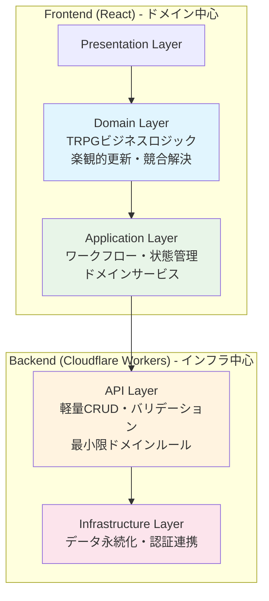

# システム概要

## 🎯 プロジェクト概要

Odyssageは**忙しい人でも自分のペースで楽しめる非同期TRPG体験**を提供するWebアプリケーションです。時間・場所の制約から解放され、プレイヤーが自分だけの物語を作り、他の冒険者の多様な旅路を発見できるプラットフォームです。

> **📖 詳細なビジョン**: [プロジェクトビジョン](../PROJECT_VISION.md) で包括的なプロジェクト目標と価値をご確認ください。

### 核となる価値提案
- **時間の自由**: いつでもどこでも自分のタイミングでプレイ進行
- **プレイログの蓄積**: 選択と物語が自然に記録として残る体験
- **多様な物語との出会い**: 他プレイヤーの冒険記録を読む楽しみ
- **低い参加ハードル**: GMやシナリオ作成スキル不要での気軽な参加

## 👥 ユーザー文脈設計

### 3つのユーザー文脈（Context-First Architecture）

**Sprint 3発見事項**: バックエンドAPI実装を通じて明確化された3つの異なるユーザー文脈



#### 🎭 Author（シナリオ作成者）文脈
- **主要価値**: 創作したシナリオを多くのプレイヤーに体験してもらう
- **核心機能**: シナリオ作成・編集・公開管理
- **API群**: `/api/authors/{uid}/scenarios/`

#### 🎲 GM（ゲームマスター）文脈  
- **主要価値**: プレイヤーと共に物語を紡ぐセッション運営
- **核心機能**: セッション作成・プレイヤー招待・進行管理
- **API群**: `/api/game-masters/{uid}/sessions/`

#### ⚔️ Player（プレイヤー）文脈
- **主要価値**: 自分のペースで楽しむ非同期TRPG体験
- **核心機能**: シナリオ探索・セッション参加・非同期プレイ
- **API群**: `/api/users/{uid}/stocked-scenarios/`

### Context-First設計原則

1. **文脈独立性**: 各文脈は独立したAPIエンドポイント・UI・機能セット
2. **段階的実装**: Player文脈から開始し、GM・Author文脈を段階的拡張
3. **文脈間連携**: シナリオ→セッション→プレイの自然な流れを設計

## 🏗️ システムアーキテクチャ

### 全体構成


### 技術スタック詳細

#### フロントエンド
- **React 18**: コンポーネントベースUI構築
- **TypeScript**: 型安全な開発環境
- **Vite**: 高速なビルドシステム
- **Feature-Sliced Design**: スケーラブルなアーキテクチャ
- **PWA対応**: オフライン機能・ネイティブ風UI

#### バックエンド
- **Hono.js**: 軽量で高速なWebフレームワーク
- **Cloudflare Workers**: Edge Computing実行環境
- **TypeScript**: フロント・バック統一言語
- **Valibot**: 型安全なバリデーション

#### データベース（ハイブリッド構成）
- **PostgreSQL (Neon)**: メタデータ・ユーザー情報・権限管理
- **Neo4j**: シナリオ構造・関係性・フロー管理
- **UUID統一**: 両DB間での一意性確保

#### 認証・セキュリティ
- **Firebase Authentication**: ユーザー認証基盤
- **JWT**: API アクセストークン
- **RBAC**: ロールベースアクセス制御

## 🔄 アーキテクチャパターン

### フルスタック境界設計とDDD（2025-08-11改訂）

#### **システム全体におけるレイヤー分離**


#### **DDD適用レベル別責務分担**

**🎯 Frontend（React + TypeScript）- フルDDD適用**:
```typescript
// ドメインサービス例
class OptimisticSceneManager {
  handleConflictResolution(local: Scene[], server: Scene[]): Scene[]
  validateSceneOrder(scenes: Scene[]): ValidationResult  
  applyBusinessRules(scene: Scene): ValidationErrors
}

// 集約ルート例  
class ScenarioAggregate {
  publish(): ValidationResult
  canBeEditedBy(userId: UserId): boolean
  addScene(scene: Scene): ValidationResult
}
```

**⚡ Backend（Cloudflare Workers + Hono.js）- 最小限DDD適用**:
```typescript
// 最小限のドメインバリデーション
class ScenarioValidator {
  validateForPersistence(scenario: DTO): ValidationResult
  checkTitleUniqueness(title: string): boolean
  validateAuthorPermissions(authorId: string): boolean
}
```

#### **設計判断の根拠とDDD戦略**
- **境界の適切設定**: 複雑性がある場所（フロントエンド）にDDD集中
- **パフォーマンス**: Edge Computing特性を活かした軽量バックエンド
- **UX最適化**: フロントエンドでの豊富なドメインロジックにより応答性向上  
- **開発効率**: 各層の特性に応じたDDD適用度で専門性最大化
- **保守性**: ドメイン知識の明示的定義によるビジネスルール可視化

### CQRS（読み書き分離）
- **Command**: データ変更操作 → PostgreSQL中心
- **Query**: データ参照操作 → 用途に応じてDB使い分け

### ハイブリッドDB戦略
```
PostgreSQL               Neo4j
┌─────────────────┐     ┌──────────────────┐
│ ユーザー管理     │     │ シナリオ構造     │
│ 権限・認証       │     │ フロー・分岐     │
│ セッション状態   │     │ 関係性データ     │
│ 在庫・お気入り   │     │ パス検索         │
└─────────────────┘     └──────────────────┘
         │                        │
         └─────── UUID統一 ─────────┘
```

## 🚀 主要機能

### 現在実装済み
- **ユーザー認証**: Firebase連携ログイン・ログアウト
- **シナリオ管理**: 作成・編集・公開設定・削除
- **セッション管理**: GM/プレイヤー参加・進行状態管理
- **在庫機能**: シナリオブックマーク・お気に入り
- **基本GraphDB連携**: シナリオ構造データのNeo4j格納

### 開発中・計画中
- **Scene/Event/Message階層**: 詳細なシナリオ構造管理
- **分岐フロー**: 複雑な物語分岐の可視化・管理
- **非同期進行**: プレイヤー個別ペースでの物語進行
- **リアルタイム通知**: 重要イベントの即座通知

## 📊 スケーラビリティ戦略

### Edge Computing活用
```
ユーザー → 最寄りEdge → Cloudflare Workers → Database
```
- **低レイテンシ**: 地理的に近いサーバーでの処理
- **高可用性**: グローバル分散による障害耐性
- **自動スケール**: トラフィック増加に応じた自動拡張

### データベース分散
- **読み取り分散**: GraphDBでの高速関係性検索
- **書き込み集中**: PostgreSQLでの確実なデータ整合性
- **キャッシュ活用**: CDNレベルでの静的コンテンツ配信

### パフォーマンス最適化
- **バンドル最適化**: Viteによるモダンな最適化
- **コード分割**: 動的インポートによる初期ロード軽減
- **画像最適化**: WebP・AVIF形式対応

## 🔐 セキュリティ設計

### 多層防御
1. **CDN層**: DDoS攻撃防御・WAF
2. **API層**: JWT検証・Rate Limiting  
3. **DB層**: パラメータ化クエリ・権限分離
4. **アプリ層**:入力検証・XSS対策

### データ保護
- **暗号化**: 保存時・転送時の暗号化
- **権限分離**: 最小権限原則の適用
- **監査ログ**: 全操作の記録・追跡

## 📈 監視・可観測性

### メトリクス収集
- **応答時間**: エンドポイント別パフォーマンス
- **エラー率**: HTTP ステータス別集計
- **リソース使用量**: メモリ・CPU・DB接続数
- **ユーザー行動**: 機能利用状況・UX改善指標

### ログ戦略
```typescript
interface StructuredLog {
  timestamp: string;
  level: 'info' | 'warn' | 'error';
  service: string;
  userId?: string;
  action: string;
  metadata: Record<string, any>;
}
```

### アラート設定
- **パフォーマンス劣化**: 応答時間閾値超過
- **エラー急増**: エラー率異常検知
- **リソース枯渇**: DB接続数上限接近

## 🔄 今後の進化計画

### Phase 2: 機能拡張（3-6ヶ月）
- **WebSocket**: リアルタイム機能強化
- **PWA完全対応**: オフライン機能・プッシュ通知
- **高度な分析**: ユーザー行動分析・推薦システム

### Phase 3: エンタープライズ化（6-12ヶ月）  
- **マイクロサービス**: ドメイン境界での分割
- **イベント駆動**: 非同期メッセージング導入
- **マルチテナント**: 組織別データ分離

### Phase 4: AI統合（12ヶ月以降）
- **物語生成**: AIによるシナリオ自動生成
- **推薦システム**: パーソナライズド体験
- **自然言語処理**: ゲーム内チャット解析・支援

## 🎯 技術選定理由

### React + TypeScript
- **学習コスト**: 豊富な情報・人材確保容易
- **エコシステム**: 豊富なライブラリ・ツール
- **型安全性**: 大規模開発での保守性確保
- **ビジネスロジック適合**: 複雑な状態管理・UXワークフローに最適

### Cloudflare Workers
- **パフォーマンス**: Edge Computing による低レイテンシ
- **運用コスト**: サーバーレスによる運用負荷軽減
- **スケーラビリティ**: トラフィック増加への自動対応
- **アーキテクチャ適合**: 軽量なCRUD操作に最適化された実行環境

### ハイブリッドDB
- **PostgreSQL**: 確実性が重要なデータの信頼性
- **Neo4j**: 複雑な関係性データの高速処理
- **適材適所**: データ特性に応じた最適技術選択

## 🤔 設計判断指針とガイドライン

### フロントエンド vs バックエンド役割分担

#### **フロントエンドで実装すべきもの**:
- **複雑な状態管理**: 楽観的更新・ライフサイクル制御
- **ビジネスワークフロー**: 作成→編集→保存の複雑なフロー
- **リアルタイムUX**: インタラクティブな操作・即座のフィードバック
- **ドメイン特化ロジック**: TRPG固有のルール・制約

#### **バックエンドで実装すべきもの**:
- **データ永続化**: 確実なCRUD操作・整合性保証
- **認証・認可**: セキュリティ境界での検証
- **基本バリデーション**: スキーマ検証・重複チェック
- **外部システム連携**: Database・Firebase Auth等

#### **判断基準**:
```typescript
// 複雑なビジネスロジック → Frontend
if (hasComplexStateMachine || requiresOptimisticUpdate) {
  // React hooks・state managementで実装
}

// シンプルなCRUD → Backend
if (isBasicDataPersistence && requiresDataIntegrity) {
  // Hono.js APIで実装
}
```

### テスト戦略指針

#### **各層のテスト責務**:

**Frontend Testing**:
- **Component Tests**: UI コンポーネントの動作確認
- **Hook Tests**: ビジネスロジック・状態管理のテスト
- **Integration Tests**: フロー全体の統合テスト

**Backend Testing**:
- **API Tests**: エンドポイントの基本動作確認
- **Schema Validation Tests**: 入力データの検証テスト
- **Integration Tests**: Database連携の確認

**E2E Testing**:
- **BDD Tests**: 実際のユーザーシナリオでの動作保証
- **Cross-browser Tests**: 環境差異の検証

#### **テスト投資レベル判断**:
- **フロントエンド**: 複雑なビジネスロジックのため高投資
- **バックエンド**: シンプルなCRUDのため中程度投資
- **E2E**: ユーザー価値保証のため必須投資

### アーキテクチャ進化指針

#### **過剰な複雑化を避ける**:
- ❌ バックエンドでの過度なDDD実装
- ❌ 不要なマイクロサービス分割
- ❌ 複雑な抽象化レイヤー

#### **適切な改善方向**:
- ✅ エラーハンドリング・ログの統一
- ✅ パフォーマンス監視・最適化
- ✅ 開発体験・保守性の向上

---

## 📖 関連リソース

### 設計詳細
- [[database-design]] - ハイブリッドDB設計思想
- [[api-design]] - REST API設計原則
- [[environment-variables]] - 環境設定・セキュリティ管理

### 開発・運用
- [[../03-development/process]] - 開発プロセス・品質保証
- [[../04-deployment/current-deployment]] - 現在のデプロイ構成
- [[../04-deployment/production-roadmap]] - 運用改善計画

### プロジェクト情報
- [[../01-getting-started/README]] - プロジェクト入門
- [[../00-index]] - ドキュメント全体インデックス

#architecture #overview #system #technical #design