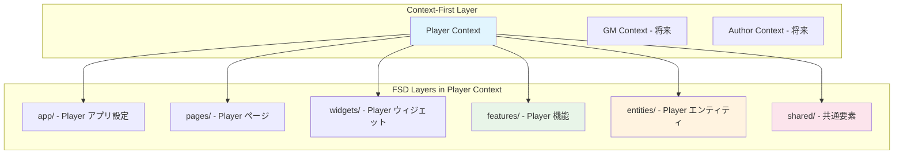

# Player文脈アーキテクチャ設計書

## 📅 設計概要

**作成日**: 2025-08-16  
**対象範囲**: Player文脈MVP実装  
**アーキテクチャ方式**: Context-First + Feature-Sliced Design統合  
**技術スタック**: React 19+ + TypeScript + Redux Toolkit + SWR + Tailwind CSS

## 🏗️ Context-First + FSD統合アプローチ

### 設計理念



### 境界設定原則

```typescript
interface ContextBoundaryStrategy {
  player_context: {
    responsibility: "プレイヤーとしてのTRPG体験";
    boundaries: [
      "シナリオ閲覧・選択",
      "ゲームブック形式プレイ",
      "プレイ記録管理",
      "個人設定管理"
    ];
    excluded: [
      "シナリオ作成・編集",
      "セッション管理・GM機能",
      "ユーザー管理・認証"
    ];
  };
  
  architecture_benefits: {
    isolation: "Player文脈の独立した開発・テスト";
    evolution: "他文脈への段階的拡張";
    maintenance: "文脈別の保守・デバッグ";
  };
}
```

## 📁 Player文脈ディレクトリ構造設計

### 目標ディレクトリ構成

```
src/
├── app/                           # アプリケーション層
│   ├── router/                   # ルーティング設定
│   └── store/                    # グローバル状態管理
│
├── pages/                        # ページ層（Player文脈専用）
│   └── player/                   # Player文脈ページ
│       ├── session-list/         # セッション一覧ページ
│       ├── session-detail/       # セッション詳細ページ
│       ├── play-session/         # プレイセッションページ
│       └── play-history/         # プレイ履歴ページ（Phase2以降）
│
├── widgets/                      # ウィジェット層（Player文脈専用）
│   └── player/                   # Player文脈ウィジェット
│       ├── session-browser/      # セッション閲覧ウィジェット
│       ├── play-interface/       # プレイインターフェース
│       └── play-history/         # プレイ履歴ウィジェット
│
├── features/                     # フィーチャー層（Player文脈専用）
│   └── player/                   # Player文脈フィーチャー
│       ├── session-discovery/    # セッション発見機能
│       ├── gameplay/             # ゲームプレイ機能
│       └── play-records/         # プレイ記録機能
│
├── entities/                     # エンティティ層（Player文脈エンティティ）
│   └── player/                   # Player文脈ドメイン
│       ├── session/              # セッションドメイン
│       ├── game-session/         # ゲームセッションドメイン
│       ├── play-record/          # プレイ記録ドメイン
│       └── player-profile/       # プレイヤープロファイル
│
└── shared/                       # 共有層（全文脈共通）
    ├── ui/                       # 汎用UIコンポーネント
    ├── api/                      # API関連
    ├── lib/                      # ライブラリ・ユーティリティ
    └── config/                   # 設定管理
```

## 🎨 UI Component開発方針

### packages/ui Component戦略

```markdown
## StoryBook統合開発
- **視覚的確認**: packages/ui配置での画面部品のStoryBook表示
- **品質保証**: コンポーネント単位での動作確認・デザインレビュー
- **ドキュメント化**: 実装者・デザイナー間でのコンポーネント仕様共有

## 人間可読性重視
- **既存コード分離**: vercel v0生成コードは参考にしない
- **可読性優先**: 人間が読んで理解しやすいコード構造
- **保守性確保**: 長期的な保守・拡張を考慮した実装

## Deprecated コード分離戦略
- **混在回避**: 既存vercel v0コードとの完全分離
- **新規ディレクトリ**: packages/ui配下での新規Component実装
- **段階的移行**: 既存コードは段階的にdeprecated化
```

### UI Component配置原則

```markdown
## packages/ui構造（文脈別 + Atomic Design）
- **文脈別フォルダ**: player/, gm/, author/, shared/
- **Atomic Design**: 各文脈内でAtoms, Molecules, Organisms構造
- **共通Component**: shared/配下で全文脈共通コンポーネント

## ディレクトリ構造例
```
packages/ui/
├── player/                    # Player文脈専用Component
│   ├── atoms/                # 基本UI要素
│   │   ├── SessionButton/
│   │   ├── ChoiceChip/
│   │   └── PlayStatus/
│   ├── molecules/            # 複合Component
│   │   ├── SessionCard/
│   │   ├── ChoiceList/
│   │   └── PlayProgress/
│   └── organisms/            # 複雑なComponent
│       ├── SessionGrid/
│       ├── PlayInterface/
│       └── PlayHistory/
├── gm/                       # GM文脈専用Component（将来）
├── author/                   # Author文脈専用Component（将来）
└── shared/                   # 全文脈共通Component
    ├── atoms/               # 汎用基本要素
    │   ├── Button/
    │   ├── Input/
    │   └── Card/
    ├── molecules/           # 汎用複合要素
    └── organisms/           # 汎用複雑要素
```

## StoryBook統合
- **文脈別Story**: 各文脈のComponent Storyを分離
- **Design Token**: 色・サイズ・間隔の統一管理
- **Interactive Demo**: プロパティ変更での動作確認
```

## 🔧 各層の責務と実装方針

### App Layer: Player文脈アプリケーション設定

```markdown
## 責務
- Player文脈専用ルート設計
- Player文脈状態管理の統合
- アプリケーション設定・初期化

## 実装方針
- React 19+を使用したモダンComponent開発
  - 最新機能・パフォーマンス向上の活用
  - React Router v7との最適化された統合
  - Concurrent Features・Suspense改善の活用
- React Router v7を使用した宣言的ルーティング
- Redux Toolkit + SWRのハイブリッド状態管理
- Context-First アプローチによる境界明確化
```

#### **ルーティング設計詳細（緊急追加）**

```typescript
// app/router/player-routes.ts
export const playerRoutes = [
  // セッション一覧・発見
  {
    path: "/player/sessions",
    element: <SessionListPage />,
    loader: () => ({ sessions: loadAvailableSessions() })
  },
  
  // セッション詳細・参加判断
  {
    path: "/player/session/:sessionId", 
    element: <SessionDetailPage />,
    loader: ({ params }) => ({ 
      session: loadSession(params.sessionId),
      scenario: loadSessionScenario(params.sessionId)
    })
  },
  
  // プレイセッション（MVP最重要）
  {
    path: "/player/session/:sessionId/play",
    element: <PlaySessionContainer />,
    loader: ({ params }) => ({
      sessionId: params.sessionId
    })
  },
  
  // 特定シーン開始（デバッグ・テスト用）
  {
    path: "/player/session/:sessionId/play/:sceneId",
    element: <PlaySessionContainer />,
    loader: ({ params }) => ({
      sessionId: params.sessionId,
      startingSceneId: params.sceneId
    })
  }
];
```

#### **ルーティング層アーキテクチャ**

```markdown
## ルーティング責務分離

✅ **app/router/**: ルート定義・設定
- player-routes.ts: Player文脈ルート定義
- route-guards.ts: MVP範囲内の基本ガード（将来）
- error-boundaries.ts: ルートレベルエラーハンドリング

✅ **pages/**: ページコンポーネント・データローダー統合
- SessionListPage: セッション一覧・ルーティング統合
- SessionDetailPage: セッション詳細・パラメータ処理
- PlaySessionContainer: プレイセッション・状態管理

✅ **MVP制約遵守**:
❌ 認証ガード・権限制御（Phase 4以降）
❌ 複雑なネストルート・レイアウト
❌ 高度なプリロード・コード分割戦略
```

### Pages Layer: Player文脈ページ構成

```markdown
## 責務
- Player文脈の各画面の統合・調整
- ページレベルのデータロード・エラーハンドリング
- ナビゲーション・レイアウト統合

## 実装方針
- 1画面1ディレクトリ構造
- ウィジェット層の組み合わせによるページ構成
- データローダーパターンの活用
```

### Widgets Layer: Player文脈複合UI

```markdown
## 責務
- 複数のフィーチャーを組み合わせた複合UI
- ページ内でのUI制御・状態管理
- レスポンシブ・アクセシビリティ対応

## 実装方針
- 機能単位での独立したウィジェット設計
- Tailwind CSSによるレスポンシブ対応
- フィーチャー層の組み合わせによる実現
```

### Features Layer: Player文脈ビジネス機能

```markdown
## 責務
- Player文脈固有のビジネスロジック
- データアクセス・API統合
- 状態管理・キャッシュ戦略

## 実装方針
- Repository パターンによるデータアクセス抽象化
- SWR + カスタムフックによる状態管理
- エンティティ層のドメインモデル活用
```

### Entities Layer: Player文脈ドメインモデル

```markdown
## 責務
- Player文脈のドメインエンティティ定義
- ビジネスルール・バリデーション
- 型安全性の確保

## 実装方針
- クラスベースのエンティティモデル
- 不変性を重視したデータ設計
- TypeScript型システムの活用
```

## 🔄 状態管理設計（Context-First統合）

### Player文脈状態管理戦略

```typescript
interface PlayerContextStateStrategy {
  global_state: {
    player_profile: "Redux Toolkit - プレイヤープロファイル";
    ui_preferences: "Redux Toolkit - UI設定";
    app_config: "Redux Toolkit - アプリ設定";
  };
  
  server_state: {
    sessions: "SWR - セッションデータキャッシュ";
    play_sessions: "SWR - プレイセッションデータ";
    play_records: "SWR - プレイ記録データ";
  };
  
  component_state: {
    form_inputs: "useState - フォーム入力状態";
    ui_controls: "useState - UI制御状態";
    temporary_data: "useState - 一時的なデータ";
  };
}
```

### 状態管理設計原則

```markdown
## Redux Toolkit 使用指針
- プレイヤープロファイルのグローバル管理
- UI設定・アプリ設定の永続化
- セッション間でのデータ保持

## SWR 使用指針
- サーバーデータのキャッシュ管理
- リアルタイムデータ更新のハンドリング
- ネットワークエラー・再試行の自動化

## useState 使用指針
- コンポーネントローカルな一時状態
- フォーム入力・ユーザー操作状態
- UIアニメーション・表示制御
```

### SWRキー体系設計

```markdown
## キー命名規則
- エンティティベース: ['sessions'], ['play-records']
- 操作ベース: ['sessions', 'list'], ['sessions', 'detail']
- パラメータ付き: ['sessions', 'detail', sessionId]

## キャッシュ戦略
- セッションリスト: 5分間キャッシュ
- セッション詳細: 10分間キャッシュ
- プレイデータ: 自動保存・キャッシュ無効
```

## 🔌 データアクセス・永続化設計

### データ永続化戦略

```markdown
## MVP段階: LocalStorage中心
- プレイヤープロファイル: LocalStorage永続化
- プレイセッション: LocalStorage + 自動保存
- セッションデータ: 静的JSON + キャッシュ

## Phase2以降: ハイブリッド戦略
- 認証ユーザー: Cloud Firestore
- ゲストユーザー: LocalStorage + エクスポート機能
- リアルタイム同期: Firebase Realtime Database
```

### Repository Pattern設計

```markdown
## 抽象化戦略
- データソースからの独立性確保
- テスト可能性の向上
- 段階的なバックエンド統合の容易化

## 実装パターン
- インターフェースベースの設計
- LocalStorage実装 -> Firebase実装への移行容易性
- エラーハンドリング・リトライ機能の統一

## キー管理戦略
- プレフィックスベースの名前空間管理
- エンティティタイプ別のキー体系
- バージョン管理・マイグレーション対応
```

## 🧪 テスト設計戦略

### テスト分類・方針

```typescript
interface PlayerContextTestStrategy {
  unit_tests: {
    entities: "ドメインロジック・ビジネスルールテスト";
    utilities: "汎用関数・ヘルパーのテスト";
    repositories: "データアクセス層のテスト";
  };
  
  component_tests: {
    ui_components: "個別UIコンポーネントのテスト";
    widgets: "複合ウィジェットの統合テスト";
    pages: "ページレベルの機能テスト";
  };
  
  integration_tests: {
    feature_flows: "フィーチャー単位の統合テスト";
    data_persistence: "データ永続化の統合テスト";
    state_management: "状態管理の統合テスト";
  };
  
  e2e_tests: {
    user_journeys: "Player文脈のエンドツーエンドテスト";
    cross_feature: "複数機能間の連携テスト";
  };
}
```

### テスト実装原則

```markdown
## ユニットテスト
- エンティティクラスのビジネスロジック検証
- Repositoryインターフェースの動作検証
- ユーティリティ関数の入出力検証

## コンポーネントテスト
- React Testing Libraryを使用したレンダリングテスト
- ユーザーインタラクションのシミュレーション
- アクセシビリティ属性の検証

## E2Eテスト
- Playwright + Cucumberを使用したBDDシナリオテスト
- ユーザージャーニー全体の検証
- Chrome最新版での確認（MVP制約）
```

## 📈 パフォーマンス最適化設計（MVP制約）

### MVP範囲外（Phase 2以降）
```markdown
## MVPのやらないこと（パフォーマンス最適化）
- 詳細なパフォーマンス最適化・コード分割戦略（Phase 2以降）
- 高度なメモ化・React最適化技法
- CDN・キャッシュ戦略・アセット最適化
- パフォーマンス監視・測定システム
- 無限スクロール・ページネーション最適化

## MVP段階での基本要件
- 基本的な動作確保（確実なComponent動作・画面遷移）
- 標準的なReact開発パターンの適用
- 基本的なコード品質・可読性の確保
```

## 🚀 実装段階・マイルストーン

### Phase 1: 基盤構築

```markdown
## 完了目標
✅ Player文脈ディレクトリ構造の構築
✅ 基本的なエンティティモデルの定義
✅ LocalStorage抽象化の設計・実装
✅ Repositoryパターンの導入

## 成枝物
- entities/player/ 以下のドメインモデル
- shared/lib/storage/ ストレージ抽象化
- 基本的なTypeScript型定義・インターフェース
```

### Phase 2: コア機能実装

```markdown
## 完了目標
✅ 3つの主要画面の実装（セッション一覧・詳細・プレイ）
✅ セッション発見・プレイ機能の実装
✅ プレイデータの保存・管理機能
✅ 基本的なUI/UXの実現

## 成果物
- 動作するPlayer文脈MVP
- BDD Featureと連携した実装
- ユーザーテスト可能なプロトタイプ
```

### Phase 3: 品質向上・最適化

```markdown
## 完了目標
✅ 統合テスト・品質確保
✅ パフォーマンス最適化の実施
✅ アクセシビリティ・ユーザビリティの改善
✅ ドキュメント・コード品質の向上

## 成果物
- プロダクションレディなPlayer文脈MVP
- 充実したテストスイート
- 最適化されたパフォーマンス
```

## 🔗 将来拡張への配慮

### 他文脈との統合戦略

```typescript
interface ContextEvolutionStrategy {
  player_isolation: {
    clear_boundaries: "Player文脈の独立性確保";
    minimal_coupling: "他文脈との最小限の結合";
    evolution_ready: "段階的拡張への準備";
  };
  
  shared_abstractions: {
    common_entities: "文脈間で共通のエンティティ抽象化";
    shared_services: "共通サービスレイヤーの設計";
    unified_storage: "統一されたデータ管理基盤";
  };
  
  integration_points: {
    session_sharing: "Author→Player セッション提供";
    session_coordination: "GM→Player セッション管理";
    user_management: "共通ユーザー管理基盤";
  };
}
```

### バックエンド統合戦略

```markdown
## API統合準備
- Repository pattern によるデータアクセス抽象化
- 静的データ → 動的API への段階的移行設計
- オフライン対応・同期機能の基盤設計

## 認証システム統合戦略
- 仮名ユーザー → 認証ユーザー への移行設計
- LocalStorage → Cloud Storage の段階的移行
- ユーザーデータマイグレーション戦略

## スケーラビリティ対応
- マイクロサービスアーキテクチャへの発展
- CDN・キャッシュ戦略の強化
- パフォーマンスモニタリング基盤
```

---

## 📝 メタデータ

**作成者**: 設計担当Claude Code  
**承認者**: リーダー（承認待ち）  
**関連文書**: 
- [player-context-requirements.md](player-context-requirements.md)
- [frontend-architecture.md](../../02-architecture/frontend-architecture.md)
- [PROJECT_VISION.md](../../PROJECT_VISION.md)

**更新履歴**:
- 2025-08-16: 初版作成（設計担当）
- 2025-08-17: POレビューフィードバック反映版（設計担当）
  - UI Component開発方針の追加（StoryBook統合・packages/ui配置戦略）
  - React Router v6→v7への修正
  - テスト戦略修正（Cucumber明記・クロスブラウザ除外）
  - 既存vercel v0コード分離戦略の明確化
  - packages/ui構造調整（文脈別フォルダ + AtomicDesign構造）
  - React 18+→React 19+への技術スタック更新
  - 理由: PO指摘による実装品質向上、技術選択正確性確保、最新React機能活用
- 2025-08-17: MVP制約調整（設計担当）
  - パフォーマンス最適化要件をMVP範囲外へ調整
  - 理由: POフィードバック「パフォーマンス要件もMVPのやらないこととしましょう」への対応
- 2025-08-18: **ルーティング層アーキテクチャ追加版**（設計担当）
  - App Layer: ルーティング設計詳細・Player文脈ルート定義追加
  - ルーティング責務分離・MVP制約遵守のアーキテクチャ明確化
  - React Router v7統合戦略・データローダーパターン統合
  - 理由: ルーティング設計の緊急対応、Phase 2動作確認への技術基盤提供

#player-context #architecture #fsd #context-first #react #typescript #mvp-design #routing-architecture