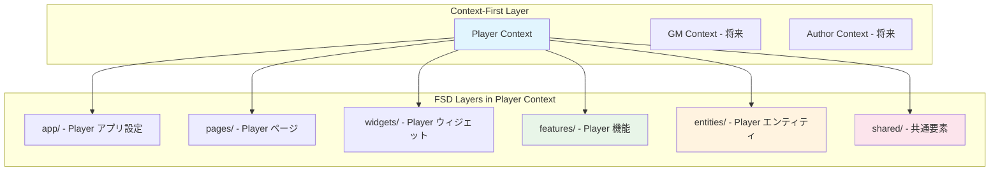

# Player文脈アーキテクチャ設計書

## 📅 設計概要

**作成日**: 2025-08-16  
**対象範囲**: Player文脈MVP実装  
**アーキテクチャ方式**: Context-First + Feature-Sliced Design統合  
**技術スタック**: React + TypeScript + Redux Toolkit + SWR + Tailwind CSS

## 🏗️ Context-First + FSD統合アプローチ

### 設計理念



### 境界設定原則

```typescript
interface ContextBoundaryStrategy {
  player_context: {
    responsibility: "プレイヤーとしてのTRPG体験";
    boundaries: [
      "シナリオ閲覧・選択",
      "ゲームブック形式プレイ",
      "プレイ記録管理",
      "個人設定管理"
    ];
    excluded: [
      "シナリオ作成・編集",
      "セッション管理・GM機能",
      "ユーザー管理・認証"
    ];
  };
  
  architecture_benefits: {
    isolation: "Player文脈の独立した開発・テスト";
    evolution: "他文脈への段階的拡張";
    maintenance: "文脈別の保守・デバッグ";
  };
}
```

## 📁 Player文脈ディレクトリ構造設計

### 目標ディレクトリ構成

```
src/
├── app/                           # アプリケーション層
│   ├── App.tsx                   # メインアプリケーション
│   ├── router/                   # ルーティング設定
│   │   ├── index.ts              # ルーター設定
│   │   └── playerRoutes.ts       # Player文脈ルート
│   └── store/                    # グローバル状態管理
│       ├── index.ts              # Store設定
│       └── rootReducer.ts        # ルートリデューサー
│
├── pages/                        # ページ層（Player文脈専用）
│   └── player/                   # Player文脈ページ
│       ├── scenario-list/        # シナリオ一覧ページ
│       │   ├── ui/
│       │   │   └── Page.tsx      # シナリオ一覧ページ
│       │   ├── api/
│       │   │   └── loader.ts     # データローダー
│       │   └── index.ts          # 公開インターフェース
│       ├── scenario-detail/      # シナリオ詳細ページ
│       │   ├── ui/
│       │   │   └── Page.tsx      # シナリオ詳細ページ
│       │   ├── api/
│       │   │   └── loader.ts     # 詳細データローダー
│       │   └── index.ts
│       ├── play-session/         # プレイセッションページ
│       │   ├── ui/
│       │   │   └── Page.tsx      # プレイ画面
│       │   ├── model/
│       │   │   └── usePlaySession.ts  # プレイロジック
│       │   └── index.ts
│       └── play-history/         # プレイ履歴ページ
│           ├── ui/
│           │   └── Page.tsx      # 履歴表示画面
│           ├── model/
│           │   └── usePlayHistory.ts  # 履歴管理
│           └── index.ts
│
├── widgets/                      # ウィジェット層（Player文脈専用）
│   └── player/                   # Player文脈ウィジェット
│       ├── scenario-browser/     # シナリオ閲覧ウィジェット
│       │   ├── ui/
│       │   │   ├── ScenarioBrowser.tsx    # メインブラウザ
│       │   │   ├── ScenarioGrid.tsx       # シナリオ一覧
│       │   │   └── ScenarioFilter.tsx     # フィルタリング
│       │   └── index.ts
│       ├── play-interface/       # プレイインターフェース
│       │   ├── ui/
│       │   │   ├── PlayInterface.tsx     # メインプレイUI
│       │   │   ├── SceneDisplay.tsx      # シーン表示
│       │   │   └── ChoiceSelector.tsx    # 選択肢UI
│       │   └── index.ts
│       └── play-history/         # プレイ履歴ウィジェット
│           ├── ui/
│           │   ├── HistoryViewer.tsx     # 履歴表示
│           │   └── SessionSummary.tsx    # セッション要約
│           └── index.ts
│
├── features/                     # フィーチャー層（Player文脈専用）
│   └── player/                   # Player文脈フィーチャー
│       ├── scenario-discovery/   # シナリオ発見機能
│       │   ├── api/
│       │   │   ├── scenarioRepository.ts  # シナリオデータアクセス
│       │   │   └── scenarioQueries.ts     # SWRクエリ
│       │   ├── model/
│       │   │   ├── useScenarioDiscovery.ts # 発見ロジック
│       │   │   └── useScenarioFilter.ts    # フィルタリング
│       │   ├── ui/
│       │   │   ├── ScenarioCard.tsx       # シナリオカード
│       │   │   ├── ScenarioDetail.tsx     # 詳細表示
│       │   │   └── FilterPanel.tsx       # フィルタパネル
│       │   └── index.ts
│       ├── gameplay/             # ゲームプレイ機能
│       │   ├── api/
│       │   │   ├── gameplayRepository.ts  # プレイデータアクセス
│       │   │   └── choiceProcessor.ts     # 選択処理
│       │   ├── model/
│       │   │   ├── useGameSession.ts      # セッション管理
│       │   │   ├── useSceneNavigation.ts  # シーン遷移
│       │   │   └── useChoiceTracking.ts   # 選択追跡
│       │   ├── ui/
│       │   │   ├── SceneRenderer.tsx      # シーン描画
│       │   │   ├── ChoiceButton.tsx       # 選択ボタン
│       │   │   └── ProgressTracker.tsx    # 進行状況
│       │   └── index.ts
│       └── play-records/         # プレイ記録機能
│           ├── api/
│           │   └── recordRepository.ts    # 記録保存
│           ├── model/
│           │   ├── usePlayRecord.ts       # 記録管理
│           │   └── useRecordAnalysis.ts   # 記録分析
│           ├── ui/
│           │   ├── RecordViewer.tsx       # 記録表示
│           │   └── ComparisonView.tsx     # 比較表示
│           └── index.ts
│
├── entities/                     # エンティティ層（Player文脈エンティティ）
│   └── player/                   # Player文脈ドメイン
│       ├── scenario/             # シナリオドメイン
│       │   ├── model.ts          # Scenarioエンティティ
│       │   ├── types.ts          # 型定義
│       │   └── validation.ts     # バリデーション
│       ├── game-session/         # ゲームセッションドメイン
│       │   ├── model.ts          # GameSessionエンティティ
│       │   ├── types.ts          # 型定義
│       │   └── validation.ts     # バリデーション
│       ├── play-record/          # プレイ記録ドメイン
│       │   ├── model.ts          # PlayRecordエンティティ
│       │   ├── types.ts          # 型定義
│       │   └── validation.ts     # バリデーション
│       └── player-profile/       # プレイヤープロファイル
│           ├── model.ts          # PlayerProfileエンティティ
│           ├── types.ts          # 型定義
│           └── validation.ts     # バリデーション
│
└── shared/                       # 共有層（全文脈共通）
    ├── ui/                       # 汎用UIコンポーネント
    │   ├── Button/               # ボタンコンポーネント
    │   ├── Card/                 # カードコンポーネント
    │   ├── Modal/                # モーダルコンポーネント
    │   ├── Input/                # 入力コンポーネント
    │   └── Layout/               # レイアウトコンポーネント
    ├── api/                      # API関連
    │   ├── client.ts             # HTTPクライアント
    │   └── types.ts              # API型定義
    ├── lib/                      # ライブラリ・ユーティリティ
    │   ├── storage/              # ストレージ操作
    │   │   ├── localStorage.ts   # LocalStorage抽象化
    │   │   └── types.ts          # ストレージ型定義
    │   ├── validation/           # 汎用バリデーション
    │   └── utils/                # 汎用ユーティリティ
    └── config/                   # 設定管理
        ├── constants.ts          # 定数定義
        └── environment.ts        # 環境設定
```

## 🔧 各層の責務と実装方針

### App Layer: Player文脈アプリケーション設定

```typescript
// app/router/playerRoutes.ts - Player文脈専用ルート
export const playerRoutes = {
  path: "/player",
  children: [
    {
      path: "scenarios",
      Component: ScenarioListPage,
      loader: scenarioListLoader
    },
    {
      path: "scenarios/:id",
      Component: ScenarioDetailPage,
      loader: scenarioDetailLoader
    },
    {
      path: "play/:sessionId",
      Component: PlaySessionPage,
      loader: playSessionLoader
    },
    {
      path: "history",
      Component: PlayHistoryPage,
      loader: playHistoryLoader
    }
  ]
};

// app/store/index.ts - Player文脈対応Store
export const store = configureStore({
  reducer: {
    // Player文脈の状態管理
    playerProfile: playerProfileSlice.reducer,
    playSession: playSessionSlice.reducer,
    
    // 共通状態管理
    ui: uiSlice.reducer,
    app: appSlice.reducer
  },
  middleware: (getDefaultMiddleware) =>
    getDefaultMiddleware({
      serializableCheck: {
        ignoredActions: ['persist/PERSIST']
      }
    })
});
```

### Pages Layer: Player文脈ページ構成

```typescript
// pages/player/scenario-list/ui/Page.tsx
export function ScenarioListPage() {
  const { scenarios, loading, error } = useScenarioDiscovery();
  
  if (loading) return <LoadingSpinner />;
  if (error) return <ErrorMessage error={error} />;
  
  return (
    <PlayerLayout title="シナリオ一覧">
      <ScenarioBrowser 
        scenarios={scenarios}
        onScenarioSelect={handleScenarioSelect}
      />
    </PlayerLayout>
  );
}

// pages/player/play-session/ui/Page.tsx
export function PlaySessionPage() {
  const { sessionId } = useParams();
  const { session, currentScene, choices } = useGameSession(sessionId);
  
  return (
    <PlayerLayout title={session?.scenario.title} hideNavigation>
      <PlayInterface
        scene={currentScene}
        choices={choices}
        onChoiceSelect={handleChoiceSelect}
        session={session}
      />
    </PlayerLayout>
  );
}
```

### Widgets Layer: Player文脈複合UI

```typescript
// widgets/player/scenario-browser/ui/ScenarioBrowser.tsx
export interface ScenarioBrowserProps {
  scenarios: Scenario[];
  onScenarioSelect: (scenario: Scenario) => void;
}

export function ScenarioBrowser({ scenarios, onScenarioSelect }: ScenarioBrowserProps) {
  const [filteredScenarios, setFilteredScenarios] = useState(scenarios);
  
  return (
    <div className="scenario-browser">
      <ScenarioFilter 
        scenarios={scenarios}
        onFilterChange={setFilteredScenarios}
      />
      <ScenarioGrid 
        scenarios={filteredScenarios}
        onScenarioSelect={onScenarioSelect}
      />
    </div>
  );
}

// widgets/player/play-interface/ui/PlayInterface.tsx
export interface PlayInterfaceProps {
  scene: Scene;
  choices: Choice[];
  onChoiceSelect: (choice: Choice) => void;
  session: GameSession;
}

export function PlayInterface({ scene, choices, onChoiceSelect, session }: PlayInterfaceProps) {
  return (
    <div className="play-interface">
      <SceneDisplay scene={scene} />
      <ChoiceSelector 
        choices={choices}
        onChoiceSelect={onChoiceSelect}
      />
      <ProgressTracker session={session} />
    </div>
  );
}
```

### Features Layer: Player文脈ビジネス機能

```typescript
// features/player/scenario-discovery/model/useScenarioDiscovery.ts
export function useScenarioDiscovery() {
  const { data: scenarios, error, isLoading } = useSWR(
    '/api/scenarios',
    scenarioRepository.getAvailableScenarios
  );
  
  const [filteredScenarios, setFilteredScenarios] = useState<Scenario[]>([]);
  
  useEffect(() => {
    if (scenarios) {
      setFilteredScenarios(scenarios);
    }
  }, [scenarios]);
  
  const applyFilter = useCallback((filter: ScenarioFilter) => {
    if (!scenarios) return;
    
    const filtered = scenarios.filter(scenario => {
      return filterMatches(scenario, filter);
    });
    
    setFilteredScenarios(filtered);
  }, [scenarios]);
  
  return {
    scenarios: filteredScenarios,
    loading: isLoading,
    error,
    applyFilter
  };
}

// features/player/gameplay/model/useGameSession.ts
export function useGameSession(sessionId: string) {
  const [session, setSession] = useState<GameSession | null>(null);
  const [currentScene, setCurrentScene] = useState<Scene | null>(null);
  const [choiceHistory, setChoiceHistory] = useState<Choice[]>([]);
  
  const selectChoice = useCallback(async (choice: Choice) => {
    if (!session) return;
    
    // 選択を記録
    const newHistory = [...choiceHistory, choice];
    setChoiceHistory(newHistory);
    
    // 次のシーンを決定
    const nextScene = await choiceProcessor.processChoice(
      session.scenario,
      currentScene,
      choice,
      newHistory
    );
    
    setCurrentScene(nextScene);
    
    // セッションを更新
    const updatedSession = {
      ...session,
      currentSceneId: nextScene.id,
      choiceHistory: newHistory
    };
    
    setSession(updatedSession);
    
    // LocalStorageに保存
    await gameplayRepository.saveSession(updatedSession);
  }, [session, currentScene, choiceHistory]);
  
  return {
    session,
    currentScene,
    choices: currentScene?.choices || [],
    selectChoice,
    choiceHistory
  };
}
```

### Entities Layer: Player文脈ドメインモデル

```typescript
// entities/player/scenario/model.ts
export class Scenario {
  constructor(
    public readonly id: string,
    public readonly title: string,
    public readonly overview: string,
    public readonly category: ScenarioCategory,
    public readonly difficulty: DifficultyLevel,
    public readonly estimatedPlayTime: number, // minutes
    public readonly scenes: Scene[],
    public readonly metadata: ScenarioMetadata
  ) {}
  
  static create(input: ScenarioInput): Scenario {
    return new Scenario(
      generateUUID(),
      input.title,
      input.overview,
      input.category,
      input.difficulty,
      input.estimatedPlayTime,
      input.scenes,
      {
        createdAt: new Date(),
        version: '1.0.0',
        tags: input.tags || []
      }
    );
  }
  
  getStartingScene(): Scene {
    return this.scenes.find(scene => scene.isStarting) || this.scenes[0];
  }
  
  canBePlayedBy(player: PlayerProfile): boolean {
    // プレイ可能性の判定ロジック
    return true; // MVP段階では制限なし
  }
  
  estimateCompletionPaths(): number {
    // 完了パスの推定計算
    const endingScenes = this.scenes.filter(scene => scene.isEnding);
    return endingScenes.length;
  }
}

// entities/player/game-session/model.ts
export class GameSession {
  constructor(
    public readonly id: string,
    public readonly scenario: Scenario,
    public readonly playerId: string,
    public readonly startedAt: Date,
    public readonly currentSceneId: string,
    public readonly choiceHistory: Choice[],
    public readonly status: SessionStatus,
    public readonly completedAt?: Date
  ) {}
  
  static start(scenario: Scenario, playerId: string): GameSession {
    const startingScene = scenario.getStartingScene();
    
    return new GameSession(
      generateUUID(),
      scenario,
      playerId,
      new Date(),
      startingScene.id,
      [],
      'active'
    );
  }
  
  makeChoice(choice: Choice): GameSession {
    return new GameSession(
      this.id,
      this.scenario,
      this.playerId,
      this.startedAt,
      choice.nextSceneId,
      [...this.choiceHistory, choice],
      this.status,
      this.completedAt
    );
  }
  
  complete(endingScene: Scene): GameSession {
    return new GameSession(
      this.id,
      this.scenario,
      this.playerId,
      this.startedAt,
      endingScene.id,
      this.choiceHistory,
      'completed',
      new Date()
    );
  }
  
  getPlayDuration(): number {
    const endTime = this.completedAt || new Date();
    return endTime.getTime() - this.startedAt.getTime();
  }
}
```

## 🔄 状態管理設計（Context-First統合）

### Player文脈状態管理戦略

```typescript
interface PlayerContextStateStrategy {
  global_state: {
    player_profile: "Redux Toolkit - プレイヤープロファイル";
    ui_preferences: "Redux Toolkit - UI設定";
    app_config: "Redux Toolkit - アプリ設定";
  };
  
  server_state: {
    scenarios: "SWR - シナリオデータキャッシュ";
    play_sessions: "SWR - プレイセッションデータ";
    play_records: "SWR - プレイ記録データ";
  };
  
  component_state: {
    form_inputs: "useState - フォーム入力状態";
    ui_controls: "useState - UI制御状態";
    temporary_data: "useState - 一時的なデータ";
  };
}
```

### Redux Slices設計

```typescript
// app/store/slices/playerProfileSlice.ts
interface PlayerProfileState {
  currentPlayer: PlayerProfile | null;
  preferences: PlayerPreferences;
  isInitialized: boolean;
}

export const playerProfileSlice = createSlice({
  name: 'playerProfile',
  initialState: {
    currentPlayer: null,
    preferences: defaultPreferences,
    isInitialized: false
  } as PlayerProfileState,
  reducers: {
    setCurrentPlayer: (state, action: PayloadAction<PlayerProfile>) => {
      state.currentPlayer = action.payload;
      state.isInitialized = true;
    },
    updatePreferences: (state, action: PayloadAction<Partial<PlayerPreferences>>) => {
      state.preferences = { ...state.preferences, ...action.payload };
    },
    clearPlayer: (state) => {
      state.currentPlayer = null;
      state.isInitialized = false;
    }
  }
});

// app/store/slices/playSessionSlice.ts
interface PlaySessionState {
  activeSession: GameSession | null;
  currentScene: Scene | null;
  isPlaying: boolean;
  sessionHistory: GameSession[];
}

export const playSessionSlice = createSlice({
  name: 'playSession',
  initialState: {
    activeSession: null,
    currentScene: null,
    isPlaying: false,
    sessionHistory: []
  } as PlaySessionState,
  reducers: {
    startSession: (state, action: PayloadAction<{ session: GameSession; scene: Scene }>) => {
      state.activeSession = action.payload.session;
      state.currentScene = action.payload.scene;
      state.isPlaying = true;
    },
    updateScene: (state, action: PayloadAction<Scene>) => {
      state.currentScene = action.payload;
    },
    completeSession: (state, action: PayloadAction<GameSession>) => {
      state.sessionHistory.push(action.payload);
      state.activeSession = null;
      state.currentScene = null;
      state.isPlaying = false;
    }
  }
});
```

### SWRキー設計

```typescript
// shared/api/keys.ts - Player文脈SWRキー体系
export const playerApiKeys = {
  scenarios: {
    all: ['scenarios'] as const,
    lists: () => ['scenarios', 'list'] as const,
    list: (filter: ScenarioFilter) => ['scenarios', 'list', filter] as const,
    details: () => ['scenarios', 'detail'] as const,
    detail: (id: string) => ['scenarios', 'detail', id] as const,
  },
  sessions: {
    all: ['sessions'] as const,
    lists: () => ['sessions', 'list'] as const,
    list: (playerId: string) => ['sessions', 'list', playerId] as const,
    details: () => ['sessions', 'detail'] as const,
    detail: (id: string) => ['sessions', 'detail', id] as const,
  },
  records: {
    all: ['records'] as const,
    lists: () => ['records', 'list'] as const,
    list: (playerId: string) => ['records', 'list', playerId] as const,
    details: () => ['records', 'detail'] as const,
    detail: (id: string) => ['records', 'detail', id] as const,
  }
} as const;
```

## 🔌 データアクセス・永続化設計

### LocalStorage抽象化

```typescript
// shared/lib/storage/localStorage.ts
export interface StorageAdapter<T> {
  get(key: string): Promise<T | null>;
  set(key: string, value: T): Promise<void>;
  remove(key: string): Promise<void>;
  clear(): Promise<void>;
}

export class LocalStorageAdapter<T> implements StorageAdapter<T> {
  constructor(private prefix: string = 'odyssage') {}
  
  private getKey(key: string): string {
    return `${this.prefix}:${key}`;
  }
  
  async get(key: string): Promise<T | null> {
    try {
      const item = localStorage.getItem(this.getKey(key));
      return item ? JSON.parse(item) : null;
    } catch (error) {
      console.error('LocalStorage get error:', error);
      return null;
    }
  }
  
  async set(key: string, value: T): Promise<void> {
    try {
      localStorage.setItem(this.getKey(key), JSON.stringify(value));
    } catch (error) {
      console.error('LocalStorage set error:', error);
      throw new Error('Failed to save data');
    }
  }
  
  async remove(key: string): Promise<void> {
    localStorage.removeItem(this.getKey(key));
  }
  
  async clear(): Promise<void> {
    const keys = Object.keys(localStorage);
    const prefixedKeys = keys.filter(key => key.startsWith(`${this.prefix}:`));
    prefixedKeys.forEach(key => localStorage.removeItem(key));
  }
}
```

### Repository Pattern実装

```typescript
// features/player/scenario-discovery/api/scenarioRepository.ts
export interface ScenarioRepository {
  getAvailableScenarios(): Promise<Scenario[]>;
  getScenarioById(id: string): Promise<Scenario | null>;
  searchScenarios(query: string): Promise<Scenario[]>;
  filterScenarios(filter: ScenarioFilter): Promise<Scenario[]>;
}

export class LocalScenarioRepository implements ScenarioRepository {
  constructor(
    private storage: StorageAdapter<Scenario[]>,
    private staticDataLoader: StaticDataLoader
  ) {}
  
  async getAvailableScenarios(): Promise<Scenario[]> {
    // まずキャッシュから取得を試行
    const cached = await this.storage.get('scenarios');
    if (cached) {
      return cached;
    }
    
    // 静的データから読み込み
    const scenarios = await this.staticDataLoader.loadScenarios();
    
    // キャッシュに保存
    await this.storage.set('scenarios', scenarios);
    
    return scenarios;
  }
  
  async getScenarioById(id: string): Promise<Scenario | null> {
    const scenarios = await this.getAvailableScenarios();
    return scenarios.find(scenario => scenario.id === id) || null;
  }
  
  async searchScenarios(query: string): Promise<Scenario[]> {
    const scenarios = await this.getAvailableScenarios();
    return scenarios.filter(scenario => 
      scenario.title.toLowerCase().includes(query.toLowerCase()) ||
      scenario.overview.toLowerCase().includes(query.toLowerCase())
    );
  }
  
  async filterScenarios(filter: ScenarioFilter): Promise<Scenario[]> {
    const scenarios = await this.getAvailableScenarios();
    return scenarios.filter(scenario => filterMatches(scenario, filter));
  }
}

// features/player/gameplay/api/gameplayRepository.ts
export interface GameplayRepository {
  saveSession(session: GameSession): Promise<void>;
  getSession(id: string): Promise<GameSession | null>;
  getPlayerSessions(playerId: string): Promise<GameSession[]>;
  deleteSession(id: string): Promise<void>;
}

export class LocalGameplayRepository implements GameplayRepository {
  constructor(private storage: StorageAdapter<GameSession>) {}
  
  async saveSession(session: GameSession): Promise<void> {
    await this.storage.set(`session:${session.id}`, session);
    
    // プレイヤー別インデックスも更新
    const playerSessions = await this.getPlayerSessions(session.playerId);
    const updatedSessions = playerSessions.filter(s => s.id !== session.id);
    updatedSessions.push(session);
    
    await this.storage.set(`player_sessions:${session.playerId}`, updatedSessions);
  }
  
  async getSession(id: string): Promise<GameSession | null> {
    return await this.storage.get(`session:${id}`);
  }
  
  async getPlayerSessions(playerId: string): Promise<GameSession[]> {
    return await this.storage.get(`player_sessions:${playerId}`) || [];
  }
  
  async deleteSession(id: string): Promise<void> {
    const session = await this.getSession(id);
    if (!session) return;
    
    await this.storage.remove(`session:${id}`);
    
    // プレイヤー別インデックスからも削除
    const playerSessions = await this.getPlayerSessions(session.playerId);
    const filteredSessions = playerSessions.filter(s => s.id !== id);
    await this.storage.set(`player_sessions:${session.playerId}`, filteredSessions);
  }
}
```

## 🧪 テスト設計戦略

### テスト分類・方針

```typescript
interface PlayerContextTestStrategy {
  unit_tests: {
    entities: "ドメインロジック・ビジネスルールテスト";
    utilities: "汎用関数・ヘルパーのテスト";
    repositories: "データアクセス層のテスト";
  };
  
  component_tests: {
    ui_components: "個別UIコンポーネントのテスト";
    widgets: "複合ウィジェットの統合テスト";
    pages: "ページレベルの機能テスト";
  };
  
  integration_tests: {
    feature_flows: "フィーチャー単位の統合テスト";
    data_persistence: "データ永続化の統合テスト";
    state_management: "状態管理の統合テスト";
  };
  
  e2e_tests: {
    user_journeys: "Player文脈のエンドツーエンドテスト";
    cross_feature: "複数機能間の連携テスト";
  };
}
```

### テスト実装例

```typescript
// entities/player/scenario/model.test.ts
describe('Scenario Entity', () => {
  describe('create', () => {
    it('should create a scenario with valid input', () => {
      const input: ScenarioInput = {
        title: 'テストシナリオ',
        overview: 'テスト用の概要',
        category: 'fantasy',
        difficulty: 'beginner',
        estimatedPlayTime: 30,
        scenes: [],
        tags: ['test']
      };
      
      const scenario = Scenario.create(input);
      
      expect(scenario.title).toBe('テストシナリオ');
      expect(scenario.category).toBe('fantasy');
      expect(scenario.id).toBeDefined();
    });
  });
  
  describe('getStartingScene', () => {
    it('should return the scene marked as starting', () => {
      const scenes = [
        createMockScene({ id: 'scene1', isStarting: false }),
        createMockScene({ id: 'scene2', isStarting: true }),
        createMockScene({ id: 'scene3', isStarting: false })
      ];
      
      const scenario = createMockScenario({ scenes });
      const startingScene = scenario.getStartingScene();
      
      expect(startingScene.id).toBe('scene2');
    });
  });
});

// features/player/scenario-discovery/model/useScenarioDiscovery.test.ts
describe('useScenarioDiscovery', () => {
  it('should return scenarios and apply filter', async () => {
    const mockScenarios = [
      createMockScenario({ category: 'fantasy' }),
      createMockScenario({ category: 'scifi' }),
      createMockScenario({ category: 'fantasy' })
    ];
    
    mockSWR.mockReturnValue({
      data: mockScenarios,
      error: null,
      isLoading: false
    });
    
    const { result } = renderHook(() => useScenarioDiscovery());
    
    expect(result.current.scenarios).toHaveLength(3);
    
    act(() => {
      result.current.applyFilter({ category: 'fantasy' });
    });
    
    expect(result.current.scenarios).toHaveLength(2);
    expect(result.current.scenarios.every(s => s.category === 'fantasy')).toBe(true);
  });
});

// widgets/player/scenario-browser/ui/ScenarioBrowser.test.tsx
describe('ScenarioBrowser', () => {
  it('should display scenarios and handle selection', async () => {
    const mockScenarios = [
      createMockScenario({ title: 'シナリオ1' }),
      createMockScenario({ title: 'シナリオ2' })
    ];
    const mockOnSelect = jest.fn();
    
    render(
      <ScenarioBrowser 
        scenarios={mockScenarios}
        onScenarioSelect={mockOnSelect}
      />
    );
    
    expect(screen.getByText('シナリオ1')).toBeInTheDocument();
    expect(screen.getByText('シナリオ2')).toBeInTheDocument();
    
    await user.click(screen.getByText('シナリオ1'));
    
    expect(mockOnSelect).toHaveBeenCalledWith(mockScenarios[0]);
  });
});
```

## 📈 パフォーマンス最適化設計

### コード分割戦略

```typescript
// app/router/playerRoutes.ts - 動的インポート
const ScenarioListPage = lazy(() => import('~/pages/player/scenario-list'));
const ScenarioDetailPage = lazy(() => import('~/pages/player/scenario-detail'));
const PlaySessionPage = lazy(() => import('~/pages/player/play-session'));
const PlayHistoryPage = lazy(() => import('~/pages/player/play-history'));

// features/player/scenario-discovery/index.ts - フィーチャーレベル分割
export const ScenarioDiscoveryFeature = lazy(() => import('./ui/ScenarioDiscoveryContainer'));

// widgets/player/play-interface/index.ts - ウィジェットレベル分割
export const PlayInterfaceWidget = lazy(() => import('./ui/PlayInterface'));
```

### メモ化・最適化戦略

```typescript
// features/player/scenario-discovery/ui/ScenarioCard.tsx
export const ScenarioCard = memo(({ scenario, onSelect }: ScenarioCardProps) => {
  const handleSelect = useCallback(() => {
    onSelect(scenario);
  }, [scenario, onSelect]);
  
  return (
    <Card onClick={handleSelect}>
      <CardHeader>
        <CardTitle>{scenario.title}</CardTitle>
      </CardHeader>
      <CardContent>
        <p>{scenario.overview}</p>
        <div className="metadata">
          <Badge>{scenario.category}</Badge>
          <span>{scenario.estimatedPlayTime}分</span>
        </div>
      </CardContent>
    </Card>
  );
}, (prevProps, nextProps) => {
  return prevProps.scenario.id === nextProps.scenario.id;
});

// features/player/gameplay/model/useGameSession.ts - 重い計算のメモ化
export function useGameSession(sessionId: string) {
  // ... other state
  
  const availableChoices = useMemo(() => {
    if (!currentScene || !session) return [];
    
    return currentScene.choices.filter(choice => {
      return choice.isAvailable(session.choiceHistory);
    });
  }, [currentScene, session?.choiceHistory]);
  
  const progressPercentage = useMemo(() => {
    if (!session) return 0;
    
    const totalScenes = session.scenario.scenes.length;
    const visitedScenes = new Set(session.choiceHistory.map(c => c.sceneId)).size;
    
    return Math.round((visitedScenes / totalScenes) * 100);
  }, [session?.scenario.scenes.length, session?.choiceHistory]);
  
  return {
    session,
    currentScene,
    availableChoices,
    progressPercentage,
    selectChoice
  };
}
```

## 🚀 実装段階・マイルストーン

### Phase 1: 基盤構築（Week 1）

```markdown
## 完了目標
✅ Player文脈ディレクトリ構造の構築
✅ 基本的なエンティティモデルの実装
✅ LocalStorage抽象化の実装
✅ 基本的なRepositoryパターンの実装

## 成果物
- entities/player/ 以下のドメインモデル
- shared/lib/storage/ LocalStorage抽象化
- features/player/*/api/ Repository実装
- 基本的なTypeScript型定義
```

### Phase 2: コア機能実装（Week 2）

```markdown
## 完了目標
✅ シナリオ発見機能の実装
✅ 基本的なプレイセッション機能
✅ プレイ記録の保存・表示機能
✅ 基本的なUI/UXの実装

## 成果物
- features/player/scenario-discovery/ 完全実装
- features/player/gameplay/ 基本実装
- features/player/play-records/ 基本実装
- widgets/player/ 主要ウィジェット実装
```

### Phase 3: 統合・品質向上（Week 3）

```markdown
## 完了目標
✅ 全機能の統合・動作確認
✅ テストの実装・実行
✅ パフォーマンス最適化
✅ ユーザビリティ改善

## 成果物
- 統合されたPlayer文脈MVP
- テストスイートの実装
- パフォーマンス最適化の適用
- ユーザビリティテストの実施
```

## 🔗 将来拡張への配慮

### Author/GM文脈との境界設計

```typescript
interface ContextEvolutionStrategy {
  player_isolation: {
    clear_boundaries: "Player文脈の独立性確保";
    minimal_coupling: "他文脈との最小限の結合";
    evolution_ready: "段階的拡張への準備";
  };
  
  shared_abstractions: {
    common_entities: "文脈間で共通のエンティティ抽象化";
    shared_services: "共通サービスレイヤーの設計";
    unified_storage: "統一されたデータ管理基盤";
  };
  
  integration_points: {
    scenario_sharing: "Author→Player シナリオ提供";
    session_coordination: "GM→Player セッション管理";
    user_management: "共通ユーザー管理基盤";
  };
}
```

### バックエンド統合への準備

```markdown
## API統合準備
- Repository pattern による抽象化完成
- Static JSON → Dynamic API への段階的移行準備
- オフライン対応・同期機能の基盤設計

## 認証システム統合準備
- 仮名ユーザー → 認証ユーザー への移行設計
- LocalStorage → クラウドストレージ の段階的移行
- ユーザーデータマイグレーション設計
```

---

## 📝 メタデータ

**作成者**: 設計担当Claude Code  
**承認者**: リーダー（承認待ち）  
**関連文書**: 
- [player-context-requirements.md](player-context-requirements.md)
- [frontend-architecture.md](../../02-architecture/frontend-architecture.md)
- [PROJECT_VISION.md](../../PROJECT_VISION.md)

**更新履歴**:
- 2025-08-16: 初版作成（設計担当）

#player-context #architecture #fsd #context-first #react #typescript #mvp-design