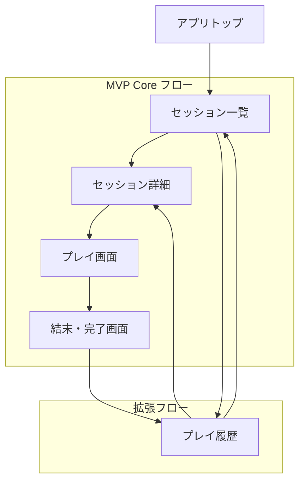

# Player文脈 アーキテクチャ概要

## 📅 設計概要

**最終更新**: 2025-08-16  
**対象範囲**: Player文脈MVP設計全体  
**デザインシステム**: Tailwind CSS + @odyssage/ui  
**レスポンシブ対応**: モバイルファースト + デスクトップ最適化

## 🎯 設計理念・基本原則

### Player体験中心の設計原則

```markdown
## デザイン原則
1. **没入感の重視**: TRPGの物語世界への没入を妨げない
2. **選択の明確化**: 重要な決断を直感的に理解できる
3. **進行の可視化**: プレイ状況・進行度を常に把握可能
4. **記録の価値化**: プレイ履歴を魅力的に表示・振り返り可能

## 体験設計の核心
- **発見の楽しさ**: シナリオ選択が楽しい体験
- **没入のスムーズさ**: プレイ開始から物語への自然な入り込み
- **選択の重み**: 決断の重要性を感じられるUI
- **達成の満足感**: 完了時の達成感・振り返りの価値
```

## 📱 画面構成・ナビゲーション

### 主要画面一覧

| 画面名 | ファイル | 主要機能 | MVP優先度 |
|--------|---------|---------|----------|
| [セッション一覧](./screens/session-list.md) | session-list.md | セッション探索・選択 | ✅ 必須 |
| [セッション詳細](./screens/session-detail.md) | session-detail.md | セッション詳細確認・参加 | ✅ 必須 |
| [プレイ画面](./screens/play-session.md) | play-session.md | 基本プレイ体験・シーン進行 | ✅ 必須 |
| [プレイ履歴](./screens/play-history.md) | play-history.md | プレイ記録・振り返り | 🔄 Phase2 |

### ナビゲーション階層



## 🎨 デザインシステム

### レスポンシブ戦略

```typescript
interface ResponsiveStrategy {
  mobile_first: {
    primary_use_case: "移動中・隙間時間でのプレイ";
    key_features: ["片手操作", "読みやすいテキスト", "明確なタッチターゲット"];
    constraints: ["画面サイズ制約", "通信環境考慮", "バッテリー消費"];
  };
  
  desktop_enhancement: {
    enhanced_features: ["より詳細な情報表示", "複数情報の同時表示"];
    layout_optimization: ["サイドバー活用", "複数カラム表示", "ホバー状態の活用"];
    // MVP範囲外: キーボードショートカット
  };
  
  responsive_breakpoints: {
    mobile: "< 768px";
    tablet: "768px - 1024px";
    desktop: "> 1024px";
  };
}
```

### カラーパレット

```typescript
interface PlayerColorPalette {
  primary: {
    main: "#2563eb"; // Blue-600 - 信頼感・安定感
    light: "#3b82f6"; // Blue-500
    dark: "#1d4ed8"; // Blue-700
    contrast: "#ffffff";
  };
  
  secondary: {
    main: "#7c3aed"; // Violet-600 - 冒険・神秘
    light: "#8b5cf6"; // Violet-500
    dark: "#5b21b6"; // Violet-700
    contrast: "#ffffff";
  };
  
  accent: {
    success: "#059669"; // Green-600 - 完了・成功
    warning: "#d97706"; // Amber-600 - 注意・重要
    danger: "#dc2626"; // Red-600 - 危険・失敗
    info: "#0284c7"; // Sky-600 - 情報・ヒント
  };
  
  story_atmosphere: {
    fantasy: "#6366f1"; // Indigo-500
    scifi: "#06b6d4"; // Cyan-500
    horror: "#ef4444"; // Red-500
    mystery: "#8b5cf6"; // Violet-500
    adventure: "#f59e0b"; // Amber-500
  };
}
```

## 🔧 MVP制約・技術方針

### MVP制約（厳守事項）

#### GM1-vs-Player1モデル
- ✅ シンプルなセッション構造
- ❌ 複数参加者管理・参加者数表示

#### 基本操作のみ
- ✅ マウス・タッチ操作
- ❌ キーボード操作・フルアクセシビリティ

#### 没入感重視
- ✅ 物語体験中心のUI
- ❌ 詳細な進行表示・時間管理
- ❌ 過度な機能・UI要素

### アクセシビリティ基準

```markdown
## MVP範囲
- 基本的なマウス・タッチ操作のみ対応
- 読みやすいテキスト・十分なコントラスト
- 明確なタッチターゲットサイズ

## 将来拡張（Phase2以降）
- WCAG 2.1 AA準拠
- キーボード操作対応
- スクリーンリーダー対応
```

## 📊 パフォーマンス基準

### Core Web Vitals

```markdown
## 必須基準
- 初回ページロード: 2秒以内（3G環境）
- 画面遷移: 300ms以内
- インタラクション応答: 100ms以内

## 画像・メディア
- 画像遅延読み込み（Lazy Loading）
- WebP形式対応
- レスポンシブ画像配信
```

## 🔄 進化的設計アプローチ

### 設計更新の原則

1. **BDDフィードバック重視**: ユーザーレビューからの学習を即座反映
2. **MVP第一**: 過剰品質より核心価値提供を優先
3. **文書同期**: 設計変更時の関連文書同期更新
4. **変更記録**: 全ての設計判断の理由・経緯を記録

### 最近の重要な学習・変更

#### BDDレビューからの学習（2025-08-16）
- **没入感重視**: 進行状況・時間表示をMVP範囲外に変更
- **シンプル性**: 選択後の中間メッセージ除去
- **セッション完了**: 再プレイ機能をMVP範囲外に変更
- **履歴管理**: 選択履歴の明示的確認を内部保持のみに変更

## 📋 関連文書・リンク

### 画面設計詳細
- [セッション一覧画面](./screens/session-list.md)
- [セッション詳細画面](./screens/session-detail.md)  
- [プレイ画面](./screens/play-session.md)
- [プレイ履歴画面](./screens/play-history.md)

### アーキテクチャ文書
- [技術アーキテクチャ](./architecture.md)
- [データ設計](./data-design.md)
- [API設計](./api-design.md)

### 要件・BDD文書
- [要件定義](./requirements.md)
- [BDD Features](../../../packages/bdd-e2e-test/e2e/features/)

### プロセス文書
- [進化的設計アプローチ](../../03-development/sprints/sprint_004/evolutionary-design-approach.md)
- [協働記録](../../03-development/sprints/sprint_004/collaboration-record.md)

## 📝 メタデータ

**作成者**: 設計担当・テスト担当（Claude Code）  
**承認者**: リーダー（承認済み）  
**MVP適用**: Sprint 4 Phase 1B完了済み  

**更新履歴**:
- 2025-08-16: 初版作成（Sprint4設計からの上位移動）
- 2025-08-16: BDDレビューフィードバック反映済み設計統合
- 2025-08-16: 1画面1ドキュメント原則に基づく構造化

**重要事項**:
> この概要文書は生きたドキュメントとして、実装・テスト・ユーザーフィードバックに基づいて継続的に更新されます。
> 各画面の詳細設計は個別ファイルに分離し、保守性・可読性を向上させています。

#player-context #architecture-overview #mvp-design #responsive-design #evolutionary-design