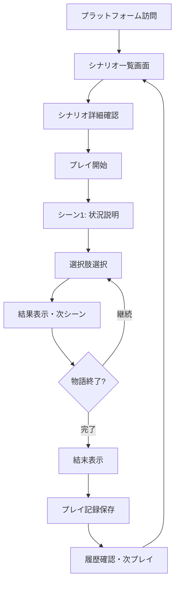

# Player文脈MVP要件定義書

## 📅 作成概要

**作成日**: 2025-08-16  
**対象**: Player文脈MVP実装  
**ステータス**: 設計中  

## 🎯 Player文脈の核心価値

### Player文脈でのユーザー体験ビジョン

```markdown
## "自分だけの冒険を気軽に始められる" 体験
プレイヤーは、興味のあるシナリオを見つけて、
自分のペースでTRPG体験を楽しむことができる。

## 価値提供の核心要素
1. **発見の楽しみ**: 多様なシナリオとの出会い
2. **選択の重み**: 自分の決断が物語に反映される実感
3. **記録の蓄積**: プレイログが自然に残る体験
4. **比較の面白さ**: 異なる選択による展開の違いを観察
```

### Player特有の価値体験

```typescript
interface PlayerExperience {
  discovery: {
    scenario_browsing: "豊富なシナリオの閲覧・検索";
    filtering: "自分好みのシナリオ発見";
    preview: "シナリオの魅力を事前に理解";
  };
  
  engagement: {
    choice_driven_story: "選択による物語分岐の実感";
    personal_pacing: "自分のペースでの進行";
    meaningful_decisions: "結果が明確に反映される選択";
  };
  
  reflection: {
    play_log_review: "自分のプレイ履歴の振り返り";
    different_paths: "他の選択肢による展開の想像";
    story_completion: "物語完了の達成感";
  };
}
```

## 🏗️ MVP機能範囲定義

### Phase 1: コアプレイ体験（必須機能）

#### 1. セッション探索・選択機能
```markdown
**機能概要**: プレイ可能なセッションの発見・選択

**詳細機能**:
- セッション一覧表示（カード形式）
- セッション詳細表示（概要、難易度、プレイ時間）
- セッション参加機能
<!-- MVP制約: フィルタリング・検索機能は除外（BDDレビューフィードバック対応） -->
<!-- 理由: "シナリオ名によるフィルタリングはMVPでは不要" -->
<!-- 代替: シンプルな一覧表示のみでMVP体験を実現 -->

**成功条件**:
✅ 5つ以上のリアルなTRPGセッションから選択可能
✅ セッションの魅力が事前に理解できる
✅ 参加開始まで3クリック以内
```

#### 2. ゲームブック形式プレイ機能
```markdown
**機能概要**: 単独でのTRPG体験実現

**詳細機能**:
- シーン表示（背景、状況説明、選択肢）
- 選択肢選択による物語進行
- 選択結果の即座反映
- プレイ進行状況の表示
- 複数結末への分岐実現

**成功条件**:
✅ 30分程度のプレイ体験を実現
✅ 選択による明確な物語変化
✅ 最低3つの異なる結末を用意
```

#### 3. プレイ記録・履歴機能
```markdown
**機能概要**: プレイ体験の自動記録・振り返り

**詳細機能**:
- 選択履歴の自動記録
- プレイ完了時の結末表示
- 過去のプレイ記録一覧
- 同シナリオでの異なる選択結果比較

**成功条件**:
✅ プレイ体験が自動で記録される
✅ 過去のプレイを後から振り返れる
✅ 複数回プレイで異なる体験を実現
```

#### 4. 基本的なユーザー管理
```markdown
**機能概要**: 最低限のユーザー識別・データ保持

**詳細機能**:
- 仮名ユーザー作成（認証なし）
- LocalStorage活用のデータ保持
- ユーザー切り替え機能
- プレイデータの初期化機能

**成功条件**:
✅ ブラウザ再読み込み後もデータ保持
✅ 複数ユーザーでの利用可能
✅ データ削除・リセット機能
```

### Phase 1 除外機能（将来実装）

```markdown
## MVP範囲外の機能（BDDレビューフィードバック反映）
- セッション検索・フィルタリング機能
- カテゴリ・タグによる絞り込み
- キーボード操作・高度なアクセシビリティ
- 参加者数表示・管理機能

## 認証・サーバー連携機能
- Firebase認証
- サーバーサイドデータ保存
- ユーザー間でのデータ共有

## 高度な機能
- リアルタイム通知
- ソーシャル機能
- ランキング・実績機能
- 詳細な分析機能
```

## 🎮 具体的なユーザーフロー設計

### メインフロー: シナリオ発見→プレイ→振り返り



### サブフロー詳細

#### 1. シナリオ発見フロー
```markdown
1. **一覧画面アクセス**
   - 利用可能なシナリオの一覧表示
   - カード形式での概要表示（タイトル、概要、難易度、プレイ時間）
   
2. **フィルタリング・検索**
   - カテゴリ選択（ファンタジー、SF、ホラー、etc）
   - 難易度フィルタ（初心者、中級者、上級者）
   - プレイ時間フィルタ（15分、30分、1時間）
   
3. **詳細確認**
   - シナリオの詳細説明
   - プレイに必要な時間
   - 他プレイヤーのプレイ実績表示（プライバシー配慮済み）
```

#### 2. プレイ体験フロー
```markdown
1. **プレイ環境準備**
   - プレイヤー名設定（仮名可）
   - プレイ環境説明
   - シナリオ導入部の表示
   
2. **物語進行**
   - シーン背景・状況の詳細説明
   - 2-4個の選択肢提示
   - 選択による即座の結果反映
   - 次シーンへの自然な遷移
   
3. **結末到達**
   - プレイヤーの選択経路による結末決定
   - 結末の詳細表示
   - プレイ統計の表示（プレイ時間、選択回数、etc）
```

#### 3. 振り返り・継続フロー
```markdown
1. **プレイ記録確認**
   - 今回のプレイサマリー
   - 重要な選択ポイントのハイライト
   - 到達した結末の説明
   
2. **他の可能性探索**
   - 同シナリオの再プレイ案内
   - 異なる選択による展開の示唆
   - 関連シナリオの推薦
   
3. **継続プレイ**
   - 新しいシナリオへの誘導
   - プレイ履歴の管理
   - お気に入りシナリオの保存
```

## 📊 技術的実現方法

### バックエンド非依存の価値提供戦略

```typescript
interface MVPImplementationStrategy {
  data_management: {
    scenario_content: "JSON静的ファイルによるシナリオデータ";
    user_data: "LocalStorage活用のクライアントサイド保存";
    play_sessions: "ブラウザ内でのセッション管理";
  };
  
  content_delivery: {
    scenario_structure: "Neo4jライクなJSONツリー構造";
    choice_branching: "静的な分岐データによる動的生成";
    result_calculation: "クライアントサイドでの結果判定";
  };
  
  user_experience: {
    responsive_design: "モバイル・デスクトップ両対応";
    progressive_enhancement: "段階的な機能提供";
    performance_optimization: "初回ロード最適化";
  };
}
```

### データ保存・管理方式

```markdown
## LocalStorage活用設計

### 保存データ構造
1. **ユーザープロファイル**
   - ユーザーID（UUID生成）
   - 表示名
   - 作成日時
   
2. **プレイセッション記録**
   - セッションID
   - シナリオID
   - 選択履歴配列
   - 到達結末
   - プレイ開始・終了時刻
   
3. **ユーザー設定**
   - 表示設定
   - プレイ履歴の表示方法
   - お気に入りシナリオ

### データ管理ポリシー
- 最大50セッション記録まで保持
- 古いデータの自動削除
- エクスポート・インポート機能（将来実装）
```

## 🎯 成功指標と品質基準

### ユーザー体験成功指標

```markdown
## プライマリ指標（必須達成）
✅ **エンゲージメント**: 自分が30分以上継続してプレイしたくなる
✅ **リプレイ価値**: 同じシナリオを異なる選択で再プレイしたくなる
✅ **完了感**: シナリオ完了時に満足感・達成感を得られる

## セカンダリ指標（推奨達成）
✅ **発見体験**: 新しいシナリオを探すのが楽しい
✅ **比較楽しさ**: 異なる選択結果を比較するのが面白い
✅ **記録価値**: プレイ履歴を後から見返したくなる
```

### 技術品質基準

```markdown
## パフォーマンス基準
- 初回ページロード: 2秒以内
- シーン遷移: 500ms以内
- レスポンシブ対応: モバイル・デスクトップ

## 品質基準
- TypeScript型安全性: 100%
- テストカバレッジ: 80%以上（重要な機能）
- ESLint違反: 0件
- アクセシビリティ: WCAG 2.1 AA基準
```

## 🔄 Phase 2への発展計画

### Phase 1完了後の拡張要素

```markdown
## 認証・永続化機能
- Firebase認証システム導入
- Cloud Firestoreでのデータ永続化
- ユーザー間でのプレイ記録共有

## ソーシャル機能
- プレイ記録の公開・共有
- 他プレイヤーのプレイログ閲覧
- シナリオへの評価・レビュー機能

## 高度なゲーム機能
- ダイスシステム
- キャラクターシート管理
- より複雑な分岐システム
```

### アーキテクチャ発展方針

```markdown
## データ管理の進化
LocalStorage → Firebase → PostgreSQL + Neo4j
静的JSON → 動的API → 高度なクエリシステム

## 機能の段階的拡張
Player文脈MVP → Author文脈追加 → GM文脈統合
単独プレイ → 協調プレイ → リアルタイムセッション
```

## 📋 実装準備状況

### 必要な設計成果物

```markdown
## 完了必須事項
1. **詳細なUI/UX設計** - 4つの主要画面設計
2. **モックデータ構造設計** - リアルなTRPGシナリオデータ
3. **FSD準拠アーキテクチャ設計** - Player文脈ディレクトリ構造
4. **状態管理設計** - Redux + SWR + useState使い分け設計

## 実装開始可能な条件
✅ コンポーネント仕様の詳細化完了
✅ モックデータのサンプル準備完了
✅ 開発環境・ツール設定確認完了
```

## 🎉 Phase 1完了時の達成状態

```markdown
## ユーザー体験の達成状態
- 5つ以上のTRPGシナリオでプレイ可能
- 各シナリオで3つ以上の異なる結末体験
- プレイ記録の自動保存・履歴確認機能
- 30分程度の満足できるプレイ体験

## 技術的達成状態
- Context-First + FSD準拠のアーキテクチャ
- 型安全なTypeScript実装
- レスポンシブ対応のUI
- バックエンド非依存での価値提供実現

## プロジェクト的達成状態
- Phase 2への明確な発展計画
- 実装経験の技術記事化準備
- 他者にも試してもらえる完成度
```

---

## 📝 メタデータ

**作成者**: 設計担当Claude Code  
**承認者**: リーダー（承認待ち）  
**関連文書**: 
- [PROJECT_VISION.md](../../PROJECT_VISION.md)
- [frontend-architecture.md](../../02-architecture/frontend-architecture.md)
- [phase1-implementation-plan.md](phase1-implementation-plan.md)

**更新履歴**:
- 2025-08-16: 初版作成（設計担当）
- 2025-08-16: BDDレビューフィードバック反映（フィルタリング機能除外、GM1-vs-Player1制約適用）
  - 参照: Sprint 4 BDDレビュー "シナリオ名によるフィルタリングはMVPでは不要"
  - セッション中心設計への統一
  - MVP範囲外機能の明確化

#player-context #mvp-requirements #trpg-experience #phase1 #requirements-definition