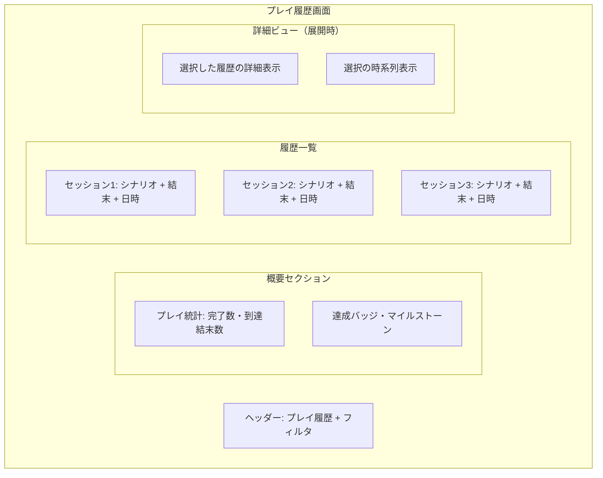

# プレイ履歴画面設計

## 📅 基本情報

**画面名**: プレイ履歴画面（Play History）  
**機能**: プレイ記録・振り返り体験  
**MVP優先度**: 🔄 Phase2（拡張機能）  
**実装予定**: Sprint 4 Phase 2以降

## 🎯 画面の目的・価値

### 主要機能
1. **プレイ記録表示**: 過去のプレイセッション一覧・統計
2. **振り返り体験**: プレイ内容の確認・比較
3. **継続促進**: 次のプレイへの動機付け

### ユーザー価値
- **記録の価値**: プレイ体験の蓄積・振り返り
- **成長実感**: プレイスタイル・選択傾向の把握
- **継続動機**: 新しいシナリオ・結末への興味喚起

## 📱 画面構成・レイアウト

### 全体構造



### MVP制約・Phase2設計

```typescript
interface PlayHistoryLayoutSpec {
  phase2_scope: {
    basic_list: "完了セッションの基本一覧";
    simple_stats: "基本的な統計情報";
    minimal_detail: "シンプルな詳細確認";
  };
  
  // Phase3以降の拡張機能
  future_enhancements: {
    advanced_analytics: "詳細な分析・比較機能";
    social_features: "他ユーザーとの比較";
    recommendation: "おすすめシナリオ提案";
  };
  
  responsive_layout: {
    mobile: "カードリスト、縦積み";
    tablet: "2カラムグリッド + 統計サイドバー";
    desktop: "3カラム、リスト + 詳細 + 統計";
  };
}
```

## 🎨 UI仕様・デザイン詳細

### 統計概要セクション

```typescript
interface HistoryStatsSpec {
  basic_statistics: {
    completed_sessions: "完了セッション数";
    unique_scenarios: "プレイしたシナリオ数";
    unique_endings: "到達した結末数";
    // MVP範囲外: total_play_time: "累計プレイ時間";
  };
  
  achievement_system: {
    completion_badges: "完了数に応じたバッジ";
    exploration_badges: "多様なジャンル体験バッジ";
    // 将来機能: time_based_badges: "継続プレイバッジ";
    // 将来機能: special_achievements: "特別な達成バッジ";
  };
  
  visual_presentation: {
    card_format: "統計情報のカード表示";
    progress_indicators: "達成度の視覚的表示";
    color_coding: "達成レベルに応じた色分け";
  };
}
```

### セッション履歴カード

```typescript
interface SessionHistoryCardSpec {
  basic_information: {
    scenario_thumbnail: "シナリオサムネイル画像";
    scenario_title: "シナリオタイトル";
    completion_date: "完了日時";
    session_outcome: "到達した結末";
  };
  
  play_summary: {
    key_choices: "主要な選択・プレイスタイル";
    ending_type: "エンディングの種類・評価";
    // MVP範囲外: detailed_path: "詳細な選択経路";
  };
  
  interaction_options: {
    view_details: "詳細確認（展開・別画面）";
    // MVP範囲外: replay_scenario: "再プレイ（別セッション作成）";
    // MVP範囲外: share_results: "結果共有";
  };
  
  card_states: {
    default: "通常表示";
    expanded: "詳細展開表示";
    loading: "詳細読み込み中";
  };
}
```

## 📊 データ表示・フィルタリング

### 履歴データ管理

```typescript
interface HistoryDataManagement {
  data_structure: {
    session_record: {
      session_id: "セッションID";
      scenario_info: "シナリオ基本情報";
      completion_data: "完了時のデータ";
      play_summary: "プレイ概要・選択サマリー";
    };
  };
  
  filtering_options: {
    by_scenario: "シナリオ別フィルタ";
    by_completion_date: "完了日付でのフィルタ";
    by_ending_type: "結末種類でのフィルタ";
    // 将来機能: by_genre: "ジャンル別フィルタ";
  };
  
  sorting_options: {
    chronological: "時系列順（新しい順・古い順）";
    scenario_name: "シナリオ名順";
    // 将来機能: play_time: "プレイ時間順";
    // 将来機能: rating: "評価順";
  };
}
```

## 🔍 詳細確認・振り返り機能

### セッション詳細表示

```typescript
interface SessionDetailViewSpec {
  basic_detail_view: {
    scenario_overview: "シナリオ概要の再表示";
    play_timeline: "主要な選択ポイントの時系列";
    ending_summary: "到達結末の詳細";
    completion_stats: "そのセッションの基本統計";
  };
  
  choice_review: {
    key_decisions: "重要な選択ポイントのハイライト";
    choice_summary: "選択傾向の簡潔な表示";
    // 将来機能: alternative_paths: "他の選択肢の示唆";
    // 将来機能: decision_analysis: "選択パターン分析";
  };
  
  comparison_features: {
    // Phase3機能: multiple_playthroughs: "同シナリオ複数プレイ比較";
    // Phase3機能: global_comparison: "他プレイヤーとの比較";
    // Phase3機能: optimization_hints: "より良い選択への示唆";
  };
}
```

## 🚀 Phase2実装スコープ

### 最小実装範囲

```markdown
## Phase2 MVP機能
- ✅ 完了セッション一覧表示
- ✅ 基本統計情報（完了数・シナリオ数・結末数）
- ✅ セッション基本情報表示
- ✅ 簡単な詳細確認
- ✅ 日付・シナリオでの基本フィルタ

## Phase2では除外
- ❌ 高度な分析・比較機能
- ❌ 再プレイ機能（MVP全体方針）
- ❌ ソーシャル機能・共有
- ❌ 詳細な統計・グラフ表示
```

### 技術実装方針

```typescript
interface Phase2ImplementationSpec {
  data_storage: {
    local_priority: "ローカルストレージ優先";
    sync_strategy: "サーバー同期は最小限";
    offline_support: "オフライン閲覧対応";
  };
  
  performance_optimization: {
    lazy_loading: "履歴データの遅延読み込み";
    pagination: "大量履歴の分割表示";
    caching: "適切なデータキャッシュ";
  };
  
  extensibility: {
    component_design: "Phase3拡張を考慮した設計";
    data_structure: "将来機能追加に対応可能な構造";
    api_design: "拡張可能なAPI設計";
  };
}
```

## ⚡ パフォーマンス・技術仕様

### 応答性要件

```markdown
## パフォーマンス目標（Phase2）
- **初期表示**: 2秒以内（履歴一覧）
- **詳細展開**: 500ms以内（キャッシュ済みデータ）
- **フィルタ適用**: 300ms以内（ローカル処理）
- **データ同期**: バックグラウンド実行、ユーザー体験を阻害しない
```

### データ管理

```typescript
interface HistoryDataTechSpec {
  storage_strategy: {
    primary: "IndexedDB（大容量ローカル）";
    fallback: "localStorage（基本データ）";
    cloud_backup: "定期的なクラウド同期";
  };
  
  data_size_management: {
    retention_policy: "古いデータの適切な管理";
    compression: "画像・大容量データの圧縮";
    cleanup: "不要データの定期削除";
  };
  
  privacy_security: {
    user_data_protection: "ユーザープライバシーの保護";
    secure_storage: "機密データの適切な暗号化";
    data_portability: "データエクスポート機能（将来）";
  };
}
```

## 🧪 テスト観点・品質基準

### Phase2テスト方針

```markdown
## 基本機能テスト
- ✅ 履歴データの正確な表示
- ✅ フィルタ・ソート機能の動作
- ✅ 詳細表示の正確性
- ✅ データの永続性・復旧

## ユーザビリティテスト  
- ✅ 履歴確認の容易さ
- ✅ 情報の見つけやすさ
- ✅ 振り返り体験の満足度
- ✅ 継続プレイへの動機付け効果

## パフォーマンステスト
- ✅ 大量履歴での応答性
- ✅ メモリ使用量の適正性
- ✅ オフライン・オンライン切り替え
```

## 🔗 関連文書・依存関係

### 画面遷移
- **プレイ完了**: [プレイ画面](./play-session.md)
- **新規プレイ**: [セッション一覧画面](./session-list.md)

### 技術依存
- **API**: プレイ履歴取得・統計API
- **ストレージ**: ローカル履歴保存・クラウド同期
- **認証**: ユーザー履歴アクセス権限

### 設計文書
- **全体概要**: [Player文脈概要](../overview.md)
- **データ設計**: [データ設計](../data-design.md)

## 📝 更新履歴

**2025-08-16**: 初版作成
- Phase2実装向けの設計分離
- MVP制約に基づく機能スコープ設定
- 将来拡張を考慮した設計構造

**設計方針**: Phase2実装時に詳細仕様を確定、Phase3以降の拡張機能は別途設計

#play-history #player-context #phase2-feature #screen-design