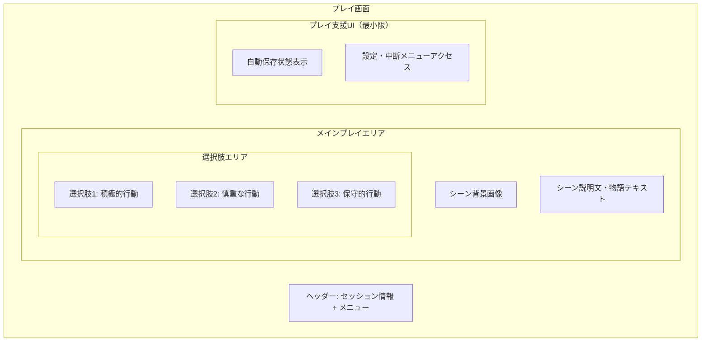
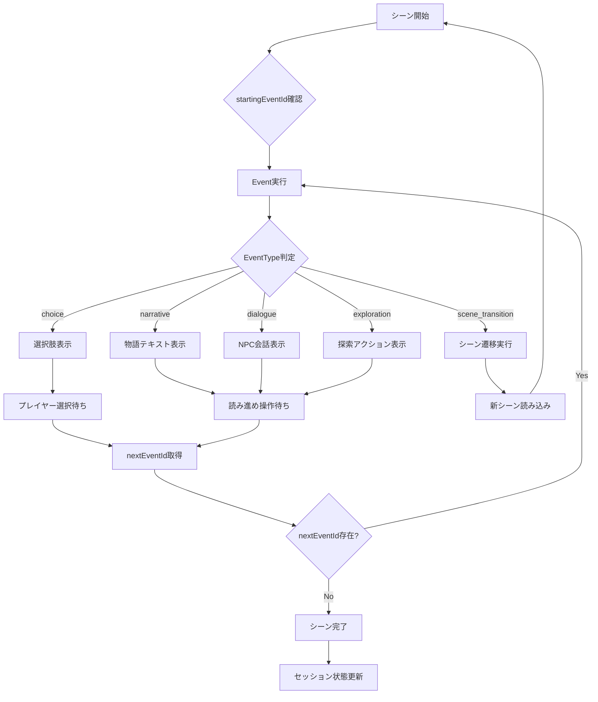

# プレイ画面設計

## 📅 基本情報

**画面名**: プレイ画面（Play Session）  
**機能**: 基本プレイ体験・シーン進行  
**MVP優先度**: ✅ 必須  
**対応BDD**: [play-experience.feature](../../../../packages/bdd-e2e-test/e2e/features/play-experience.feature)

## 🎯 画面の目的・価値

### 主要機能
1. **没入的プレイ体験**: TRPGシナリオの物語世界への没入
2. **選択肢システム**: 意味のある選択による物語進行
3. **シーン進行管理**: 滑らかなシーン遷移・状態保存

### ユーザー価値
- **没入感**: 物語世界への深い没入体験
- **選択の重み**: 判断が物語に与える影響の実感
- **継続性**: 中断・復帰可能な柔軟なプレイ体験

## 📱 画面構成・レイアウト

### 全体構造



### 没入感重視のレイアウト

```typescript
interface ImmersivePlayLayoutSpec {
  design_philosophy: {
    immersion_first: "物語体験を最優先、UIの最小化";
    story_focus: "シーンコンテンツを画面の80%以上に配分";
    minimal_chrome: "ナビゲーション・メタUIの最小化";
  };
  
  responsive_layout: {
    mobile: "フルスクリーン、最小限のヘッダー";
    tablet: "画面活用最大化、サイドマージン最小";
    desktop: "中央集中レイアウト、適切な読み幅";
  };
  
  // MVP制約: 以下は除外
  // progress_indicators: "進行状況バー・チャプター表示";
  // time_tracking: "プレイ時間・経過時間表示";
  // detailed_history: "詳細な選択履歴表示";
}
```

## 🎨 UI仕様・デザイン詳細

### シーン表示システム

```typescript
interface ScenePresentationSpec {
  background_image: {
    aspect_ratio: "16:9推奨、可変対応";
    loading_strategy: "プログレッシブ読み込み + フォールバック";
    overlay_support: "テキスト読みやすさのためのオーバーレイ";
    fallback_design: "画像なし時のデフォルト背景";
  };
  
  story_text: {
    font_family: "Georgia, serif（物語専用セリフフォント）";
    font_size: "clamp(1rem, 2vw, 1.125rem)";
    line_height: "1.7（読みやすさ重視）";
    color_contrast: "高コントラスト、背景に応じた適応";
    max_width: "65ch（最適読み幅）";
  };
  
  text_reveal: {
    initial_display: "即座の全文表示（MVPでは簡素化）";
    // 将来機能: typewriter_effect: "タイプライター効果";
    // 将来機能: paragraph_by_paragraph: "段落単位での表示";
  };
}
```

### 選択肢インターフェース

```typescript
interface ChoiceInterfaceSpec {
  layout_strategy: {
    arrangement: "縦積み、十分な間隔";
    touch_target: "最小44px高さ、十分なタップエリア";
    visual_hierarchy: "選択肢の重要度・危険度を色・スタイルで表現";
  };
  
  choice_styling: {
    default_state: "明確な境界、読みやすいテキスト";
    hover_state: "ホバー時の視覚フィードバック";
    selected_state: "選択時の即座のハイライト";
    disabled_state: "選択後の他選択肢無効化";
  };
  
  choice_types: {
    standard: "通常の選択肢（ニュートラル）";
    risky: "リスクのある選択肢（注意色）";
    safe: "安全な選択肢（安心色）"; 
    important: "重要な選択肢（強調）";
  };
  
  interaction_flow: {
    selection: "選択 → 即座のハイライト → 次シーン遷移";
    // MVP範囲外: confirmation: "重要選択時の確認ダイアログ";
    // MVP範囲外: loading_message: "選択処理中メッセージ";
  };
}
```

## 🔄 シーン進行・遷移システム

### 遷移フロー

```markdown
## シーン進行フロー（MVP版）
1. **シーン表示**
   - 背景画像の読み込み・表示
   - シーン説明文の表示
   - 選択肢の表示（アニメーション最小限）
   
2. **選択インタラクション**
   - 選択肢クリック → 即座のハイライト
   - 他選択肢の無効化
   - 次シーンへの直接遷移（中間メッセージなし）
   
3. **次シーン準備**
   - 自動保存の実行
   - 次シーンデータの読み込み
   - 新シーンの表示（3秒以内）
```

### 状態管理

```typescript
interface PlayStateManagementSpec {
  auto_save: {
    trigger_events: ["選択完了時", "シーン遷移時"];
    save_data: ["現在シーン", "選択履歴", "プレイ時刻"];
    failure_handling: "保存失敗時の再試行・ユーザー通知";
  };
  
  session_continuity: {
    pause_resume: "画面離脱・復帰時の状態復元";
    crash_recovery: "異常終了時の状態復旧";
    cross_device: "デバイス間でのセッション継続（将来機能）";
  };
  
  // MVP制約: シンプルな状態管理
  minimal_state: {
    current_scene: "現在のシーンID・内容";
    choice_history: "選択履歴（内部保持、表示なし）";
    session_meta: "セッション基本情報";
  };
}
```

## 🎮 ユーザーインタラクション

### プレイ操作

```typescript
interface PlayInteractionSpec {
  core_interactions: {
    choice_selection: "選択肢タップ・クリック";
    scene_navigation: "自動的なシーン進行";
    menu_access: "設定・中断メニューへのアクセス";
  };
  
  secondary_interactions: {
    pause_play: "一時停止・再開";
    save_game: "手動保存（自動保存補完）";
    exit_session: "セッション中断・終了";
  };
  
  // MVP範囲外
  // keyboard_shortcuts: "キーボード操作";
  // choice_history_view: "選択履歴の詳細確認";
  // scene_replay: "過去シーンの再確認";
}
```

### メニューシステム

```typescript
interface PlayMenuSpec {
  menu_access: {
    trigger: "ヘッダー内メニューボタン";
    display: "オーバーレイ形式、没入感を損なわない";
    close: "背景タップ・メニューボタン再押しで閉じる";
  };
  
  menu_options: {
    save_game: "現在の状態を保存";
    settings: "音量・表示設定等";
    exit_session: "セッション一覧に戻る";
    // MVP範囲外: help: "ヘルプ・操作説明";
  };
  
  confirmation_flows: {
    exit_confirmation: "セッション終了時の確認";
    save_feedback: "保存完了の簡潔なフィードバック";
  };
}
```

## ⚡ パフォーマンス・技術仕様（MVP制約）

### MVP範囲外（Phase 2以降）
```markdown
## MVPのやらないこと（パフォーマンス最適化）
- 詳細なパフォーマンス要件・最適化（Phase 2以降）
- 高度な画像最適化・キャッシュ戦略
- 厳密な応答時間要件・レスポンシブ最適化
- パフォーマンス監視・測定システム

## MVP段階での基本要件
- 基本的な動作確保（確実なEvent処理・画面遷移）
- 標準的なWeb UI応答性
- 基本的なエラーハンドリング
```

### エラーハンドリング

```markdown
## エラー状態・復旧

### 基本的なエラー表示（MVP制約）
- **表示**: "エラーが発生しました"
- **アクション**: "再試行"ボタンのみ
- **復旧**: 前の状態への基本的な復旧

### MVP範囲外（Phase 2以降）
- 詳細なエラー分類・復旧戦略
- 自動リトライ・高度な復旧機能  
- ネットワークエラー・データ不整合の詳細対応
```

## 🏁 プレイ完了・エンディング

### 完了画面仕様

```typescript
interface PlayCompletionSpec {
  ending_presentation: {
    final_scene: "エンディングシーンの適切な表示";
    completion_message: "「プレイ完了おめがとうございます！」";
    story_summary: "到達エンディング・主要選択の振り返り";
  };
  
  completion_data: {
    ending_type: "到達したエンディングの種類";
    play_summary: "主要な選択・プレイスタイルの概要";
    // MVP範囲外: total_time: "総プレイ時間";
    // MVP範囲外: statistics: "詳細なプレイ統計";
  };
  
  post_completion_actions: {
    return_to_list: "セッション一覧に戻る";
    // MVP範囲外: replay_session: "再プレイ（別セッション）";
    // MVP範囲外: share_results: "結果共有";
  };
}
```

## 🧪 テスト観点・品質基準

### BDD Feature対応

```gherkin
# 主要シナリオ（play-experience.feature より）
Scenario: プレイ画面の初期表示
  Given プレイヤーがプレイ画面にアクセスする
  Then シーン背景画像が表示される
  And シーン説明文が表示される
  And 選択肢が表示される

Scenario: 選択肢の選択と次シーンへの遷移
  Given プレイヤーが選択肢を表示している
  When プレイヤーが選択肢を選択する
  Then 選択した選択肢がハイライトされる
  And 3秒以内に次のシーンに遷移する
```

### 品質チェックポイント

```markdown
## 没入感・体験品質
- ✅ 物語世界への没入を妨げないUI
- ✅ 選択の重みを感じられるインタラクション
- ✅ 滑らかなシーン遷移・進行感
- ✅ 中断・復帰の自然な体験

## 機能品質
- ✅ 選択肢システムの確実な動作
- ✅ シーン進行の正確性
- ✅ 状態保存・復旧の確実性
- ✅ エラー時の適切な復旧

## パフォーマンス品質
- ✅ 応答性基準の達成
- ✅ 画像読み込みの最適化
- ✅ メモリ使用量の適正性
```

## 🛣️ ルーティング統合・画面遷移

### **PlaySessionページ ルーティング仕様（緊急追加）**

#### **ルート定義・パラメータ**
```typescript
interface PlaySessionRouting {
  // メインルート: /player/session/:sessionId/play
  primary_route: "/player/session/:sessionId/play";
  
  // シーン指定ルート: /player/session/:sessionId/play/:sceneId
  scene_specific_route: "/player/session/:sessionId/play/:sceneId";
  
  // パラメータ仕様
  params: {
    sessionId: "必須 - Session.id と対応";
    sceneId: "オプショナル - 特定シーン開始用";
  };
  
  // 遷移元ルート
  entry_points: {
    from_session_detail: "/player/session/:sessionId → 参加ボタン";
    from_session_list: "/player/sessions → 直接参加ボタン";
    from_bookmark: "ブックマーク・履歴からの復帰（将来）";
  };
}
```

#### **データ取得・状態管理統合**
```typescript
interface PlaySessionDataFlow {
  // URL → データ読み込みフロー
  initialization: {
    url_params: "sessionId, sceneId取得";
    session_validation: "sessionId存在確認・参加権限確認";
    state_restoration: "LocalStorage経由でのセッション状態復元";
    event_engine_init: "useEventEngine初期化・開始Event決定";
  };
  
  // Event処理とURL状態の関係
  url_state_policy: {
    sessionId: "URL固定 - セッション識別・状態管理キー";
    sceneId: "初期表示のみ - Event進行中は状態管理で追跡";
    eventId: "URL管理対象外 - useEventEngine内部状態";
    choice_state: "URL管理対象外 - 一時的UI状態";
  };
}
```

#### **エラーハンドリング・ルーティング復旧**
```markdown
ルーティングエラー対応:
❌ 無効sessionId → /player/sessions リダイレクト + エラーメッセージ
❌ 無効sceneId → シナリオ開始シーンへフォールバック
❌ セッション終了済み → 読み取り専用モード または 履歴表示
❌ データ取得失敗 → エラー表示 + リトライ + 戻るボタン

MVP制約:
✅ シンプルエラー表示・基本リダイレクト
❌ 複雑な復旧フロー・詳細エラー分類
❌ 高度な状態復元・履歴管理機能
```

### **PlaySessionContainer統合設計**
```markdown
Container責務:
✅ ルーティングパラメータ取得・バリデーション
✅ セッション状態復元・useEventEngine初期化
✅ エラーハンドリング・ルーティング復旧
✅ PlaySessionViewへの適切なProps受け渡し

packages/ui分離:
✅ PlaySessionView: プレゼンテーション専用・ルーティング非依存
✅ useEventEngine: Event処理専用・URL状態非依存
✅ Container: ルーティング統合・ビジネスロジック統合
```

## 🎯 シーン中のEvent処理設計

### Event概念統合UI/UX

#### MVP必須Event処理

```typescript
interface EventProcessingUISpec {
  // MVP必須: choiceイベント処理
  choice_event: {
    display_elements: [
      "選択肢リスト表示",
      "選択肢説明文",
      "選択ボタン群"
    ];
    interaction_flow: [
      "タップ選択",
      "選択確認",
      "nextEventId取得",
      "次イベント遷移"
    ];
    state_management: [
      "選択済み状態",
      "無効化状態",
      "進行中状態"
    ];
  };
  
  // MVP必須: narrativeイベント処理
  narrative_event: {
    display_elements: [
      "物語テキスト表示",
      "読み進めボタン",
      "テキスト表示状態"
    ];
    interaction_flow: [
      "テキスト表示完了待ち",
      "読み進め操作",
      "nextEventId取得",
      "次イベント遷移"
    ];
    text_presentation: [
      "MVP: 即座全文表示",
      "将来: タイプライター効果"
    ];
  };
  
  // MVP必須: scene_transitionイベント処理
  scene_transition_event: {
    display_elements: [
      "遷移メッセージ表示",
      "読み込み状態表示",
      "エラーハンドリング"
    ];
    interaction_flow: [
      "targetSceneId取得",
      "新シーン読み込み",
      "シーン表示更新",
      "自動遷移完了"
    ];
    feedback_states: [
      "遷移中状態表示",
      "読み込みエラー表示",
      "復旧オプション"
    ];
  };
}
```

#### MVP最小限Event処理

```typescript
interface MinimalEventProcessingSpec {
  // MVP最小限: dialogueイベント処理
  dialogue_event: {
    display_elements: [
      "NPC名表示",
      "NPCテキスト表示",
      "基本的な会話UI"
    ];
    interaction_flow: [
      "会話テキスト表示",
      "継続操作待ち",
      "nextEventId取得",
      "次イベント遷移"
    ];
    mvp_constraints: [
      "選択肢は別途ChoiceEventで管理",
      "シンプルなテキスト表示のみ",
      "複雑な会話システムは除外"
    ];
  };
  
  // MVP最小限: explorationイベント処理
  exploration_event: {
    display_elements: [
      "探索対象表示",
      "探索結果表示",
      "基本的なアクションUI"
    ];
    interaction_flow: [
      "探索アクション表示",
      "結果テキスト表示",
      "nextEventId取得",
      "次イベント遷移"
    ];
    mvp_constraints: [
      "MVP版では結果は単純なテキスト表示のみ",
      "複雑なアイテム管理は除外",
      "判定システムは除外"
    ];
  };
}
```

### Event処理フロー設計



### Event処理状態管理設計

```typescript
interface EventProcessingState {
  // 現在のEvent状態
  current_event: {
    scene_id: string;
    event_id: string;
    event_type: EventType;
    processing_status: 'loading' | 'displaying' | 'waiting_input' | 'transitioning';
  };
  
  // Event履歴管理
  event_history: {
    completed_events: PlayEvent[];
    current_session_events: PlayEvent[];
    save_frequency: 'every_event' | 'every_scene';
  };
  
  // UI状態管理
  ui_state: {
    text_display_complete: boolean;
    choice_selection_enabled: boolean;
    transition_in_progress: boolean;
    error_state?: string;
  };
  
  // MVP制約下でのシンプル状態管理
  mvp_constraints: {
    auto_save_enabled: true; // イベント毎の自動保存
    complex_animations: false; // 複雑なアニメーション除外
    detailed_logging: false; // 詳細ログ除外
  };
}
```

### MVP制約下でのEvent処理

```markdown
## MVP制約下でのEvent処理

### 実装必須Event
- **choice**: 選択肢表示・選択・遷移（完全実装）
- **narrative**: テキスト表示・読み進め（完全実装）
- **scene_transition**: シーン遷移・読み込み（完全実装）

### 最小限実装Event
- **dialogue**: 基本的なNPC会話表示（簡素実装）
- **exploration**: 基本的な探索結果表示（簡素実装）

### Phase 2移行Event
- **item_acquire**: アイテム獲得・管理
- **skill_use**: スキル使用・効果
- **condition**: 条件判定・分岐

### MVP実装制約
- **演出最小限**: 派手なアニメーション・エフェクト除外
- **基本的UI**: 標準的なWeb UIコンポーネント活用
- **確実な動作**: 複雑な演出より確実な動作優先
- **自動保存**: Event毎の確実な状態保存
```

## 🔗 関連文書・依存関係

### 画面遷移
- **セッション参加**: [セッション詳細画面](./session-detail.md)
- **プレイ完了**: [セッション一覧画面](./session-list.md)

### 技術依存
- **API**: シーン取得・選択処理・状態保存API
- **認証**: セッション参加権限・プレイ継続権限
- **ストレージ**: ローカル状態保存・復旧

### 設計文書
- **全体概要**: [Player文脈概要](../overview.md)
- **データ設計**: [データ設計](../data-design.md)
- **BDD Feature**: [play-experience.feature](../../../../packages/bdd-e2e-test/e2e/features/play-experience.feature)

## 📝 更新履歴

**2025-08-16**: 初版作成
- Sprint 4 Phase 1B設計からの分離・独立化
- BDDレビューフィードバック反映済み
- 没入感重視（進行表示・時間表示・中間メッセージ除外）
- MVP制約適用（キーボード操作・詳細履歴等除外）

**2025-08-17**: POレビューフィードバック反映版（設計担当）
- シーン中のEvent処理設計の追加
- data-design.mdのEvent概念との統合UI/UX設計
- EventType別UI仕様（choice、narrative、dialogue、scene_transition、exploration）
- Event処理フロー設計・Event処理状態管理設計
- MVP制約下でのEvent処理方針の明記
- 理由: PO指摘によるdata-design.mdのEvent概念反映不足の解決

**進化的設計**: この文書は実装・テスト・ユーザーフィードバックに基づいて継続的に更新されます。

#play-session #player-context #mvp-design #immersive-experience #event-processing #screen-design