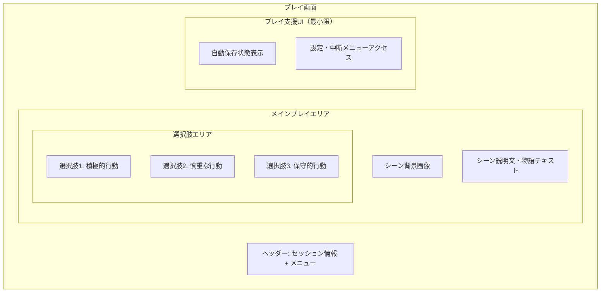

# プレイ画面設計

## 📅 基本情報

**画面名**: プレイ画面（Play Session）  
**機能**: 基本プレイ体験・シーン進行  
**MVP優先度**: ✅ 必須  
**対応BDD**: [play-experience.feature](../../../../packages/bdd-e2e-test/e2e/features/play-experience.feature)

## 🎯 画面の目的・価値

### 主要機能
1. **没入的プレイ体験**: TRPGシナリオの物語世界への没入
2. **選択肢システム**: 意味のある選択による物語進行
3. **シーン進行管理**: 滑らかなシーン遷移・状態保存

### ユーザー価値
- **没入感**: 物語世界への深い没入体験
- **選択の重み**: 判断が物語に与える影響の実感
- **継続性**: 中断・復帰可能な柔軟なプレイ体験

## 📱 画面構成・レイアウト

### 全体構造



### 没入感重視のレイアウト

```typescript
interface ImmersivePlayLayoutSpec {
  design_philosophy: {
    immersion_first: "物語体験を最優先、UIの最小化";
    story_focus: "シーンコンテンツを画面の80%以上に配分";
    minimal_chrome: "ナビゲーション・メタUIの最小化";
  };
  
  responsive_layout: {
    mobile: "フルスクリーン、最小限のヘッダー";
    tablet: "画面活用最大化、サイドマージン最小";
    desktop: "中央集中レイアウト、適切な読み幅";
  };
  
  // MVP制約: 以下は除外
  // progress_indicators: "進行状況バー・チャプター表示";
  // time_tracking: "プレイ時間・経過時間表示";
  // detailed_history: "詳細な選択履歴表示";
}
```

## 🎨 UI仕様・デザイン詳細

### シーン表示システム

```typescript
interface ScenePresentationSpec {
  background_image: {
    aspect_ratio: "16:9推奨、可変対応";
    loading_strategy: "プログレッシブ読み込み + フォールバック";
    overlay_support: "テキスト読みやすさのためのオーバーレイ";
    fallback_design: "画像なし時のデフォルト背景";
  };
  
  story_text: {
    font_family: "Georgia, serif（物語専用セリフフォント）";
    font_size: "clamp(1rem, 2vw, 1.125rem)";
    line_height: "1.7（読みやすさ重視）";
    color_contrast: "高コントラスト、背景に応じた適応";
    max_width: "65ch（最適読み幅）";
  };
  
  text_reveal: {
    initial_display: "即座の全文表示（MVPでは簡素化）";
    // 将来機能: typewriter_effect: "タイプライター効果";
    // 将来機能: paragraph_by_paragraph: "段落単位での表示";
  };
}
```

### 選択肢インターフェース

```typescript
interface ChoiceInterfaceSpec {
  layout_strategy: {
    arrangement: "縦積み、十分な間隔";
    touch_target: "最小44px高さ、十分なタップエリア";
    visual_hierarchy: "選択肢の重要度・危険度を色・スタイルで表現";
  };
  
  choice_styling: {
    default_state: "明確な境界、読みやすいテキスト";
    hover_state: "ホバー時の視覚フィードバック";
    selected_state: "選択時の即座のハイライト";
    disabled_state: "選択後の他選択肢無効化";
  };
  
  choice_types: {
    standard: "通常の選択肢（ニュートラル）";
    risky: "リスクのある選択肢（注意色）";
    safe: "安全な選択肢（安心色）"; 
    important: "重要な選択肢（強調）";
  };
  
  interaction_flow: {
    selection: "選択 → 即座のハイライト → 次シーン遷移";
    // MVP範囲外: confirmation: "重要選択時の確認ダイアログ";
    // MVP範囲外: loading_message: "選択処理中メッセージ";
  };
}
```

## 🔄 シーン進行・遷移システム

### 遷移フロー

```markdown
## シーン進行フロー（MVP版）
1. **シーン表示**
   - 背景画像の読み込み・表示
   - シーン説明文の表示
   - 選択肢の表示（アニメーション最小限）
   
2. **選択インタラクション**
   - 選択肢クリック → 即座のハイライト
   - 他選択肢の無効化
   - 次シーンへの直接遷移（中間メッセージなし）
   
3. **次シーン準備**
   - 自動保存の実行
   - 次シーンデータの読み込み
   - 新シーンの表示（3秒以内）
```

### 状態管理

```typescript
interface PlayStateManagementSpec {
  auto_save: {
    trigger_events: ["選択完了時", "シーン遷移時"];
    save_data: ["現在シーン", "選択履歴", "プレイ時刻"];
    failure_handling: "保存失敗時の再試行・ユーザー通知";
  };
  
  session_continuity: {
    pause_resume: "画面離脱・復帰時の状態復元";
    crash_recovery: "異常終了時の状態復旧";
    cross_device: "デバイス間でのセッション継続（将来機能）";
  };
  
  // MVP制約: シンプルな状態管理
  minimal_state: {
    current_scene: "現在のシーンID・内容";
    choice_history: "選択履歴（内部保持、表示なし）";
    session_meta: "セッション基本情報";
  };
}
```

## 🎮 ユーザーインタラクション

### プレイ操作

```typescript
interface PlayInteractionSpec {
  core_interactions: {
    choice_selection: "選択肢タップ・クリック";
    scene_navigation: "自動的なシーン進行";
    menu_access: "設定・中断メニューへのアクセス";
  };
  
  secondary_interactions: {
    pause_play: "一時停止・再開";
    save_game: "手動保存（自動保存補完）";
    exit_session: "セッション中断・終了";
  };
  
  // MVP範囲外
  // keyboard_shortcuts: "キーボード操作";
  // choice_history_view: "選択履歴の詳細確認";
  // scene_replay: "過去シーンの再確認";
}
```

### メニューシステム

```typescript
interface PlayMenuSpec {
  menu_access: {
    trigger: "ヘッダー内メニューボタン";
    display: "オーバーレイ形式、没入感を損なわない";
    close: "背景タップ・メニューボタン再押しで閉じる";
  };
  
  menu_options: {
    save_game: "現在の状態を保存";
    settings: "音量・表示設定等";
    exit_session: "セッション一覧に戻る";
    // MVP範囲外: help: "ヘルプ・操作説明";
  };
  
  confirmation_flows: {
    exit_confirmation: "セッション終了時の確認";
    save_feedback: "保存完了の簡潔なフィードバック";
  };
}
```

## ⚡ パフォーマンス・技術仕様

### 応答性・読み込み

```typescript
interface PlayPerformanceSpec {
  scene_loading: {
    target_time: "3秒以内での次シーン表示";
    preloading: "次シーンの事前読み込み（可能な範囲）";
    fallback: "ネットワーク遅延時のスケルトン表示";
  };
  
  image_optimization: {
    format: "WebP優先、JPEG/PNGフォールバック";
    sizing: "レスポンシブ画像、デバイス適応";
    caching: "適切なブラウザキャッシュ活用";
  };
  
  interaction_response: {
    choice_feedback: "100ms以内での選択フィードバック";
    scene_transition: "1秒以内での遷移開始";
    auto_save: "バックグラウンドでの非同期保存";
  };
}
```

### エラーハンドリング

```markdown
## エラー状態・復旧

### 選択処理エラー
- **表示**: "選択の処理に失敗しました"
- **アクション**: "再試行" + "メニューに戻る"
- **復旧**: 元の選択肢状態への復帰

### シーン読み込みエラー  
- **表示**: "シーンの読み込みに失敗しました"
- **アクション**: "再試行" + "前のシーンに戻る"
- **復旧**: 前シーンからの継続・代替シーン

### 保存エラー
- **表示**: "進行状況の保存に失敗しました"
- **アクション**: "再試行" + "オフライン継続"
- **復旧**: 自動リトライ・手動保存促進
```

## 🏁 プレイ完了・エンディング

### 完了画面仕様

```typescript
interface PlayCompletionSpec {
  ending_presentation: {
    final_scene: "エンディングシーンの適切な表示";
    completion_message: "「プレイ完了おめがとうございます！」";
    story_summary: "到達エンディング・主要選択の振り返り";
  };
  
  completion_data: {
    ending_type: "到達したエンディングの種類";
    play_summary: "主要な選択・プレイスタイルの概要";
    // MVP範囲外: total_time: "総プレイ時間";
    // MVP範囲外: statistics: "詳細なプレイ統計";
  };
  
  post_completion_actions: {
    return_to_list: "セッション一覧に戻る";
    // MVP範囲外: replay_session: "再プレイ（別セッション）";
    // MVP範囲外: share_results: "結果共有";
  };
}
```

## 🧪 テスト観点・品質基準

### BDD Feature対応

```gherkin
# 主要シナリオ（play-experience.feature より）
Scenario: プレイ画面の初期表示
  Given プレイヤーがプレイ画面にアクセスする
  Then シーン背景画像が表示される
  And シーン説明文が表示される
  And 選択肢が表示される

Scenario: 選択肢の選択と次シーンへの遷移
  Given プレイヤーが選択肢を表示している
  When プレイヤーが選択肢を選択する
  Then 選択した選択肢がハイライトされる
  And 3秒以内に次のシーンに遷移する
```

### 品質チェックポイント

```markdown
## 没入感・体験品質
- ✅ 物語世界への没入を妨げないUI
- ✅ 選択の重みを感じられるインタラクション
- ✅ 滑らかなシーン遷移・進行感
- ✅ 中断・復帰の自然な体験

## 機能品質
- ✅ 選択肢システムの確実な動作
- ✅ シーン進行の正確性
- ✅ 状態保存・復旧の確実性
- ✅ エラー時の適切な復旧

## パフォーマンス品質
- ✅ 応答性基準の達成
- ✅ 画像読み込みの最適化
- ✅ メモリ使用量の適正性
```

## 🔗 関連文書・依存関係

### 画面遷移
- **セッション参加**: [セッション詳細画面](./session-detail.md)
- **プレイ完了**: [セッション一覧画面](./session-list.md)

### 技術依存
- **API**: シーン取得・選択処理・状態保存API
- **認証**: セッション参加権限・プレイ継続権限
- **ストレージ**: ローカル状態保存・復旧

### 設計文書
- **全体概要**: [Player文脈概要](../overview.md)
- **データ設計**: [データ設計](../data-design.md)
- **BDD Feature**: [play-experience.feature](../../../../packages/bdd-e2e-test/e2e/features/play-experience.feature)

## 📝 更新履歴

**2025-08-16**: 初版作成
- Sprint 4 Phase 1B設計からの分離・独立化
- BDDレビューフィードバック反映済み
- 没入感重視（進行表示・時間表示・中間メッセージ除外）
- MVP制約適用（キーボード操作・詳細履歴等除外）

**進化的設計**: この文書は実装・テスト・ユーザーフィードバックに基づいて継続的に更新されます。

#play-session #player-context #mvp-design #immersive-experience #screen-design