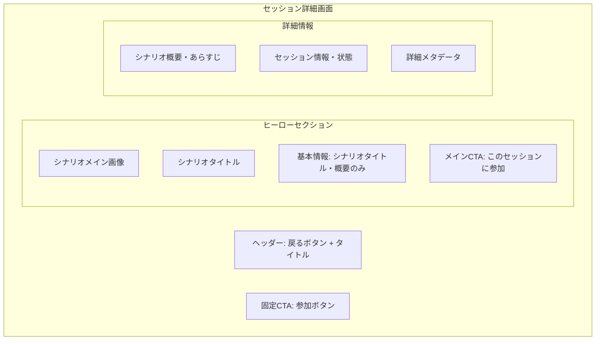

# セッション詳細画面設計

## 📅 基本情報

**画面名**: セッション詳細画面（Session Detail）  
**機能**: セッション詳細確認・参加決定  
**MVP優先度**: ✅ 必須  
**対応BDD**: [session-joining.feature](../../../../packages/bdd-e2e-test/e2e/features/session-joining.feature)

## 🎯 画面の目的・価値

### 主要機能
1. **詳細情報提示**: セッション・シナリオの詳細情報表示
2. **参加判断支援**: 十分な情報による参加判断の支援
3. **参加フロー開始**: セッション参加手続きの開始

### ユーザー価値
- **情報充実**: 参加前の十分な情報提供
- **意思決定支援**: 明確な参加判断材料の提示
- **安心感**: 参加内容・プロセスの透明性

## 📱 画面構成・レイアウト

### 全体構造



### レスポンシブレイアウト

```typescript
interface SessionDetailLayoutSpec {
  hero_section: {
    mobile: "縦型レイアウト、画像上にテキストオーバーレイ";
    tablet: "横型レイアウト、左画像・右情報";
    desktop: "横型レイアウト、左画像・右情報";
  };
  
  content_flow: {
    mobile: "縦積み、セクション分離";
    desktop: "2カラム、メイン + サイドバー";
  };
  
  cta_strategy: {
    primary_cta: "ヒーローセクション内の大きなボタン";
    floating_cta: "スクロール時の固定ボタン（モバイル）";
    secondary_actions: "戻る・共有等の補助アクション";
  };
}
```

## 🎨 UI仕様・デザイン詳細

### ヒーローセクション

```typescript
interface HeroSectionSpec {
  image_display: {
    aspect_ratio: "16:9（デスクトップ）、4:3（モバイル）";
    fallback: "統一デフォルト画像";
    loading: "基本的な画像読み込み";
  };
  
  title_hierarchy: {
    main_title: "シナリオタイトル（display font）";
    session_name: "セッション名（heading-1）";
    metadata: "基本情報バッジ（caption）";
  };
  
  cta_prominence: {
    size: "大きく目立つボタン（min-height: 48px）";
    color: "プライマリカラー（高コントラスト）";
    state_adaptive: "セッション状態に応じたボタン文言・色";
  };
}
```

### セッション状態表示

```typescript
interface SessionStatusDisplay {
  status_variants: {
    available: {
      label: "参加者募集中";
      color: "green";
      cta_text: "このセッションに参加";
      enabled: true;
    };
    ongoing: {
      label: "進行中";
      color: "blue"; 
      cta_text: "このセッションに参加";
      enabled: true;
    };
    completed: {
      label: "完了";
      color: "gray";
      cta_text: "このセッションは既に完了しています";
      enabled: false;
    };
  };
  
  additional_info: {
    // MVP制約: 基本情報のみ表示
    scenario_overview: "シナリオ概要・説明文";
  };
}
```

## 📄 コンテンツ仕様

### セクション構成

```typescript
interface ContentSectionSpec {
  scenario_overview: {
    format: "マークダウン形式対応";
    length: "モバイル: 初期3行表示、展開可能";
    typography: "読みやすいセリフフォント";
    content_type: "シナリオあらすじ・背景設定";
  };
  
  session_information: {
    session_status: "現在のセッション状態";
    session_timeline: "セッション開始予定・進行状況";
    participation_notes: "参加に関する注意事項";
  };
  
  scenario_metadata: {
    tags: "関連タグ・キーワード";
    author_info: "シナリオ作者情報（基本）";
    creation_date: "作成日・更新日";
    // MVP範囲外: rating_system: "評価・レビュー";
    // MVP範囲外: related_scenarios: "関連シナリオ";
  };
}
```

### テキスト処理

```markdown
## コンテンツ表示ルール

### 長文対応
- **概要文**: 3行以上は「続きを読む」で展開
- **あらすじ**: マークダウン形式でのリッチテキスト対応
- **メタデータ**: 簡潔な情報表示

### 安全性
- **XSS対策**: HTMLタグの適切なサニタイズ
- **文字数制限**: 異常に長いテキストの制限
- **フォールバック**: データ欠損時のデフォルト表示
```

## 🔄 ユーザーインタラクション

### 参加フロー

```markdown
## セッション参加フロー
1. **詳細確認**
   - セッション・シナリオ情報の確認
   - 参加可能性・状態の確認
   - 十分な情報による参加判断
   
2. **参加意思決定**
   - 「このセッションに参加」ボタンクリック
   - 参加確認ダイアログの表示
   - 最終確認・参加実行
   
3. **参加完了・プレイ開始**
   - 参加処理の実行
   - プレイ画面への遷移
   - セッション開始準備
```

### インタラクション詳細・ルーティング統合

```typescript
interface InteractionSpec {
  primary_flow: {
    view_details: "詳細情報の閲覧・展開";
    join_session: "セッション参加フローの開始";
    confirm_participation: "参加確認・最終決定";
  };
  
  secondary_actions: {
    back_to_list: "セッション一覧への戻り";
    share_session: "セッション情報の共有（将来機能）";
    bookmark: "お気に入り登録（将来機能）";
  };
  
  error_handling: {
    join_failure: "参加処理失敗時の再試行・代替案";
    network_error: "ネットワークエラー時の対応";
    session_unavailable: "セッション状態変更時の適切な案内";
  };
}
```

#### **ルーティング遷移仕様（緊急追加）**

```typescript
// SessionDetailPage ルーティング遷移パターン
interface SessionDetailRouting {
  // 現在ページ: /player/session/:sessionId
  current_route: "/player/session/:sessionId";
  params: {
    sessionId: "URL pathから取得するセッション識別子";
  };
  
  // 遷移元・遷移先ルート
  navigation: {
    from: "/player/sessions";                      // セッション一覧から
    to_play: "/player/session/:sessionId/play";   // プレイ画面へ
    back_to_list: "/player/sessions";             // 一覧に戻る
  };
  
  // ページロード・データ取得
  data_loading: {
    session_data: "params.sessionIdでのセッション詳細取得";
    scenario_data: "session.scenarioIdでのシナリオ詳細取得"; 
    validation: "sessionId存在確認・アクセス権限確認";
  };
}
```

#### **Parameter処理・エラーハンドリング**

```markdown
URLパラメータ処理:
✅ sessionId: 必須パラメータ・存在確認必須
✅ セッション取得: Session.id照合・データ読み込み
✅ シナリオ取得: Session.scenarioId経由でのシナリオデータ取得

エラー時のルーティング:
❌ 無効sessionId → /player/sessions へリダイレクト
❌ セッション終了済み → 読み取り専用表示・プレイ不可
❌ データ取得失敗 → エラー表示・リトライ機能

MVP制約:
❌ 複雑な権限チェック・認証機能
❌ 詳細なアクセス制御・参加制限機能
❌ 高度なエラー復旧・状態管理
```

## 🎯 参加確認フロー

### 確認ダイアログ仕様

```typescript
interface ParticipationConfirmationSpec {
  dialog_content: {
    session_summary: "セッション名・基本情報の再確認";
    commitment_info: "セッション参加への確認";
    action_buttons: [
      "参加する（プライマリ）",
      "キャンセル（セカンダリ）"
    ];
  };
  
  confirmation_flow: {
    display_trigger: "「このセッションに参加」ボタンクリック";
    user_confirmation: "「参加する」ボタンでの最終確認";
    processing_state: "「プレイ開始準備中...」の処理状態表示";
    success_transition: "プレイ画面への自動遷移";
  };
  
  error_scenarios: {
    network_failure: "「参加処理に失敗しました」+ 再試行オプション";
    session_full: "「セッションが満席になりました」+ 代替案提示";
    session_closed: "「セッションが終了しました」+ 一覧への誘導";
  };
}
```

## ⚡ パフォーマンス・技術仕様

### 読み込み最適化

// MVP制約によりPerformanceOptimizationセクションは除外
// 基本的な読み込み・表示機能のみ実装

### 応答性基準

```markdown
## パフォーマンス目標
- **初期表示**: 2秒以内（3G環境）
- **画像読み込み**: 3秒以内（プログレッシブ表示）
- **参加処理**: 1秒以内での処理開始表示
- **画面遷移**: 300ms以内での遷移完了
```

## 🧪 テスト観点・品質基準

### BDD Feature対応

```gherkin
# 主要シナリオ（session-joining.feature より）
Scenario: 参加可能セッションへの正常参加
  Given プレイヤーがセッション詳細画面を表示している
  And セッションの状態が "参加者募集中" である
  When プレイヤーが「このセッションに参加」ボタンをクリックする
  Then 参加確認ダイアログが表示される

Scenario: 参加確認からプレイ開始へ
  Given プレイヤーが参加確認ダイアログを表示している
  When プレイヤーが「参加する」ボタンをクリックする
  Then 参加処理が実行される
  And プレイ画面へ遷移する
```

### 品質チェックポイント

```markdown
## UI/UX品質
- ✅ セッション詳細情報の明確な表示
- ✅ 参加判断に必要な情報の充足
- ✅ 参加フローの直感的な理解
- ✅ エラー状態の適切な案内

## 機能品質  
- ✅ セッション詳細の正確な表示
- ✅ 参加処理の確実な実行
- ✅ プレイ画面への正常な遷移
- ✅ エラーハンドリングの適切性

## セキュリティ
- ✅ 参加権限の適切な検証
- ✅ XSS攻撃の防止
- ✅ 不正参加の防止
```

## 🔗 関連文書・依存関係

### 画面遷移
- **一覧戻り**: [セッション一覧画面](./session-list.md)
- **プレイ開始**: [プレイ画面](./play-session.md)

### 技術依存
- **API**: セッション詳細取得・参加処理API
- **認証**: ユーザー認証・参加権限確認
- **状態管理**: セッション状態・ユーザー参加状態

### 設計文書
- **全体概要**: [Player文脈概要](../overview.md)
- **データ設計**: [データ設計](../data-design.md)
- **BDD Feature**: [session-joining.feature](../../../../packages/bdd-e2e-test/e2e/features/session-joining.feature)

## 📝 更新履歴

**2025-08-16**: 初版作成
- Sprint 4 Phase 1B設計からの分離・独立化
- BDDレビューフィードバック反映済み
- MVP制約適用（キーボード操作等除外）

**2025-08-17**: POレビューフィードバック反映版（設計担当）
- 全体構造図のHeroMeta修正（ジャンル・難易度除外）
- ヒーローセクション仕様の簡素化（ジャンル参照除外・基本的読み込み）
- セッション状態表示の簡素化（推定時間・ジャンル・難易度除外）
- 確認ダイアログの簡素化（推定プレイ時間除外）
- パフォーマンス最適化セクションの除外
- 理由: PO指摘によるdata-design.mdとの整合性確保、MVP制約一貫適用

## MVP制約による除外機能

### Phase 2以降への移行項目
- **ジャンル・カテゴリ表示**: シナリオジャンル分類・表示
- **難易度レベル**: 難易度レベル表示・フィルタリング
- **推定プレイ時間**: プレイ時間表示・参加判断材料
- **高度な画像最適化**: WebP・プログレッシブJPEG・プライオリティ読み込み

### MVP範囲の集中
- シナリオタイトル・概要の表示
- 基本的なセッション参加確認
- シンプルな画像表示・読み込み

**進化的設計**: この文書は実装・テスト・ユーザーフィードバックに基づいて継続的に更新されます。

#session-detail #player-context #mvp-design #screen-design