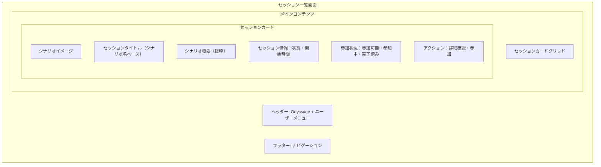

# セッション一覧画面設計

## 📅 基本情報

**画面名**: セッション一覧画面（Session List）  
**機能**: セッション探索・選択体験  
**MVP優先度**: ✅ 必須  
**対応BDD**: [scenario-discovery.feature](../../../../packages/bdd-e2e-test/e2e/features/scenario-discovery.feature)

## 🎯 画面の目的・価値

### 主要機能
1. **セッション発見**: 利用可能なTRPGセッションの一覧表示
2. **セッション選択**: 興味のあるセッションの詳細確認・参加判断
3. **基本情報提示**: セッション概要・状態・参加可能性の明確表示

### ユーザー価値
- **発見の楽しさ**: 魅力的なセッション選択体験
- **情報の透明性**: 参加前の十分な情報提供
- **アクセスの容易さ**: 直感的なセッション探索・選択

## 📱 画面構成・レイアウト

### 全体構造



### レスポンシブレイアウト

```typescript
interface SessionListLayoutSpec {
  responsive_layout: {
    mobile: "1カラム、カードリスト形式";
    tablet: "2カラムグリッド";  
    desktop: "3-4カラムグリッド";
  };
  
  card_sizing: {
    mobile: "全幅、最小高さ120px";
    tablet: "固定幅350px";
    desktop: "固定幅320px";
  };
  
  spacing: {
    card_gap: "16px（mobile）、24px（desktop）";
    section_padding: "16px（mobile）、32px（desktop）";
  };
}
```

## 🎨 UI仕様・デザイン詳細

### セッションカード設計

```typescript
interface SessionCardSpec {
  content_structure: {
    thumbnail: "シナリオ画像（16:9比率）";
    title: "セッション名（最大2行、省略対応）";
    scenario_summary: "シナリオ概要（最大3行、省略対応）";
    metadata_badges: [
      "セッション状態（参加募集中・進行中・完了）",
      "シナリオタグ（ジャンル・難易度等）"
    ];
    action_buttons: [
      "詳細を見る（セカンダリ）",
      "参加する（プライマリ）"
    ];
  };
  
  visual_states: {
    default: "通常表示状態";
    hover: "ホバー時のエレベーション増加";
    loading: "読み込み中のスケルトン表示";
    unavailable: "参加不可セッションのグレーアウト";
  };
  
  // MVP制約: 以下は除外
  // participant_info: "参加者数・最大参加者数表示";
  // detailed_progress: "詳細な進行状況表示";
}
```

### 状態表示・バッジ

```typescript
interface SessionStatusBadges {
  session_status: {
    available: {
      label: "参加募集中";
      color: "green";
      action: "参加可能";
    };
    ongoing: {
      label: "進行中"; 
      color: "blue";
      action: "参加可能（途中参加）";
    };
    completed: {
      label: "完了";
      color: "gray";
      action: "参加不可（閲覧のみ）";
    };
  };
  
  scenario_tags: {
    genre: ["ファンタジー", "SF", "ホラー", "ミステリー"];
    difficulty: ["初心者向け", "中級者向け", "上級者向け"];
    playtime: ["30分以下", "1時間程度", "2時間以上"];
  };
}
```

## 🔄 ユーザーインタラクション

### 画面アクセスフロー

```markdown
## セッション発見フロー
1. **画面表示**
   - セッション一覧の読み込み・表示
   - ローディング状態 → スケルトン → 実際のコンテンツ
   - 空状態の場合: "現在参加可能なセッションがありません"
   
2. **セッション閲覧**
   - スクロールによる一覧閲覧
   - カード形式での視覚的情報提示
   - セッション状態・参加可能性の明確表示
   
3. **セッション選択**
   - 「詳細を見る」→ セッション詳細画面
   - 「参加する」→ 参加確認 → プレイ画面
   - カードタップ → 詳細画面（モバイル）
```

### 操作パターン・ルーティング統合

```typescript
interface UserInteractionSpec {
  primary_actions: {
    card_tap: "セッション詳細画面への遷移";
    detail_button: "セッション詳細の表示";
    join_button: "セッション参加フローの開始";
  };
  
  secondary_actions: {
    refresh: "セッション一覧の再読み込み";
    navigation: "他画面（履歴等）への移動";
  };
  
  // MVP範囲外
  // search_filter: "検索・フィルタリング機能";
  // sort_options: "ソート・並び替え機能";
}
```

#### **ルーティング遷移仕様（緊急追加）**

```typescript
// SessionListPage ルーティング遷移パターン
interface SessionListRouting {
  // 現在ページ: /player/sessions
  current_route: "/player/sessions";
  
  // 遷移先ルート
  transitions: {
    session_detail: "/player/session/:sessionId";     // 詳細確認
    direct_play: "/player/session/:sessionId/play";   // 直接参加
    session_history: "/player/history";               // プレイ履歴（将来）
  };
  
  // 遷移トリガー
  triggers: {
    card_click: "session_detail";           // カードクリック → 詳細画面
    detail_button: "session_detail";        // 詳細ボタン → 詳細画面  
    join_button: "direct_play";             // 参加ボタン → 直接プレイ
    history_nav: "session_history";         // 履歴ナビ → 履歴画面
  };
}
```

#### **Navigation実装方針**

```markdown
遷移実装パターン:
✅ useNavigate Hook使用: React Router v7標準パターン
✅ パラメータ受け渡し: sessionId経由でのセッション特定
✅ 状態管理: 遷移前後での適切な状態保持

MVP制約:
❌ 複雑な状態受け渡し・クエリパラメータ
❌ 戻るボタン・履歴スタック管理
❌ ページ間アニメーション・トランジション効果
```

## ⚡ パフォーマンス・技術仕様

### 読み込み・応答性

```typescript
interface PerformanceSpec {
  loading_strategy: {
    initial_load: "3秒以内での初期表示完了";
    skeleton_display: "読み込み中のスケルトン表示";
    lazy_loading: "画像の遅延読み込み対応";
  };
  
  data_management: {
    caching: "セッション情報の適切なキャッシュ";
  };
  
  responsive_behavior: {
    touch_response: "タッチ操作への即座の視覚フィードバック";
    loading_states: "全ての非同期操作に対する適切な状態表示";
  };
}
```

### エラーハンドリング

```markdown
## エラー状態・復旧

### ネットワークエラー
- **表示**: "セッション情報の読み込みに失敗しました"
- **アクション**: "再試行"ボタン
- **復旧**: 自動リトライ + 手動リトライ

### データ不整合
- **表示**: "セッション情報に問題があります"
- **アクション**: "リロード"ボタン
- **復旧**: ページリロード

### 空状態
- **表示**: "現在参加可能なセッションがありません"
- **アクション**: "リロード"ボタン
- **ガイダンス**: セッション作成の案内（将来機能）
```

## 🧪 テスト観点・品質基準

### BDD Feature対応

```gherkin
# 主要シナリオ（scenario-discovery.feature より）
Scenario: 開催中セッション一覧の正常表示
  When プレイヤーがセッション一覧画面を開く
  Then 利用可能なセッションが表示される
  And 完了済みセッションは表示されない
  And 各セッションに「詳細を見る」ボタンが表示される

Scenario: セッション選択とシナリオ詳細確認
  Given プレイヤーがセッション一覧画面を開いている
  When プレイヤーがセッションを選択する
  Then セッション詳細画面が表示される
```

### 品質チェックポイント

```markdown
## UI/UX品質
- ✅ セッション情報の明確な視覚表示
- ✅ 参加可能性の直感的理解
- ✅ レスポンシブデザインの適切な動作
- ✅ ローディング・エラー状態の適切な表示

## 機能品質
- ✅ セッション一覧の正確な表示
- ✅ セッション状態の正確な反映
- ✅ 詳細画面への適切な遷移
- ✅ パフォーマンス基準の達成

## MVP適合性
- ✅ 過剰機能の除外（検索・フィルタ等）
- ✅ 基本操作のみ対応（マウス・タッチ）
- ✅ シンプルな情報表示
```

## 🔗 関連文書・依存関係

### 画面遷移
- **詳細確認**: [セッション詳細画面](./session-detail.md)
- **履歴確認**: [プレイ履歴画面](./play-history.md)

### 技術依存
- **API**: セッション一覧取得API
- **認証**: ユーザー認証状態
- **画像**: シナリオサムネイル配信

### 設計文書
- **全体概要**: [Player文脈概要](../overview.md)
- **データ設計**: [データ設計](../data-design.md)
- **BDD Feature**: [scenario-discovery.feature](../../../../packages/bdd-e2e-test/e2e/features/scenario-discovery.feature)

## 📝 更新履歴

**2025-08-16**: 初版作成
- Sprint 4 Phase 1B設計からの分離・独立化
- BDDレビューフィードバック反映済み
- MVP制約適用（検索・フィルタ・参加者数表示除外）

**2025-08-17**: POレビューフィードバック反映版（設計担当）
- PerformanceSpec.data_managementの簡素化（pagination・refresh除外）
- PerformanceSpec.responsive_behaviorの簡素化（breakpoint_switching除外）
- 理由: PO指摘によるMVP制約適用、実装複雑化回避

## MVP制約による除外機能

### Phase 2以降への移行項目
- **ページネーション**: 大量セッション対応（仮想スクロール）
- **リアルタイム更新**: WebSocket or ポーリングによる状態更新
- **レスポンシブ切り替え**: 300ms以内でのレイアウト切り替え

### MVP範囲の集中
- セッション情報の基本表示・キャッシュ
- タッチ操作の基本的フィードバック
- 読み込み状態の適切な表示

**進化的設計**: この文書は実装・テスト・ユーザーフィードバックに基づいて継続的に更新されます。

#session-list #player-context #mvp-design #screen-design