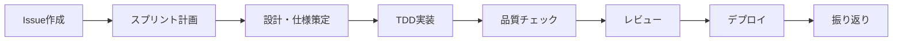

# 開発ガイド

Odyssage プロジェクトの開発プロセス・実装ガイドライン・品質保証手順

## 📋 概要

本ディレクトリは、Odyssage の開発に参加する全メンバーが従うべきプロセス・ガイドライン・ツールを提供します。

### 開発哲学

1. **テスト駆動開発（TDD）**: テストファースト・Red-Green-Refactor
2. **継続的改善**: 1週間スプリント・定期振り返り
3. **証跡管理**: 全ての技術判断を文書化・共有
4. **品質重視**: ESLint・TypeScript・自動テスト

## 🚀 はじめに

### 新規開発者

1. [[process]] - 開発プロセス全体（旧CLAUDE.md）
2. [[../01-getting-started/setup]] - 環境構築
3. [[sprints/README]] - スプリント運用ルール

### 既存開発者

- [[sprints/sprint_003]] - 現在のスプリント状況
- [[testing-strategy]] - テスト戦略・実践方法
- [[architecture-design-framework]] - 設計フレームワーク

## 📚 主要ドキュメント

### [[process]] - 開発プロセス

**最重要**: プロジェクト開発の中核となるプロセス定義（元CLAUDE.md）

#### カバー範囲

- **Phase 1-3**: 計画・設計・実装・品質保証の段階的プロセス
- **TDD実践**: 真のテスト駆動開発の具体的手順
- **証跡管理**: 実装記録・技術判断の文書化方針
- **品質保証**: lint・型チェック・テスト実行の必須手順

### [[sprints/README]] - スプリント運用

**1週間スプリント**（土曜〜金曜）の運用ルール・テンプレート

#### スプリント構成

- **土曜日**: スプリント開始・計画策定
- **日〜木曜日**: 実装・日次進捗更新
- **金曜日**: 完了確認・レトロスペクティブ・**📋 完了チェックリスト実行**

#### スプリント成果物

- `SPRINT_CONFIG.md` - 目標・スコープ・リスク管理
- `*-implementation.md` - 実装記録・技術判断
- `retrospective.md` - KPT振り返り・改善アクション

#### 完了時必須手順

- [[sprints/sprint-completion-checklist|スプリント完了チェックリスト]] - 更新漏れ防止・品質保証

### [[testing-strategy]] - テスト戦略

包括的テスト設計・実装ガイドライン

#### テスト階層

- **Unit Test**: 関数・クラス単位（Vitest）
- **Integration Test**: API・DB連携（Hono + 実DB）
- **E2E Test**: ユーザーシナリオ（Playwright + BDD）

### [[architecture-design-framework]] - 設計フレームワーク

システム設計・アーキテクチャ決定の体系的手法

## 🔄 開発フロー

### 典型的な機能開発サイクル



### 段階的実装アプローチ

1. **要件分析**: Issue・ユーザーストーリー定義
2. **設計フェーズ**: アーキテクチャ・API・データモデル設計
3. **実装フェーズ**: TDD・段階的機能実装
4. **品質保証**: テスト・lint・型チェック・手動確認
5. **リリース**: デプロイ・監視・フィードバック収集

## 📊 現在のスプリント

### Sprint 004 (2025-08-16土 〜 2025-08-22金)

**テーマ**: [[sprints/sprint_004/SPRINT_CONFIG|プレイヤー文脈MVP実装準備]]

#### 主要タスク（⚡ バックエンド除外・フロントエンド単体MVP）

- [ ] Phase 1: フロントエンドMVP設計（バックエンド非依存設計・モックデータ構造）
- [ ] Phase 2: コンポーネント・UI設計（FSD準拠・プレイヤー文脈UI/UX）
- [ ] Phase 3: プロトタイプ実装（モックデータ・基本コンポーネント・動作確認）
- [ ] Phase 4: 検証・次Sprint準備（価値検証・統合計画策定）

### 完了スプリント

- **Sprint 003** (2025-08-09土〜2025-08-15金): [[sprints/sprint_003/SPRINT_CONFIG|プロジェクトビジョン統一・OpenAPI品質改善]]
  - ✅ プロジェクトビジョン統一完了（PROJECT_VISION.md中心化）
  - ✅ OpenAPI lint完全クリア（33エラー+7警告 → 0エラー+0警告）
  - ✅ ドキュメント体系整備・統一参照化
- **Sprint 002** (2025-07-26土〜2025-08-01金): [[sprints/sprint_002/SPRINT_CONFIG|Optimistic UI & Batch Update]]
- **Sprint 001** (2025-07-19土〜2025-07-25金): [[sprints/sprint_001/SPRINT_CONFIG|GraphDB Integration]]

## 🛠️ 開発ツール

### コード品質

```bash
# バックエンド品質チェック
cd apps/backend
bun run test             # 統合テスト
bun run lint             # ESLint
bunx tsc --noEmit        # 型チェック

# フロントエンド品質チェック
cd apps/frontend
bun run test             # 単体テスト
bun run lint             # ESLint
bun run build            # ビルド + 型チェック
```

### E2Eテスト

```bash
# BDD E2Eテスト実行
cd packages/bdd-e2e-test
bun run test             # Playwright + Cucumber
bun run test:headed      # ブラウザ表示
```

### 開発環境

```bash
# 全サービス起動
bun run local:all

# 個別サービス起動
bun run dev:frontend     # React開発サーバー
bun run dev:backend      # Hono.js API
```

## 📈 品質メトリクス

### 必須品質基準

- **テストカバレッジ**: 80%以上
- **ESLint**: エラー0件
- **TypeScript**: 型エラー0件
- **Build**: 成功・警告最小化

### コード品質指標

- **関数複雑度**: 7以下（ESLint制限）
- **ファイルサイズ**: 適切な分割・責任分担
- **import順序**: ESLint自動整理

### パフォーマンス目標

- **API応答時間**: 平均500ms以内
- **フロントエンド初期表示**: 3秒以内
- **バンドルサイズ**: 圧縮後1MB以内

## 🔐 セキュリティ

### 開発時セキュリティ

- **秘密情報**: .env.local・Git除外徹底
- **依存関係**: 定期的脆弱性スキャン
- **入力検証**: 全APIエンドポイントでバリデーション

### コードレビュー観点

- **ビジネスロジック**: ドメイン境界・責任分担
- **エラーハンドリング**: 適切な例外処理・ユーザー体験
- **パフォーマンス**: N+1問題・メモリリーク

## 📚 学習リソース

### 実装パターン

- **Hono.js**: [[../02-architecture/api-design]] - REST API実装
- **React**: Feature-Sliced Design・状態管理
- **Neo4j**: [[../02-architecture/database-design]] - グラフDB活用

### プロジェクト固有知識

- **ドメイン知識**: TRPG・ゲームブック・物語生成
- **技術選定**: [[../02-architecture/overview]] - アーキテクチャ判断
- **運用知識**: [[../04-deployment]] - インフラ・デプロイ

---

## 📖 関連リソース

### 中核ドキュメント

- [[process]] - 開発プロセス詳細（最重要）
- [[sprints/README]] - スプリント運用ルール
- [[testing-strategy]] - テスト実践ガイド

### 設計・アーキテクチャ

- [[../02-architecture/database-design]] - ハイブリッドDB設計
- [[../02-architecture/api-design]] - REST API仕様
- [[architecture-design-framework]] - 設計手法

### 環境・運用

- [[../01-getting-started/setup]] - 開発環境構築
- [[../04-deployment]] - デプロイ・運用手順

#development #process #sprint #quality
