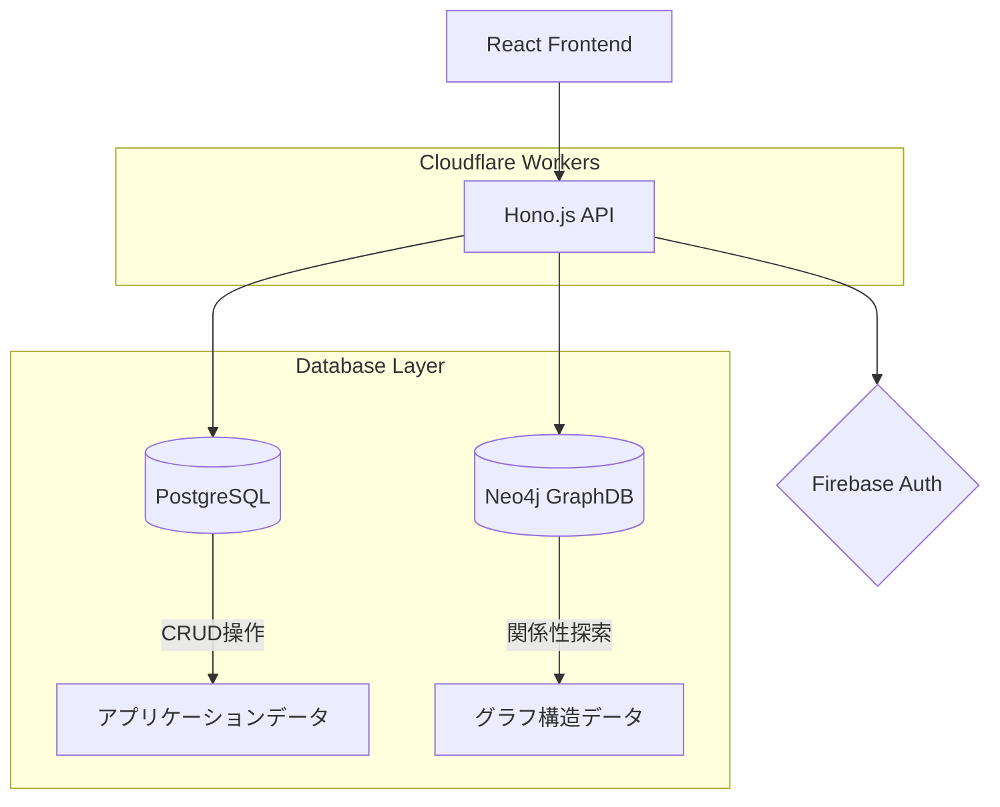

# バックエンドリアーキテクティング実装記録

> GitHub Issue #111 に基づくバックエンドアーキテクチャ改善実装タスク記録

## 📋 プロジェクト概要

### 目的・背景
- **GitHub Issue**: #111 
- **関連Issue**: Issue #109（ドキュメントリアーキテクティング）との差別化
- **実装期間**: 2025-08-09 〜 （Sprint 003 追加バックログ）
- **担当**: Claude + 開発チーム

### 解決したい課題
現在のバックエンドアーキテクチャの技術的課題を特定し、保守性・拡張性・パフォーマンスの向上を図る。

### 実装スコープ
```markdown
# Phase 1: 現状分析・課題特定（今回実装）
- 既存バックエンドアーキテクチャの詳細分析
- 技術的負債・ボトルネックの特定
- 改善案の検討・評価

# Phase 2: 設計・計画（今後の実装）
- 新アーキテクチャ設計
- 移行計画策定
- リスク評価・対策

# Phase 3: 段階的実装（今後の実装）
- 優先度の高い改善項目から実装
- テスト・検証
- 段階的リリース
```

## 🏗️ アーキテクチャ分析

### 現在のシステム構成


### 現在の技術スタック
```markdown
# バックエンド構成
- **Runtime**: Cloudflare Workers (Edge Computing)
- **Framework**: Hono.js (Lightweight Web Framework)
- **Language**: TypeScript
- **Authentication**: Firebase Authentication + JWT
- **Database**: PostgreSQL (Neon) + Neo4j (AuraDB)
- **ORM**: Drizzle (PostgreSQL), Neo4j Driver (GraphDB)
- **Validation**: Valibot
- **Testing**: Vitest
```

### 関連ファイル・ディレクトリ構造
```bash
# バックエンド関連（分析対象）
apps/backend/
├── src/
│   ├── index.ts           # エントリーポイント
│   ├── middleware/        # 認証・CORS等
│   ├── route/            # APIルート定義
│   └── utils/            # ユーティリティ
├── package.json          # 依存関係
└── wrangler.toml        # Cloudflare Workers設定

# 共有パッケージ（分析対象）
packages/
├── database/             # PostgreSQL接続・マイグレーション
├── graph-database/       # Neo4j専用ライブラリ
├── schema/               # API・DB スキーマ定義
└── core/                 # DDDドメイン層
```

## 🔍 課題特定・分析項目

### 技術的課題候補（調査対象）

#### 1. アーキテクチャ設計課題
```markdown
# 調査項目
- [ ] レイヤー分離の適切性（DDD実装状況）
- [ ] 責務分担の明確性（SRPの遵守度）
- [ ] 依存関係の方向性（DI実装状況）
- [ ] モジュール化の程度（凝集度・結合度）
```

#### 2. データアクセス層課題
```markdown
# 調査項目
- [ ] ORM使用状況・パフォーマンス
- [ ] データベース間連携の複雑さ
- [ ] トランザクション管理の適切性
- [ ] クエリ最適化の必要性
```

#### 3. API設計・実装課題
```markdown
# 調査項目  
- [ ] OpenAPI仕様との実装乖離
- [ ] エラーハンドリングの統一性
- [ ] バリデーション実装の一貫性
- [ ] レスポンス形式の標準化度
```

#### 4. パフォーマンス課題
```markdown
# 調査項目
- [ ] Cold Start時間・最適化余地
- [ ] メモリ使用量・効率性
- [ ] データベース接続・クエリ速度
- [ ] 並行処理・非同期処理の効率性
```

#### 5. テスト・品質課題
```markdown
# 調査項目
- [ ] テストカバレッジ・品質
- [ ] 統合テストの充実度
- [ ] モック・テストダブルの活用
- [ ] TDD実践度合い
```

#### 6. 運用・保守課題
```markdown
# 調査項目
- [ ] ログ・監視の充実度
- [ ] デバッグ・トラブルシューティング容易さ
- [ ] 設定管理・環境変数整理
- [ ] デプロイ・CI/CD最適化余地
```

## 📊 分析手法・ツール

### 静的分析
```bash
# コード品質分析
- ESLint ルール遵守度確認
- TypeScript 型安全性チェック
- 循環依存検出（Madge等）
- コードメトリクス測定（複雑度、LOC等）
```

### 動的分析
```bash
# パフォーマンス分析
- Cloudflare Workers Analytics
- Database Query Performance
- Memory Usage Profiling
- Response Time Measurement
```

### アーキテクチャ分析
```bash
# 構造分析
- 依存関係グラフ生成
- レイヤー間結合度測定
- モジュール凝集度評価
- 技術的負債定量化
```

## 💡 改善案検討フレームワーク

### 評価軸
```markdown
# 優先度評価基準
1. **ビジネスインパクト**: 機能追加・拡張への影響度
2. **技術的負債解消**: 保守性・可読性向上効果
3. **パフォーマンス向上**: 速度・効率性改善効果
4. **実装コスト**: 工数・リスク・複雑さ
5. **緊急度**: 現在の問題による影響度合い
```

### 改善パターン検討
```markdown
# 検討パターン
- **リファクタリング**: 既存構造の段階的改善
- **段階的移行**: 部分的な新アーキテクチャ導入
- **全面刷新**: 抜本的なアーキテクチャ変更
- **ハイブリッド**: 既存維持 + 新規部分のみ改善
```

## 🎯 実装計画・マイルストーン

### Phase 1: 現状分析・課題特定（今回）
```markdown
# 実装項目・期間
- [ ] バックエンドコード全体の静的分析（2日）
- [ ] アーキテクチャ構造図の作成（1日）
- [ ] パフォーマンスボトルネック特定（2日）
- [ ] 技術的負債リスト作成（1日）
- [ ] 改善優先度マトリクス作成（1日）
```

### Phase 2: 設計・計画（次段階）
```markdown
# 計画項目
- [ ] 新アーキテクチャ設計書作成
- [ ] 移行戦略・ロードマップ策定
- [ ] リスク分析・対策検討
- [ ] 実装工数見積もり
```

### Phase 3: 実装・検証（将来段階）
```markdown
# 実装項目
- [ ] 優先度の高い改善項目実装
- [ ] テスト強化・カバレッジ向上
- [ ] パフォーマンス最適化
- [ ] 品質・保守性向上
```

## 🔄 進捗記録

### 2025-08-09
- [x] プロジェクト立ち上げ・基本文書作成
- [x] Issue #109との分離フォルダ構造確定
- [ ] 現状分析開始（次のタスク）

### 今後の記録
```markdown
### YYYY-MM-DD
- [ ] 実装項目
- 技術的判断・課題・解決策
```

## 📚 関連リソース

### Issue・証跡文書
- **GitHub Issue**: #111（バックエンドリアーキテクティング）
- **関連証跡**: [[backend-rearchitecting-todo]] - TODOリスト管理
- **参照Issue**: #109（ドキュメントリアーキテクティング）※分離済み

### アーキテクチャドキュメント  
- [[../../../02-architecture/overview]] - 現在のシステム概要
- [[../../../02-architecture/api-design]] - API設計指針
- [[../../../02-architecture/database-design]] - ハイブリッドDB設計

### 開発プロセス
- [[../../process]] - 開発プロセス・TDD実践
- [[../SPRINT_CONFIG]] - Sprint 003設定
- [[document-architecture-implementation]] - Issue #109実装記録

### 実装参照
- `apps/backend/` - 分析対象バックエンドコード
- `packages/database/` - データベース層
- `packages/graph-database/` - グラフDB層
- `packages/core/` - ドメイン層

---

## 🏷️ メタデータ

**作成日**: 2025-08-09  
**最終更新**: 2025-08-09  
**ステータス**: Phase 1 開始  
**関連Sprint**: Sprint 003（追加バックログ）

#development #sprint #backend #architecture #rearchitecting #issue111