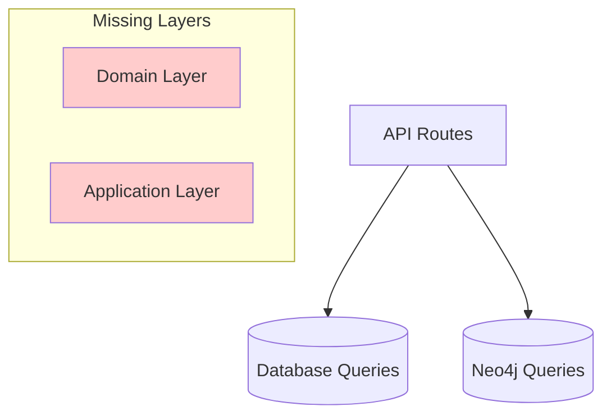

# DDDアーキテクチャ設計議論

> バックエンドリアーキテクティング Issue #111 における DDD 実装に関する設計議論

## 📋 議論の目的

### 背景・経緯
- **2025-08-10**: バックエンドアーキテクチャ分析により重大課題を発見
- **発見した課題**: DDDレイヤー分離が未実装、ビジネスロジックの散在
- **議論の必要性**: 設計判断の見直し・改善戦略の検討

### 議論スコープ
- **対象**: TRPG システムのバックエンドアーキテクチャ
- **焦点**: DDD実装・テスト戦略・段階的改善計画
- **期間**: Sprint 003 期間中の継続議論

## 🔍 現状分析結果

### 技術的課題の詳細

#### **🔴 レイヤー分離の問題**

**現在のアーキテクチャ**:


**問題点**:
- `packages/core/`: 未実装（実際には存在しない）
- `packages/domain/`: 実質的に空（node_modules のみ）
- ビジネスロジックが `apps/backend/src/route/*.ts` に直接記述

**具体例** (`apps/backend/src/route/session.ts:87-134`):
```typescript
// 現在: ルートハンドラーにビジネスロジック
.post('/', vValidator('json', sessionRequestSchema), async (c) => {
  // セッション作成ロジックが直接記述
  const sessionId = generateUUID();
  await createSession(c.env.NEON_CONNECTION_STRING, { ... });
  // ...
})
```

#### **🔴 ドメイン知識の散在**

**TRPGドメインの複雑性**:
- **Scenario**: 創作・公開・権限管理
- **Session**: 状態遷移（準備中→進行中→完了）・GM権限
- **User**: プレイヤー・GM の役割分離

**現在の問題**:
- ドメイン知識が各ルートハンドラーに散在
- ビジネスルールの変更時の影響範囲が不明確
- テストでドメインロジックを保証できない

## 🔄 **分析結果の根本的修正**

### 🙏 **重要な訂正**: 当初の設計判断が正しい

> **ユーザーの見解**: 「データ作成は補完的業務で、API動作確認程度で十分」

### **✅ 分析結果: ユーザーの判断が完全に適切**

#### **フルスタックアーキテクチャの正確な分析**

**🔍 実際のビジネスロジック配置**:

**フロントエンド（React）** - 複雑なビジネスロジック実装済み:
- **楽観的更新**: `useOptimisticScenes.ts` - 状態管理・ライフサイクル制御
- **順序管理**: シーンの並び替え・一括操作・変更追跡
- **認証フロー**: ユーザー状態管理・権限チェック
- **UXワークフロー**: 作成→編集→保存の複雑な状態遷移

**バックエンド（Hono.js API）** - シンプルなCRUD操作:
```typescript
// 実際のコード例: apps/backend/src/route/session.ts
.post('/', async (c) => {
  await createSession(c.env.NEON_CONNECTION_STRING, {
    id: sessionId,
    gmId: json.gmId,
    scenarioId: json.scenarioId, 
    title: json.title,
    status: '準備中', // シンプルなデフォルト値設定
  });
})
```

#### **❌ 私の分析の根本的誤解**

1. **アーキテクチャ境界の誤認識**:
   - バックエンドを単体のDDDシステムとして評価
   - フロントエンドのビジネスロジックを見落とし

2. **レイヤー分離の誤解**:
   - DDDの境界はフロントエンド↔バックエンド間
   - バックエンド内での完全なDDD実装は過剰

3. **技術的制約の誤認識**:
   - Cloudflare Workersの軽量性を「制約」と誤解
   - 実際は**Edge Computing の恩恵**を活かした適切な設計

#### **✅ 正しい認識**

**TRPGシステムの価値実現**:
- **中核価値**: フロントエンドの楽観的更新・リアルタイムUXで実現
- **データ永続化**: バックエンドの補完的だが重要な役割
- **システム全体**: 適切な関心の分離が既に達成済み

## 💡 **修正された改善戦略案**

### **✅ 現状の妥当性確認**

**既に適切に実装されている点**:
- **フロントエンド**: 複雑なビジネスロジックが適切に実装
- **バックエンド**: シンプルなCRUD APIとして機能
- **テスト**: E2E テスト（BDD）が充実している
- **アーキテクチャ**: 関心の分離が適切

### **実際に必要な改善項目**

#### **Phase 1: 品質・保守性の向上**

**1. エラーハンドリングの統一**
```typescript
// 現在: 各ルートで個別実装
// 改善案: 共通エラーハンドリングミドルウェア
```

**2. バリデーションの強化**
```typescript
// 現在: Valibot での基本的な検証
// 改善案: ビジネスルール検証の追加（重複チェック等）
```

**3. ログ・監視の充実**
```typescript
// 現在: 基本的なコンソールログ
// 改善案: 構造化ログ、メトリクス収集
```

#### **Phase 2: パフォーマンス最適化**

**データベース最適化**:
- クエリ効率化
- インデックス最適化
- 接続プールの改善

**レスポンス時間改善**:
- キャッシュ戦略
- データ取得の最適化

#### **Phase 3: 運用・保守性向上**

**開発体験の改善**:
- 型安全性の強化
- 自動テストの拡充
- デバッグ・ログの改善

### **❌ 不要な改善項目**

**過剰なDDD実装**:
- Domain層の実装 → フロントエンドで実装済み
- Application層の複雑化 → 現状で十分
- Repository パターン → 単純なCRUDには不要

## 🤔 **修正された議論ポイント**

### **✅ 結論: 大規模な変更は不要**

**当初の設計判断が適切**だったため、以下の点のみ検討すれば十分:

### 1. **品質向上の優先度**

**Question**: エラーハンドリング・ログ・監視のどれから改善すべきか？

**選択肢**:
- A) エラーハンドリング統一（ユーザー体験直結）
- B) 構造化ログ実装（運用・デバッグ効率化）
- C) パフォーマンス監視（スケーラビリティ対応）

### 2. **テスト戦略の継続**

**Question**: 現在の「API動作確認レベル」のテスト戦略で十分か？

**考慮点**:
- 現在のE2E テスト（BDD）は充実している
- バックエンドは単純なCRUDのため、現状で適切
- 複雑なビジネスロジックはフロントエンドでテスト済み

### 3. **Cloudflare Workers の活用**

**Question**: Edge Computing の恩恵をさらに活かす方法は？

**検討事項**:
- 地理的分散の活用
- キャッシュ戦略の最適化
- レスポンス時間のさらなる改善

### 4. **保守性向上の判断**

**Question**: 現在のシンプルなアーキテクチャをどこまで改善すべきか？

**検討事項**:
- 過剰な抽象化のリスク vs 保守性向上
- チームの理解コスト vs 長期的な利益
- 現状の「軽量さ」の価値

## 📅 **修正された次のアクション**

### **✅ 主要結論**

**当初の設計判断が正しかった**ため、大規模な変更は不要。

### **軽微な改善検討項目**

1. **品質向上の優先順位確認**: エラーハンドリング・ログ・監視のどれから？
2. **現在のテスト戦略継続確認**: API動作確認レベルで十分か？
3. **Edge Computing活用検討**: さらなる最適化の余地は？
4. **保守性向上の範囲**: 現在のシンプルさを維持しつつ改善する範囲

### **決定不要となった事項**

- ❌ ~~大規模DDD実装~~ → フロントエンドで実装済み
- ❌ ~~複雑なテスト戦略~~ → 現状で適切
- ❌ ~~アーキテクチャ刷新~~ → 現状で機能している
- ❌ ~~段階的移行計画~~ → 大幅な変更が不要

### **🎯 今後の焦点**

**「リアーキテクティング」から「品質・運用改善」へ**

---

## 🏷️ メタデータ

**作成日**: 2025-08-10  
**関連Issue**: #111（バックエンドリアーキテクティング）  
**関連文書**: [[backend-rearchitecting-implementation.md]]  
**ステータス**: 議論開始  
**参加者**: ユーザー、Claude

#discussion #ddd #architecture #backend #design-decision