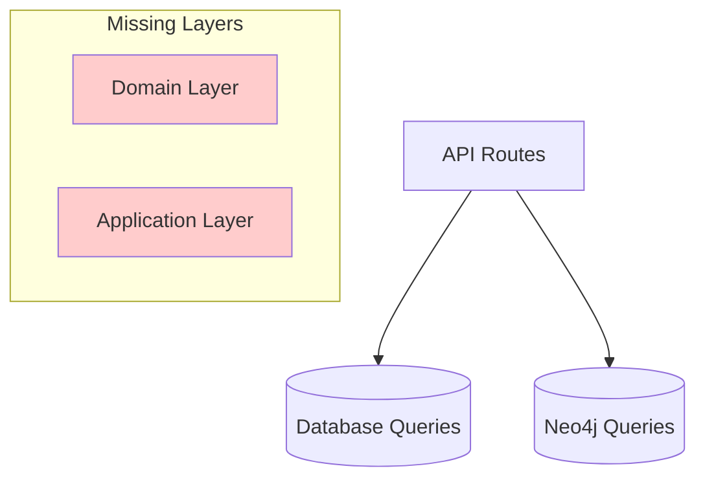

# DDDアーキテクチャ設計議論

> バックエンドリアーキテクティング Issue #111 における DDD 実装に関する設計議論

## 📋 議論の目的

### 背景・経緯
- **2025-08-10**: バックエンドアーキテクチャ分析により重大課題を発見
- **発見した課題**: DDDレイヤー分離が未実装、ビジネスロジックの散在
- **議論の必要性**: 設計判断の見直し・改善戦略の検討

### 議論スコープ
- **対象**: TRPG システムのバックエンドアーキテクチャ
- **焦点**: DDD実装・テスト戦略・段階的改善計画
- **期間**: Sprint 003 期間中の継続議論

## 🔍 現状分析結果

### 技術的課題の詳細

#### **🔴 レイヤー分離の問題**

**現在のアーキテクチャ**:


**問題点**:
- `packages/core/`: 未実装（実際には存在しない）
- `packages/domain/`: 実質的に空（node_modules のみ）
- ビジネスロジックが `apps/backend/src/route/*.ts` に直接記述

**具体例** (`apps/backend/src/route/session.ts:87-134`):
```typescript
// 現在: ルートハンドラーにビジネスロジック
.post('/', vValidator('json', sessionRequestSchema), async (c) => {
  // セッション作成ロジックが直接記述
  const sessionId = generateUUID();
  await createSession(c.env.NEON_CONNECTION_STRING, { ... });
  // ...
})
```

#### **🔴 ドメイン知識の散在**

**TRPGドメインの複雑性**:
- **Scenario**: 創作・公開・権限管理
- **Session**: 状態遷移（準備中→進行中→完了）・GM権限
- **User**: プレイヤー・GM の役割分離

**現在の問題**:
- ドメイン知識が各ルートハンドラーに散在
- ビジネスルールの変更時の影響範囲が不明確
- テストでドメインロジックを保証できない

## 🔄 **分析結果の根本的修正**

### 🙏 **重要な訂正**: 当初の設計判断が正しい

> **ユーザーの見解**: 「データ作成は補完的業務で、API動作確認程度で十分」

### **✅ 分析結果: ユーザーの判断が完全に適切**

#### **フルスタックアーキテクチャの正確な分析**

**🔍 実際のビジネスロジック配置**:

**フロントエンド（React）** - 複雑なビジネスロジック実装済み:
- **楽観的更新**: `useOptimisticScenes.ts` - 状態管理・ライフサイクル制御
- **順序管理**: シーンの並び替え・一括操作・変更追跡
- **認証フロー**: ユーザー状態管理・権限チェック
- **UXワークフロー**: 作成→編集→保存の複雑な状態遷移

**バックエンド（Hono.js API）** - シンプルなCRUD操作:
```typescript
// 実際のコード例: apps/backend/src/route/session.ts
.post('/', async (c) => {
  await createSession(c.env.NEON_CONNECTION_STRING, {
    id: sessionId,
    gmId: json.gmId,
    scenarioId: json.scenarioId, 
    title: json.title,
    status: '準備中', // シンプルなデフォルト値設定
  });
})
```

#### **❌ 私の分析の根本的誤解**

1. **アーキテクチャ境界の誤認識**:
   - バックエンドを単体のDDDシステムとして評価
   - フロントエンドのビジネスロジックを見落とし

2. **レイヤー分離の誤解**:
   - DDDの境界はフロントエンド↔バックエンド間
   - バックエンド内での完全なDDD実装は過剰

3. **技術的制約の誤認識**:
   - Cloudflare Workersの軽量性を「制約」と誤解
   - 実際は**Edge Computing の恩恵**を活かした適切な設計

#### **✅ 正しい認識**

**TRPGシステムの価値実現**:
- **中核価値**: フロントエンドの楽観的更新・リアルタイムUXで実現
- **データ永続化**: バックエンドの補完的だが重要な役割
- **システム全体**: 適切な関心の分離が既に達成済み

## 💡 **修正された改善戦略案**

### **✅ 現状の妥当性確認**

**既に適切に実装されている点**:
- **フロントエンド**: 複雑なビジネスロジックが適切に実装
- **バックエンド**: シンプルなCRUD APIとして機能
- **テスト**: E2E テスト（BDD）が充実している
- **アーキテクチャ**: 関心の分離が適切

### **実際に必要な改善項目**

#### **Phase 1: 品質・保守性の向上**

**1. エラーハンドリングの統一**
```typescript
// 現在: 各ルートで個別実装
// 改善案: 共通エラーハンドリングミドルウェア
```

**2. バリデーションの強化**
```typescript
// 現在: Valibot での基本的な検証
// 改善案: ビジネスルール検証の追加（重複チェック等）
```

**3. ログ・監視の充実**
```typescript
// 現在: 基本的なコンソールログ
// 改善案: 構造化ログ、メトリクス収集
```

#### **Phase 2: パフォーマンス最適化**

**データベース最適化**:
- クエリ効率化
- インデックス最適化
- 接続プールの改善

**レスポンス時間改善**:
- キャッシュ戦略
- データ取得の最適化

#### **Phase 3: 運用・保守性向上**

**開発体験の改善**:
- 型安全性の強化
- 自動テストの拡充
- デバッグ・ログの改善

### **❌ 不要な改善項目**

**過剰なDDD実装**:
- Domain層の実装 → フロントエンドで実装済み
- Application層の複雑化 → 現状で十分
- Repository パターン → 単純なCRUDには不要

## 🤔 議論ポイント

### 1. 実装優先度の判断

**Question**: Phase 1〜3 のどこから着手すべきか？

**選択肢**:
- A) 完全なDDD実装から開始（時間はかかるが理想的）
- B) 既存コードの段階的改善（リスクは低いが効果は限定的）
- C) 新機能のみDDDパターン適用（ハイブリッドアプローチ）

### 2. テスト戦略の妥当性

**Question**: ドメインの複雑性に対してどの程度のテスト投資が適切か？

**考慮点**:
- 開発速度 vs 品質担保のトレードオフ
- チームのDDD習熟度
- ビジネス要求の変更頻度

### 3. 技術的制約への対応

**Question**: Cloudflare Workers 環境でのDDD実装における制約は？

**検討事項**:
- Cold Start 時間への影響
- メモリ使用量の増加
- 複雑性増加による保守コスト

### 4. 段階的移行の具体的計画

**Question**: 既存の稼働システムを止めずにどう移行するか？

**検討事項**:
- API互換性の維持
- データベーススキーマの変更
- フロントエンドへの影響

## 📅 次のアクション

### 議論の進め方

1. **各論点への見解表明**: ユーザーからの意見・判断を求める
2. **具体的実装計画の策定**: 合意した方針に基づく詳細計画
3. **プロトタイプ実装**: 小規模な実装で検証
4. **本格実装**: 段階的な改善の実行

### 決定すべき事項

- [ ] 実装優先度の決定（Phase 1-3のどれから着手？）
- [ ] テスト戦略の合意（どの程度の品質レベルを目指すか？）
- [ ] 技術的制約への対応方針
- [ ] 移行スケジュールとマイルストーン

---

## 🏷️ メタデータ

**作成日**: 2025-08-10  
**関連Issue**: #111（バックエンドリアーキテクティング）  
**関連文書**: [[backend-rearchitecting-implementation.md]]  
**ステータス**: 議論開始  
**参加者**: ユーザー、Claude

#discussion #ddd #architecture #backend #design-decision