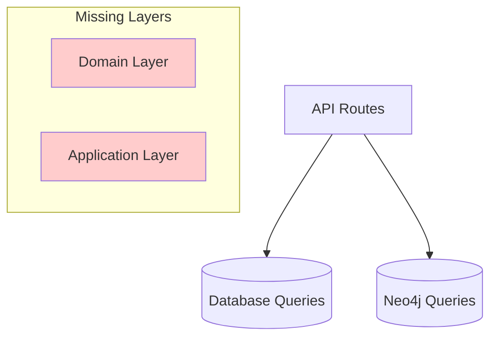

# DDDアーキテクチャ設計議論

> バックエンドリアーキテクティング Issue #111 における DDD 実装に関する設計議論

## 📋 議論の目的

### 背景・経緯
- **2025-08-10**: バックエンドアーキテクチャ分析により重大課題を発見
- **発見した課題**: DDDレイヤー分離が未実装、ビジネスロジックの散在
- **議論の必要性**: 設計判断の見直し・改善戦略の検討

### 議論スコープ
- **対象**: TRPG システムのバックエンドアーキテクチャ
- **焦点**: DDD実装・テスト戦略・段階的改善計画
- **期間**: Sprint 003 期間中の継続議論

## 🔍 現状分析結果

### 技術的課題の詳細

#### **🔴 レイヤー分離の問題**

**現在のアーキテクチャ**:


**問題点**:
- `packages/core/`: 未実装（実際には存在しない）
- `packages/domain/`: 実質的に空（node_modules のみ）
- ビジネスロジックが `apps/backend/src/route/*.ts` に直接記述

**具体例** (`apps/backend/src/route/session.ts:87-134`):
```typescript
// 現在: ルートハンドラーにビジネスロジック
.post('/', vValidator('json', sessionRequestSchema), async (c) => {
  // セッション作成ロジックが直接記述
  const sessionId = generateUUID();
  await createSession(c.env.NEON_CONNECTION_STRING, { ... });
  // ...
})
```

#### **🔴 ドメイン知識の散在**

**TRPGドメインの複雑性**:
- **Scenario**: 創作・公開・権限管理
- **Session**: 状態遷移（準備中→進行中→完了）・GM権限
- **User**: プレイヤー・GM の役割分離

**現在の問題**:
- ドメイン知識が各ルートハンドラーに散在
- ビジネスルールの変更時の影響範囲が不明確
- テストでドメインロジックを保証できない

## 🎯 設計判断の見直し

### 当初の判断

> **ユーザーの見解**: 「データ作成は補完的業務で、API動作確認程度で十分」

### 分析結果による修正提案

#### **❌ 判断の問題点**

1. **ビジネス価値の誤認**:
   - **Scenario作成**: TRPGコンテンツの中核的価値
   - **Session管理**: プレイ体験の実現
   - これらは「補完的」ではなく**中核価値創出業務**

2. **ドメイン複雑性の過小評価**:
   - セッション状態管理の複雑さ
   - マルチデータベース（PostgreSQL + Neo4j）の整合性
   - 権限・可視性制御の重要性

3. **技術的負債のリスク**:
   - 現状のままでは機能追加時の影響範囲拡大
   - バグ修正の困難さ
   - 新メンバーの理解コスト増大

#### **✅ 修正後の認識**

**TRPGシステムにおけるデータ作成の重要性**:
- **創作価値**: シナリオは創作者の表現手段
- **体験価値**: セッションはユーザー体験の中核
- **コミュニティ価値**: ユーザー間のインタラクション基盤

**必要な品質レベル**:
- データ整合性の確保（必須）
- ビジネスルールの一貫性（必須）
- 拡張性・保守性（重要）

## 💡 改善戦略案

### Phase 1: アーキテクチャ基盤整備

#### **Domain層の実装**
```typescript
// 提案: packages/core/domain/
export class Scenario {
  constructor(
    private id: ScenarioId,
    private title: string,
    private authorId: UserId,
    private visibility: Visibility
  ) {}
  
  // ドメインロジック
  public changeVisibility(newVisibility: Visibility, requesterId: UserId): void {
    if (!this.canChangeVisibility(requesterId)) {
      throw new DomainError('権限がありません');
    }
    this.visibility = newVisibility;
  }
  
  private canChangeVisibility(userId: UserId): boolean {
    return this.authorId.equals(userId);
  }
}
```

#### **Application層の実装**
```typescript
// 提案: packages/core/application/
export class ScenarioApplicationService {
  constructor(
    private scenarioRepository: IScenarioRepository,
    private userRepository: IUserRepository
  ) {}
  
  async createScenario(command: CreateScenarioCommand): Promise<ScenarioDto> {
    const author = await this.userRepository.findById(command.authorId);
    if (!author) throw new ApplicationError('ユーザーが見つかりません');
    
    const scenario = Scenario.create(command.title, command.authorId);
    await this.scenarioRepository.save(scenario);
    
    return ScenarioDto.fromDomain(scenario);
  }
}
```

### Phase 2: テスト戦略の強化

#### **現在のテスト状況**
- E2E テスト: ✅ 充実（packages/bdd-e2e-test/）
- 統合テスト: ⚠️ 基本的なAPI動作確認のみ
- 単体テスト: ❌ ドメインロジックが未テスト

#### **強化案**
```typescript
// ドメインテスト例
describe('Scenario', () => {
  test('作成者のみが可視性を変更できる', () => {
    const scenario = new Scenario(id, title, authorId, Visibility.Private);
    const otherUserId = new UserId('other-user');
    
    expect(() => {
      scenario.changeVisibility(Visibility.Public, otherUserId);
    }).toThrow('権限がありません');
  });
});
```

### Phase 3: 段階的移行

#### **移行戦略**
1. **新機能**: DDD パターンで実装
2. **既存機能**: 段階的にリファクタリング
3. **レガシーコード**: インターフェース経由で隔離

## 🤔 議論ポイント

### 1. 実装優先度の判断

**Question**: Phase 1〜3 のどこから着手すべきか？

**選択肢**:
- A) 完全なDDD実装から開始（時間はかかるが理想的）
- B) 既存コードの段階的改善（リスクは低いが効果は限定的）
- C) 新機能のみDDDパターン適用（ハイブリッドアプローチ）

### 2. テスト戦略の妥当性

**Question**: ドメインの複雑性に対してどの程度のテスト投資が適切か？

**考慮点**:
- 開発速度 vs 品質担保のトレードオフ
- チームのDDD習熟度
- ビジネス要求の変更頻度

### 3. 技術的制約への対応

**Question**: Cloudflare Workers 環境でのDDD実装における制約は？

**検討事項**:
- Cold Start 時間への影響
- メモリ使用量の増加
- 複雑性増加による保守コスト

### 4. 段階的移行の具体的計画

**Question**: 既存の稼働システムを止めずにどう移行するか？

**検討事項**:
- API互換性の維持
- データベーススキーマの変更
- フロントエンドへの影響

## 📅 次のアクション

### 議論の進め方

1. **各論点への見解表明**: ユーザーからの意見・判断を求める
2. **具体的実装計画の策定**: 合意した方針に基づく詳細計画
3. **プロトタイプ実装**: 小規模な実装で検証
4. **本格実装**: 段階的な改善の実行

### 決定すべき事項

- [ ] 実装優先度の決定（Phase 1-3のどれから着手？）
- [ ] テスト戦略の合意（どの程度の品質レベルを目指すか？）
- [ ] 技術的制約への対応方針
- [ ] 移行スケジュールとマイルストーン

---

## 🏷️ メタデータ

**作成日**: 2025-08-10  
**関連Issue**: #111（バックエンドリアーキテクティング）  
**関連文書**: [[backend-rearchitecting-implementation.md]]  
**ステータス**: 議論開始  
**参加者**: ユーザー、Claude

#discussion #ddd #architecture #backend #design-decision