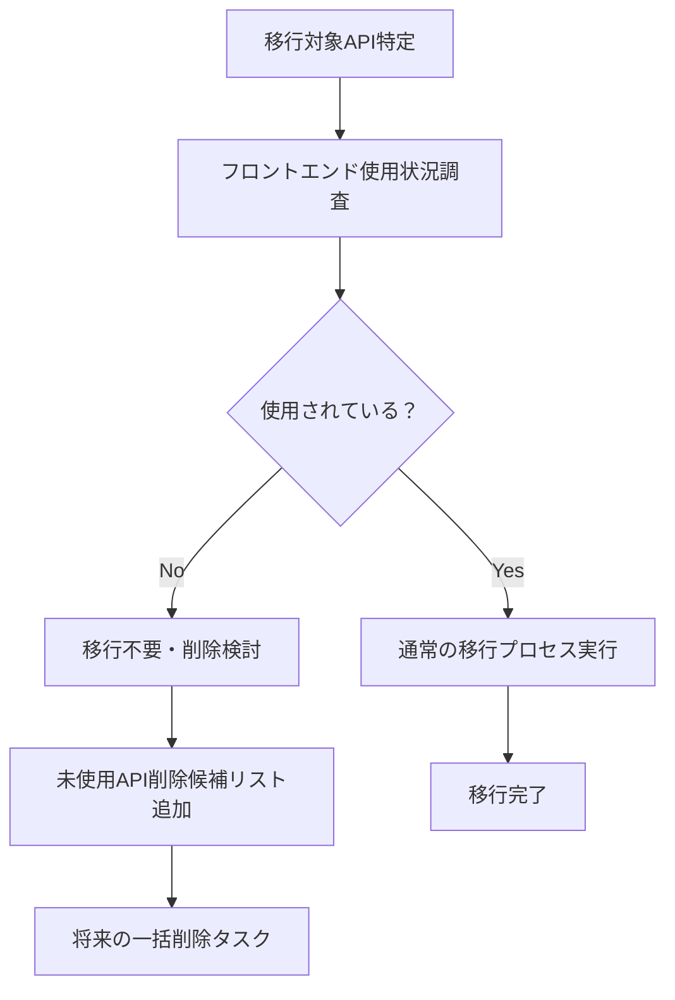

# 未使用API削除候補リスト

> フロントエンド使用状況調査で発見された未使用APIの削除検討

## 📋 削除候補API一覧

### **🔴 削除候補: GET /api/game-masters/{uid}/sessions**

#### **発見経緯**
- **日付**: 2025-08-12
- **発見タイミング**: 第2弾API移行のフロントエンド影響調査
- **調査範囲**: `apps/frontend/**/*.{ts,tsx,js,jsx}` 全ファイル

#### **現状分析**
```http
# ❌ 未使用API（削除候補）
GET /api/game-masters/{uid}/sessions

# ✅ 実際に使用されているAPI
GET /api/sessions?gm_id={uid}  # クエリパラメータでGMセッション取得

# ❌ 削除済みAPI（元々未使用）
GET /api/sessions/gm/{gm_id}   # 第2弾移行で削除
```

#### **削除対象ファイル**
```
📁 バックエンド実装
├── apps/backend/src/route/gameMasters.ts (全体)
├── apps/backend/src/route/index.ts:23 (.route('/game-masters', gameMastersRoute))

📁 OpenAPI仕様
├── docs/redocly/openapi/paths/gameMasterSessions.yaml (全体)
├── docs/redocly/openapi/api.yaml:35 (/api/game-masters/{uid}/sessions)

📁 テスト
├── apps/backend/test/integrations/session-gm.spec.ts (全体)

📁 型定義・依存関係
└── apps/backend/src/route/gameMasters.ts からの import (削除済み)
```

#### **削除による影響**
- **✅ 機能影響**: なし（フロントエンドで未使用）
- **✅ 互換性**: 問題なし（外部API利用者なし）
- **✅ 代替手段**: `GET /api/sessions?gm_id={uid}` で同等機能提供
- **⚠️ テスト**: 統合テスト7件削除

#### **削除効果**
- **コード削減**: 約150行
- **保守負荷軽減**: 未使用コードの維持コスト削除
- **API設計明確化**: 重複機能の排除

---

## 📊 未使用API調査方法

### **調査手順**
1. **文字列検索**: API パスでの全文検索
2. **import文検索**: 関連する型・関数のimport検索  
3. **動的生成確認**: テンプレート文字列でのAPI構築確認
4. **設定ファイル確認**: API エンドポイント設定の確認

### **調査コマンド例**
```bash
# 直接パス検索
grep -r "game-masters.*sessions" apps/frontend/
grep -r "api/game-masters" apps/frontend/

# クエリパラメータ vs パスパラメータ
grep -r "sessions?gm_id" apps/frontend/     # クエリパラメータ（使用中）
grep -r "sessions/gm" apps/frontend/         # パスパラメータ（未使用）

# API クライアント確認
grep -r "gameMasters\|game-masters" apps/frontend/src/shared/api/
```

---

## 🔄 今後の改善策

### **移行プロセス改善**


### **事前調査チェックリスト**
- [ ] フロントエンドでの直接利用確認
- [ ] API クライアント生成ツールでの利用確認
- [ ] 外部サービスからのAPI呼び出し確認
- [ ] ドキュメント・チュートリアルでの言及確認
- [ ] テストコードでの利用確認（E2E・手動テスト等）

### **削除判断基準**
#### **削除可能条件**
- ✅ フロントエンドで未使用
- ✅ 外部サービスで未使用
- ✅ 代替API存在
- ✅ 機能的価値なし

#### **削除延期条件**
- ❌ 将来的な利用予定あり
- ❌ 外部パートナーとの契約上必要
- ❌ レガシーシステムからの移行途中
- ❌ ドキュメント化された公開API

---

## 📋 削除実行プラン

### **Phase 1: 影響調査拡大**
- [ ] 外部サービス・パートナーAPI利用状況確認
- [ ] プロダクション環境でのアクセスログ分析
- [ ] 開発者・ステークホルダーへの確認

### **Phase 2: 段階的削除**
- [ ] OpenAPI仕様からの削除（API文書更新）
- [ ] 統合テスト削除
- [ ] バックエンド実装削除
- [ ] 関連ファイル・依存関係削除

### **Phase 3: 削除後確認**
- [ ] 全テスト実行・通過確認
- [ ] アプリケーション動作確認
- [ ] API文書整合性確認

---

## ⚠️ 注意事項

### **削除前必須確認**
1. **外部影響**: 他チーム・外部サービスでの利用なし
2. **将来計画**: プロダクトロードマップでの利用予定なし
3. **テスト影響**: E2E テスト・手動テストシナリオへの影響なし

### **削除後リスク**
1. **復旧困難**: 削除後の機能復旧に時間要する
2. **移行作業無駄**: 実装した移行作業が無価値化
3. **設計一貫性**: Context-based Design パターン適用例の削除

### **推奨アプローチ**
- **段階的削除**: 仕様→テスト→実装の順序で削除
- **バックアップ**: Git履歴での復元可能性確保
- **文書化**: 削除理由・経緯の明確な記録

---

## 🏷️ メタデータ

**作成日**: 2025-08-12  
**関連移行**: 第2弾API移行（sessions/gm → game-masters/sessions）  
**発見者**: API移行プロセス フロントエンド影響調査  

**ステータス**: 削除検討中  
**優先度**: 低（機能影響なし、保守負荷のみ）  
**推定作業時間**: 0.5日（削除自体は簡単）

**関連ドキュメント**:
- `api-migration-phase2-completion.md`
- `api-migration-design-principles.md`

#unused-api #cleanup #technical-debt #code-maintenance #api-design