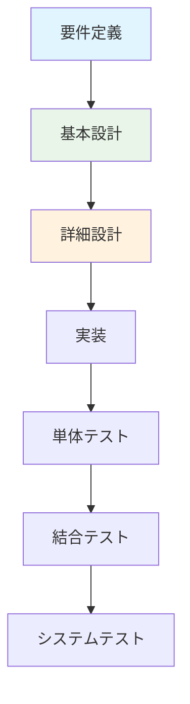
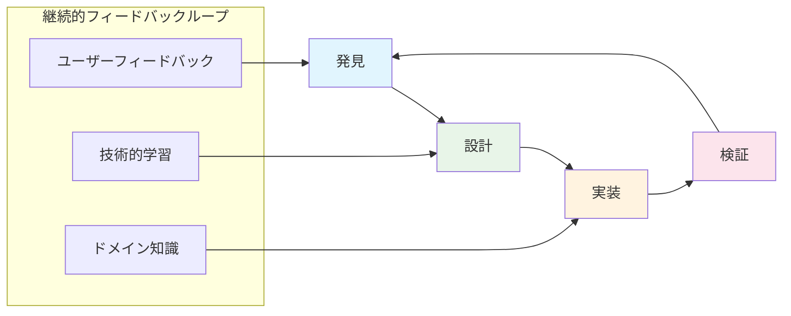
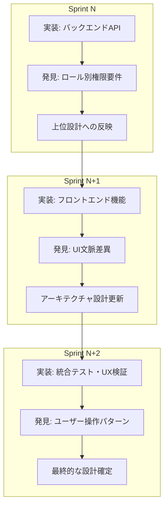
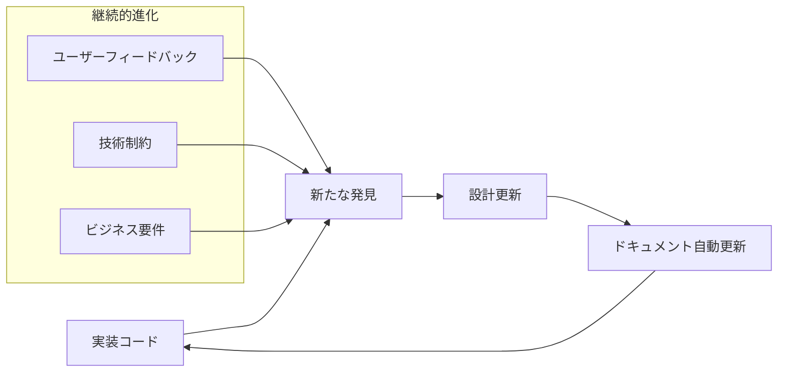

# DDD知見からフロントエンドアーキテクチャ設計への現代的アプローチ

## 📋 背景と問題提起

### バックエンドリファクタリングで得られた重要な知見

#### **🎭 3つのユーザーロールの文脈差異の発見**
Sprint 3のバックエンドリファクタリングで明らかになった重要な設計要件：

```typescript
// バックエンドAPI設計で発見された文脈別要件
interface UserRoleContext {
  author: {
    scenarios: {
      canEdit: boolean;     // 自分のシナリオのみ編集可能
      canDelete: boolean;   // 自分のシナリオのみ削除可能
      visibility: 'private' | 'public'; // 非公開も含む
    };
  };
  
  gm: {
    scenarios: {
      canStock: boolean;    // 公開シナリオのストック機能
      canCreateSession: boolean; // シナリオベースのセッション作成
    };
    sessions: {
      canManage: boolean;   // 自分が作成したセッションのみ管理可能
      canInvite: boolean;   // プレイヤー招待・除名
    };
  };
  
  player: {
    sessions: {
      canJoin: boolean;     // セッション参加申請
      canView: boolean;     // 参加セッションの閲覧
      canInteract: boolean; // セッション内での行動
    };
  };
}
```

#### **⚠️ 上位アーキテクチャドキュメントへの反映不足**

**現状の問題**:
- `docs/02-architecture/overview.md`にはロール別文脈の記載が不足
- フロントエンド設計指針にユーザーロール考慮が欠如
- DDDのドメイン境界が不明確

### **🤔 根本的な設計課題：ウォーターフォールからアジャイルへのパラダイムシフト**

#### **従来のV字モデル（ウォーターフォール）**


**問題点**:
- ❌ 要件変更に対する柔軟性不足
- ❌ 実装段階での新たな発見を設計に反映しづらい
- ❌ ユーザーフィードバックが遅すぎる

#### **現代的なアジャイルアプローチ**


---

## 🚀 現代的なアーキテクチャ設計アプローチ

### **1. Discovery-Driven Architecture (発見駆動アーキテクチャ)**

#### **基本思想**: 実装を通じた継続的なドメイン発見
```typescript
// 例：バックエンド実装でのロール文脈発見 → フロントエンド設計への反映

// Phase 1: バックエンドAPI実装で発見
interface APIDiscovery {
  // 実装段階で明らかになった権限要件
  authorization: {
    scenario_edit: 'author_only';     // 作成者のみ編集可能
    session_create: 'gm_only';       // GMのみセッション作成可能
    session_join: 'player_action';   // プレイヤーの参加アクション
  };
  
  // 実装段階で明らかになったUI要件差異
  ui_context: {
    scenario_list: {
      author: ['editUrl', 'deleteButton', 'visibilityToggle'];
      gm: ['stockButton', 'createSessionUrl', 'authorName'];
      player: ['viewOnly', 'joinableSessionIndicator'];
    };
  };
}

// Phase 2: フロントエンド設計への反映
interface FrontendArchitecture {
  // 発見されたドメイン境界を基にした設計
  features: {
    'scenario-management': {
      contexts: ['author', 'gm', 'player'];
      shared_components: ['ScenarioCard'];
      context_specific: {
        author: ['EditScenarioForm', 'VisibilityControl'];
        gm: ['StockButton', 'SessionCreateButton'];
        player: ['ViewOnlyDisplay'];
      };
    };
  };
}
```

### **2. Context-First Architecture (文脈優先アーキテクチャ)**

#### **設計原則**: ユーザー文脈を第一級オブジェクトとして扱う

```typescript
// 従来のアプローチ：機能別設計
interface TraditionalApproach {
  scenario: {
    list: ScenarioListComponent;      // 全ロール共通
    create: ScenarioCreateComponent;  // 作成機能
    edit: ScenarioEditComponent;      // 編集機能
  };
}

// 現代的アプローチ：文脈優先設計
interface ContextFirstApproach {
  contexts: {
    author: {
      scenario_management: {
        list: AuthorScenarioListWidget;    // 編集・削除・公開設定UI
        create: AuthorScenarioCreateFlow;  // 作成フロー
        edit: AuthorScenarioEditFlow;      // 編集フロー
      };
    };
    
    gm: {
      scenario_browsing: {
        public_list: GMScenarioPublicList; // ストック・セッション作成UI
        session_creation: GMSessionCreateFlow; // セッション作成フロー
      };
    };
    
    player: {
      session_participation: {
        available_sessions: PlayerSessionBrowser; // 参加可能セッション
        join_flow: PlayerSessionJoinFlow;         // 参加フロー
      };
    };
  };
  
  shared: {
    // 文脈横断で共通の部分のみ
    base_components: ['Button', 'Modal', 'Form'];
    domain_models: ['Scenario', 'Session', 'User'];
  };
}
```

### **3. Iterative Domain Refinement (反復的ドメイン精緻化)**

#### **プロセス**: 実装 → 学習 → 設計更新のサイクル



---

## 🏗️ Odyssageプロジェクトでの具体的適用

### **Phase 1: バックエンド知見の上位設計への統合**

#### **🔄 overview.mdへのフィードバック統合**
```typescript
// 追加すべき設計指針
interface UpdatedArchitectureOverview {
  user_role_contexts: {
    design_principle: "ユーザーロール別の文脈差異を第一級の設計要素として扱う";
    
    role_definitions: {
      author: "シナリオ作成者 - 創作・編集・公開管理";
      gm: "ゲームマスター - セッション運営・プレイヤー管理";
      player: "プレイヤー - セッション参加・体験";
    };
    
    context_boundaries: {
      scenario_management: "作成者の創作活動文脈";
      session_operation: "GMのセッション運営文脈";
      game_participation: "プレイヤーのゲーム参加文脈";
    };
  };
  
  frontend_ddd_strategy: {
    principle: "フロントエンドに複雑なドメインロジックを配置";
    application_areas: {
      context_switching: "ロール切り替え時のUI・状態管理";
      permission_logic: "文脈に応じた操作可能性判定";
      workflow_management: "ロール別の操作フロー制御";
    };
  };
}
```

#### **🎯 frontend-architecture.mdの文脈対応強化**
```typescript
// 現行設計の拡張
interface ContextAwareFrontendArchitecture {
  // 既存のClean Architecture + FSD を文脈対応に拡張
  features: {
    scenario: {
      contexts: {
        author: {
          // 作成者文脈での特化機能
          create: AuthorScenarioCreateFeature;
          edit: AuthorScenarioEditFeature;
          manage: AuthorScenarioManageFeature;
        };
        
        gm: {
          // GM文脈での特化機能
          browse: GMScenarioBrowseFeature;
          stock: GMScenarioStockFeature;
        };
        
        player: {
          // プレイヤー文脈での特化機能（将来拡張）
          discover: PlayerScenarioDiscoverFeature;
        };
      };
      
      shared: {
        // 文脈横断の共通部分
        domain: ['ScenarioEntity', 'ScenarioValidator'];
        ui: ['ScenarioCard', 'ScenarioModal'];
      };
    };
  };
  
  context_management: {
    // ロール文脈の管理戦略
    state: 'Redux(グローバル) + Context API(局所的)';
    routing: 'ロール別ルート分離 + 権限ガード';
    components: 'Context Provider + Hook パターン';
  };
}
```

### **Phase 2: フロントエンド設計の文脈対応実装**

#### **📁 ディレクトリ構造の文脈対応**
```
src/
├── app/
│   ├── contexts/              # 新設：文脈管理
│   │   ├── AuthorContext.tsx  # 作成者文脈
│   │   ├── GMContext.tsx      # GM文脈
│   │   └── PlayerContext.tsx  # プレイヤー文脈
│   └── routing/
│       ├── AuthorRoutes.tsx   # 作成者専用ルート
│       ├── GMRoutes.tsx       # GM専用ルート
│       └── PlayerRoutes.tsx   # プレイヤー専用ルート
│
├── features/
│   └── scenario/
│       ├── author-management/ # 作成者視点のシナリオ管理
│       │   ├── create/
│       │   ├── edit/
│       │   └── publish/
│       ├── gm-browsing/       # GM視点のシナリオ閲覧
│       │   ├── browse/
│       │   ├── stock/
│       │   └── session-create/
│       └── shared/            # 文脈横断の共通機能
│           ├── domain/
│           └── ui/
│
└── widgets/
    ├── author-dashboard/      # 作成者専用ダッシュボード
    ├── gm-control-panel/      # GM専用コントロールパネル
    └── player-interface/      # プレイヤー専用インターフェース
```

#### **🎮 Context管理の実装パターン**
```typescript
// Context Provider パターン
export const AuthorContext = createContext<AuthorContextValue>(null);

export function AuthorProvider({ children }: PropsWithChildren) {
  const { user } = useAuth();
  const [authorState, setAuthorState] = useState<AuthorState>();
  
  // 作成者文脈でのドメインロジック
  const createScenario = useCallback(async (input: ScenarioInput) => {
    // 作成者権限でのシナリオ作成ワークフロー
    const scenario = ScenarioEntity.createAsAuthor(user.id, input);
    const result = await scenario.validateAsAuthor();
    // ...
  }, [user]);
  
  const contextValue = {
    user,
    authorState,
    actions: {
      createScenario,
      editScenario,
      publishScenario,
    },
  };
  
  return (
    <AuthorContext.Provider value={contextValue}>
      {children}
    </AuthorContext.Provider>
  );
}

// 使用側
export function AuthorScenarioList() {
  const { authorState, actions } = useAuthorContext();
  
  return (
    <div>
      {authorState.scenarios.map(scenario => (
        <AuthorScenarioCard 
          key={scenario.id}
          scenario={scenario}
          onEdit={actions.editScenario}
          onPublish={actions.publishScenario}
        />
      ))}
    </div>
  );
}
```

### **Phase 3: 統合的な設計進化プロセス**

#### **🔄 継続的設計改善サイクル**

```typescript
interface ContinuousArchitectureEvolution {
  cycle: {
    // 1. 実装での発見
    implementation_discovery: {
      source: '各Sprint実装段階';
      output: '新たなドメイン知識・技術制約・ユーザー要件';
    };
    
    // 2. 上位設計へのフィードバック
    architecture_feedback: {
      target: 'docs/02-architecture/';
      process: '発見事項の設計原則・指針への反映';
    };
    
    // 3. 下位実装への指針更新
    implementation_guidance: {
      target: 'docs/03-development/';
      process: '更新された設計指針の実装計画への反映';
    };
    
    // 4. 次Sprint計画への反映
    next_sprint_planning: {
      input: '更新された設計指針';
      output: '文脈対応の実装計画';
    };
  };
  
  quality_gates: {
    domain_consistency: 'ドメインモデルの一貫性チェック';
    context_coverage: '全ユーザー文脈の考慮確認';
    architecture_alignment: '上位設計との整合性検証';
  };
}
```

---

## 🎯 現代開発手法でのアーキテクチャ進化プロセス

### **1. Living Architecture (生きているアーキテクチャ)**

#### **従来**: 静的なドキュメント
```
要件定義書 → 基本設計書 → 詳細設計書 → 実装
              ↑
         変更が困難、実装と乖離
```

#### **現代**: 動的に進化する設計


### **2. Evolutionary Design (進化的設計)**

#### **基本原則**: YAGNI (You Aren't Gonna Need It) + 継続的リファクタリング

```typescript
// 段階的進化の例
interface EvolutionaryDesignExample {
  // Phase 1: 最小限の実装で開始
  mvp: {
    scenario: {
      create: BasicScenarioCreate;     // 基本的な作成機能のみ
      list: BasicScenarioList;         // シンプルな一覧表示
    };
  };
  
  // Phase 2: ユーザーフィードバックで文脈差異を発見
  context_awareness: {
    scenario: {
      author_create: AuthorScenarioCreate;  // 作成者特化機能
      gm_browse: GMScenarioBrowse;          // GM特化機能
    };
  };
  
  // Phase 3: さらなる最適化
  advanced_features: {
    scenario: {
      author_workflow: AuthorScenarioWorkflow; // 高度なワークフロー
      gm_management: GMScenarioManagement;     // 高度な管理機能
    };
  };
}
```

### **3. Architecture Decision Records (ADR)**

#### **設計判断の記録・追跡システム**
```markdown
# ADR-003: フロントエンドにおける文脈別アーキテクチャの採用

## Status
Accepted

## Context
バックエンドAPIの実装を通じて、Author/GM/Playerの3つのロールで
シナリオ・セッションに対する権限・UI要件が大きく異なることが判明。

## Decision
Context-First Architecture を採用。
- ユーザーロールを第一級のアーキテクチャ要素として扱う
- features/ 以下を文脈別に組織化
- 共通部分は shared/ で管理

## Consequences
Positive:
- ロール別要件の明確な分離
- 権限ロジックの実装安全性向上
- 将来の新ロール追加に対する拡張性

Negative:
- コードの重複リスク
- 複雑性の増加
```

---

## 🚀 実装ロードマップ

### **Phase 1: アーキテクチャドキュメント統合 (1週間)**

#### **Week 1: 上位設計への知見反映**
- [ ] `overview.md` にロール別文脈の記載追加
- [ ] `frontend-architecture.md` の文脈対応設計強化
- [ ] ADR形式での設計判断記録開始

### **Phase 2: フロントエンド基盤設計 (2-3週間)**

#### **Week 2-3: Context-First Architecture 基盤**
- [ ] Context Provider システム実装
- [ ] ロール別ルーティング設計
- [ ] 文脈対応ディレクトリ構造構築

#### **Week 4: ドメインモデル統一**
- [ ] 共通ドメインモデル定義
- [ ] 文脈別ビジネスロジック分離
- [ ] バックエンドAPI連携層統一

### **Phase 3: 機能実装 (4-8週間)**

#### **Week 5-6: Author Context 実装**
- [ ] 作成者文脈でのシナリオ管理機能
- [ ] 編集・公開ワークフロー
- [ ] 権限制御の実装

#### **Week 7-8: GM Context 実装**
- [ ] GM文脈でのシナリオ閲覧・ストック機能
- [ ] セッション作成・管理機能
- [ ] プレイヤー招待・管理機能

### **Phase 4: 統合・最適化 (1-2週間)**

#### **Week 9-10: 統合テスト・UX改善**
- [ ] 文脈切り替えの UX テスト
- [ ] パフォーマンス最適化
- [ ] アクセシビリティ対応

---

## 💡 重要な結論

### **🎯 現代的なアーキテクチャ設計の本質**

#### **設計は実装と共に進化するもの**
- 完璧な事前設計は不可能かつ不要
- 実装を通じた学習と設計の継続的改善が重要
- ユーザーフィードバックの早期・継続的取得

#### **文脈を第一級の設計要素として扱う**
- ユーザーロール別の要件差異を設計の中核に据える
- 技術的制約ではなく、ビジネス価値・ユーザー体験を優先
- 共通化と特化のバランスを動的に調整

#### **DDDは「設計手法」ではなく「思考の枠組み」**
- ドメイン知識の明示化と継続的精緻化
- 技術的実装とビジネス要件の適切な分離
- 複雑性を適切な場所に配置する判断力

### **🚀 Odyssageプロジェクトでの適用**

#### **既に良い方向性で進んでいる**
- バックエンドでのシンプル設計
- フロントエンドでの複雑なドメインロジック配置
- 実装を通じた継続的な学習

#### **さらなる進化の方向性**
- ロール別文脈の明示的なアーキテクチャ反映
- 上位設計と実装知見の継続的な相互フィードバック
- 現代的な進化的設計プロセスの確立

---

## 🏷️ メタデータ

**作成日**: 2025-08-14  
**関連Sprint**: Sprint 3 フロントエンドリファクタリング  
**関連文書**: 
- [[../backend-rearchitecting/openapi-context-based-design-discussion.md]]
- [[../backend-rearchitecting/fullstack-ddd-responsibility.md]]
- [[../../02-architecture/overview.md]]
- [[../../02-architecture/frontend-architecture.md]]

**ステータス**: 検討ドキュメント - 実装方針決定待ち  
**次のアクション**: Phase 1実装計画の詳細化

#frontend #ddd #architecture #context-driven #agile #evolutionary-design #modern-development