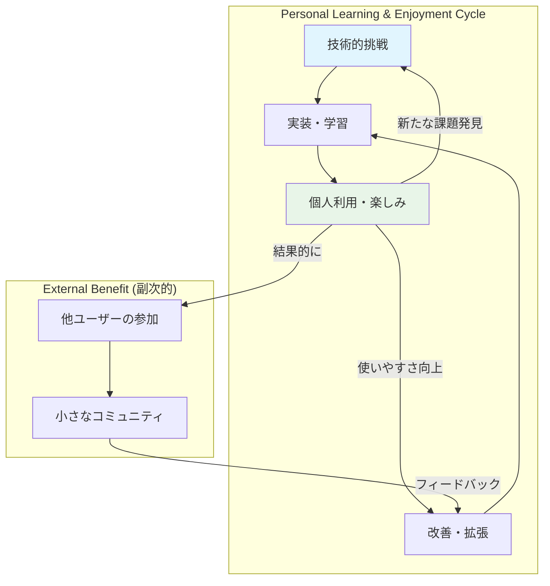

# Odyssage 真のプロジェクトビジョン修正

## 📋 重要なフィードバックと方向修正

### **ユーザーからの重要な指摘**
> 「マネタイズやメディア展開は目指していないです。私が、技術を磨く題材として、このOdyssageを作ろうとしています。私はシナリオ製作やGMが得意でなく、プレイヤーを楽しんでいる人間です。このプラットフォームをつくることで、他人の冒険の記録を読んだり、プレイヤーとしてシナリオを遊べることを期待しています。」

### **前回分析の問題点**
❌ **商業的視点の過度な適用**: マネタイズ、エコシステム、メディア展開を想定  
❌ **ステークホルダー均等視**: Author/GM/Playerを同等に扱った分析  
❌ **外向きビジネス志向**: 市場拡大・収益化前提の設計  

---

## 🎯 真のプロジェクト動機の理解

### **2つの核となる動機**

#### **1. 技術習得・実践の場**
```typescript
interface TechnicalLearningGoals {
  primary_technologies: {
    frontend: "React + TypeScript + Modern State Management";
    backend: "Cloudflare Workers + Hono.js + Edge Computing";
    database: "Hybrid DB (PostgreSQL + Neo4j)";
    architecture: "Clean Architecture + DDD + Feature-Sliced Design";
  };
  
  learning_objectives: {
    fullstack_development: "フロント・バック・インフラの統合理解";
    modern_architecture: "現代的なアーキテクチャパターンの習得";
    complex_domain: "複雑なドメインロジックの実装経験";
    performance_optimization: "スケーラブルな設計の実践";
  };
  
  skill_improvement_areas: [
    "TypeScript型設計の熟練度向上",
    "非同期処理・楽観的更新の実装",
    "GraphDBを活用した複雑なクエリ設計",
    "Edge Computing環境での最適化"
  ];
}
```

#### **2. 個人的なTRPG楽しみの拡張**
```typescript
interface PersonalEnjoymentGoals {
  current_situation: {
    role_preference: "Player";
    skills: {
      scenario_creation: "苦手";
      gm_management: "苦手"; 
      playing: "得意・楽しい";
    };
    constraints: {
      time_availability: "限定的";
      coordination_difficulty: "他プレイヤーとのスケジュール調整困難";
    };
  };
  
  desired_experience: {
    content_consumption: "他人の冒険記録を読む楽しみ";
    player_participation: "プレイヤーとしてシナリオを遊ぶ";
    passive_enjoyment: "自分で作らなくても良質な体験を得る";
    flexible_participation: "自分のペースでの参加";
  };
  
  ideal_outcome: {
    rich_content: "多様で面白いプレイログが蓄積される";
    easy_participation: "手軽にプレイヤーとして参加できる";
    reading_pleasure: "他人のプレイスタイル・選択を楽しめる";
  };
}
```

---

## 🔄 プロジェクト構造の再理解

### **個人プロジェクトとしての健全な設計**

#### **本質的な価値創造フロー**


### **プレイヤー中心の価値設計**

#### **Primary User: 自分自身（プレイヤー）**
```typescript
interface PrimaryUserValue {
  immediate_benefits: {
    skill_development: "最新技術スタックでの実践経験";
    portfolio_building: "技術力証明のための実装成果";
    learning_documentation: "学習過程・判断記録の蓄積";
  };
  
  entertainment_benefits: {
    content_access: "他人が作った良質なシナリオへのアクセス";
    flexible_play: "時間制約なしでのTRPG参加";
    story_collection: "多様なプレイログの閲覧・収集";
    low_commitment: "GM・シナリオ作成責任なしでの楽しみ";
  };
}
```

#### **Secondary Users: 協力してくれる人たち**
```typescript
interface SecondaryUserValue {
  authors: {
    motivation: "自分の創作を試してもらえる場";
    benefit: "技術的に面白いプラットフォームでの実験";
    expectation: "商業的成功ではなく、創作の楽しみ";
  };
  
  gms: {
    motivation: "新しいツールでのセッション運営経験";
    benefit: "技術的に先進的なシステムでの管理体験";
    expectation: "収益ではなく、運営の新しい形の探求";
  };
  
  players: {
    motivation: "面白い非同期TRPGプラットフォームの体験";
    benefit: "革新的なゲーム体験";
    expectation: "楽しい時間、新しい体験";
  };
}
```

---

## 🛠️ 技術習得目標との整合性

### **学習価値を最大化する技術選択**

#### **現在の技術スタック再評価**
```typescript
interface TechStackLearningValue {
  high_learning_value: {
    "React + TypeScript": {
      reason: "現代フロントエンドの標準、転用性高";
      complexity: "状態管理・型設計で深い学習可能";
    };
    "Cloudflare Workers": {
      reason: "Edge Computing、サーバーレスの最先端";
      complexity: "制約下での最適化、新しいパラダイム";
    };
    "Neo4j + PostgreSQL": {
      reason: "ハイブリッドDB設計、グラフDB活用";
      complexity: "データモデリングの高度な判断";
    };
    "Clean Architecture + DDD": {
      reason: "大規模開発の基本、設計力向上";
      complexity: "抽象化・境界設計の実践";
    };
  };
  
  practical_challenges: {
    async_state_management: "楽観的更新・競合解決の実装";
    complex_domain_logic: "TRPG特有のビジネスルール";
    performance_optimization: "レスポンス・スケーラビリティ";
    user_experience: "非同期プレイでのUX設計";
  };
}
```

#### **学習成果の可視化戦略**
```typescript
interface LearningDocumentation {
  technical_blog_topics: [
    "ハイブリッドDB設計の判断基準と実装",
    "Edge ComputingでのClean Architecture実践",
    "非同期TRPGでの楽観的更新パターン",
    "GraphDBを活用した複雑なクエリ最適化"
  ];
  
  portfolio_highlights: {
    architecture_diagram: "システム全体設計の可視化";
    code_quality: "TypeScript型設計・テストカバレッジ";
    performance_metrics: "レスポンス時間・スケーラビリティ指標";
    domain_complexity: "複雑ビジネスロジックの整理・実装";
  };
  
  open_source_contribution: {
    documentation: "設計判断・学習過程の詳細記録";
    reusable_components: "汎用化可能な部分の切り出し";
    learning_materials: "同じ技術スタックでの学習リソース";
  };
}
```

---

## 🎮 個人的楽しみを最大化する設計

### **プレイヤー体験の最適化**

#### **理想的なプレイヤージャーニー**
```markdown
1. **発見・参加**: 「面白そうなセッションがある！」
   - 魅力的なシナリオ説明・GM紹介
   - 簡単な参加プロセス
   - 他プレイヤーのプレイログサンプル

2. **快適なプレイ**: 「自分のペースで楽しめる」
   - 直感的なUI・選択肢の提示
   - じっくり考えられる時間的余裕
   - 選択の結果への適切なフィードバック

3. **個別化体験**: 「自分だけの物語になった」
   - 選択による分岐・結果の差異
   - 個性が反映される物語展開
   - 愛着を持てる冒険記録

4. **読み返し・共有**: 「面白い記録ができた」
   - 読みやすいプレイログ表示
   - 他プレイヤーとの比較・共有機能
   - 思い出として残る価値

5. **継続参加**: 「また遊びたい」
   - 次のシナリオへの興味
   - プレイヤーとしての成長実感
   - コミュニティへの帰属感
```

#### **読書体験としての価値**
```typescript
interface ReadingExperience {
  content_types: {
    own_adventure_log: "自分の冒険記録の読み返し";
    others_adventures: "他プレイヤーの異なる選択・結末";
    comparison_reading: "同シナリオでの複数プレイログ比較";
    scenario_exploration: "未プレイシナリオの雰囲気把握";
  };
  
  reading_features: {
    beautiful_formatting: "読みやすいテキスト表示";
    choice_highlighting: "重要な選択ポイントの可視化";
    timeline_view: "時系列での進行確認";
    character_focus: "PC成長・変化の追跡";
  };
  
  discovery_mechanisms: {
    recommendation: "好みに基づくシナリオ・プレイログ推薦";
    tag_system: "ジャンル・雰囲気での分類・検索";
    rating_system: "面白さ・完成度での評価";
    trending: "人気・話題のコンテンツ表示";
  };
}
```

---

## 🚀 修正されたプロジェクト方針

### **新しいビジョンステートメント**

```markdown
**Odyssage - 技術学習と個人的楽しみのためのTRPGプラットフォーム**

最新技術スタックでの開発実践を通じて技術力向上を図りながら、
自分が楽しめるプレイヤー体験を創り出す個人プロジェクト。

非同期プレイにより時間制約なくTRPGを楽しみ、
他人の冒険記録を読む楽しみも提供する、
学習と娯楽が両立したプラットフォーム。
```

### **成功指標の再定義**

#### **技術習得面での成功**
```typescript
interface TechnicalSuccess {
  skill_metrics: {
    architecture_mastery: "Clean Architecture + DDDの実践的理解";
    fullstack_capability: "React + Cloudflare Workers + DBの統合開発";
    performance_optimization: "Edge Computing環境での最適化実装";
    domain_modeling: "複雑ドメインの適切な抽象化";
  };
  
  portfolio_value: {
    technical_depth: "高度な技術スタックでの実装成果";
    problem_solving: "非同期プレイ特有の課題解決";
    code_quality: "保守可能で拡張性の高い設計";
    documentation: "設計判断・学習過程の記録";
  };
}
```

#### **個人的楽しみ面での成功**
```typescript
interface PersonalEnjoymentSuccess {
  content_richness: {
    scenario_variety: "様々なジャンル・スタイルのシナリオ";
    playlog_diversity: "多様なプレイスタイル・選択の記録";
    reading_satisfaction: "読み物として楽しめるコンテンツ";
  };
  
  participation_ease: {
    low_barrier: "プレイヤーとしての参加しやすさ";
    flexible_timing: "自分のペースでの進行";
    stress_free: "GM・創作責任なしでの楽しみ";
  };
  
  community_formation: {
    like_minded_people: "技術・TRPGに興味を持つ人たちとの交流";
    mutual_benefit: "お互いに楽しめる関係";
    sustainable_participation: "無理のない継続的な参加";
  };
}
```

### **開発優先順位の調整**

#### **Phase 1: 個人利用基盤（最優先）**
```markdown
1. **自分が楽しめるプレイヤー体験**
   - 快適なシナリオ参加・選択UI
   - 読みやすいプレイログ表示
   - 他プレイヤーのプレイログ閲覧機能

2. **技術学習価値の最大化**
   - 複雑なドメインロジックの実装
   - 楽観的更新・非同期処理の実装
   - ハイブリッドDBの活用

3. **最小限のコミュニティ機能**
   - シナリオ作成者・GMの基本機能
   - 簡単な参加・招待システム
```

#### **Phase 2: 体験改善（次優先）**
```markdown
1. **読書体験の向上**
   - プレイログの比較・検索機能
   - おすすめ・発見システム
   - 美しい表示・フォーマット

2. **技術的挑戦の拡張**
   - パフォーマンス最適化
   - 高度なUI/UXパターン
   - 新しい技術の実験的導入

3. **小さなコミュニティ育成**
   - 質の高いコンテンツの蓄積
   - 参加しやすい環境整備
```

---

## 💡 重要な気づきと修正点

### **根本的な視点転換**

#### **From: ビジネス志向 → To: 学習・趣味志向**
```markdown
❌ 削除すべき要素:
- マネタイゼーション戦略
- スケールアップ計画
- マーケットプレイス構想
- エンタープライズ展開

✅ 重視すべき要素:
- 技術学習価値
- 個人的楽しみ
- コード品質・設計
- 小さく持続可能なコミュニティ
```

#### **From: 多角的ステークホルダー → To: プレイヤー中心**
```markdown
❌ 均等な価値提案:
Author/GM/Playerを同等に扱った分析

✅ プレイヤー中心の価値:
- Primary: 自分自身（プレイヤーとして）
- Secondary: 協力してくれる人たち
- 目標: プレイヤー体験の最大化
```

### **持続可能性の確保**

#### **個人プロジェクトとしての健全性**
```typescript
interface SustainablePersonalProject {
  motivation_alignment: {
    learning: "技術習得による実用的価値";
    enjoyment: "個人的な楽しみの確保";
    portfolio: "キャリアへの貢献";
  };
  
  scope_management: {
    realistic_goals: "完璧を求めすぎない";
    iterative_development: "段階的な改善";
    personal_use_focus: "自分が使いたいものを作る";
  };
  
  community_approach: {
    organic_growth: "自然な参加者の増加";
    quality_over_quantity: "少数でも質の高い交流";
    no_pressure: "商業的プレッシャーなし";
  };
}
```

---

## 📋 次のアクション

### **ドキュメント修正が必要な箇所**
1. `README.md` - ビジネス色の強い表現削除
2. `docs/02-architecture/overview.md` - 商業的価値提案の修正
3. `docs/01-getting-started/domain.md` - ペルソナの個人プロジェクト向け調整

### **設計思想の調整**
1. プレイヤー体験を最優先とした機能優先順位
2. 技術学習価値を最大化する実装方針
3. 小さく持続可能なコミュニティ設計

---

## 🏷️ メタデータ

**作成日**: 2025-08-14  
**修正理由**: 真のプロジェクト動機（技術学習+個人的楽しみ）の反映  
**影響範囲**: プロジェクト全体のビジョン・方針・優先順位

**重要な変更**:
- ❌ 商業的・ビジネス志向の削除
- ✅ 技術学習・個人的楽しみの最優先化
- 🎯 プレイヤー中心の価値設計への転換

#personal-project #learning-goals #player-focused #vision-correction