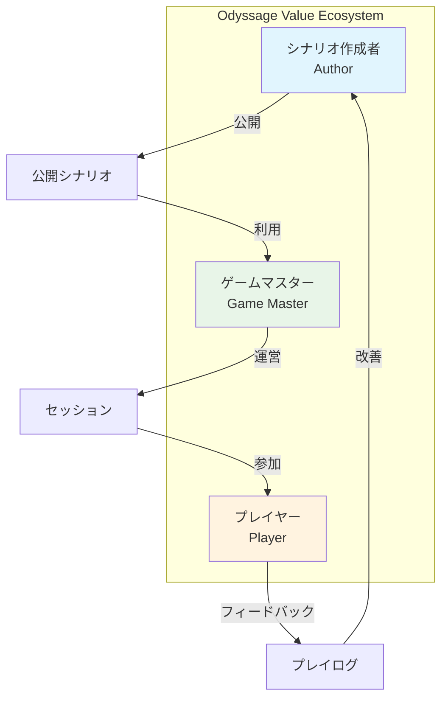

# Odyssage プロジェクトビジョンの進化的再検討

## 📋 検討の背景と目的

### **問題意識**
> 「コンセプトややりたいことは出していたつもりですが、きちんと言語化してドキュメントにできているか自信がありません」

### **進化的設計の観点での課題**
- 実装を通じて明確になった実際の価値提案と、初期コンセプトとの整合性
- 技術制約や実装可能性を踏まえた現実的なビジョンへの調整
- ユーザーロール分化（Author/GM/Player）を踏まえたコンセプトの精緻化

---

## 🔍 既存ドキュメント分析結果

### **散在するコンセプト情報の現状**

#### **📄 `README.md` でのコンセプト**
```markdown
**Odyssage** is a web application for **asynchronous gamebook-style TRPG sessions**. 
Players embark on adventures at their own pace, creating unique journey records 
in their digital journals.
```

**特徴**:
- ✅ 簡潔で分かりやすい
- ❓ "digital journals" の具体的価値が不明確

#### **📄 `docs/02-architecture/overview.md` でのコンセプト**
```markdown
Odyssageは**非同期型ゲームブック風TRPG**のためのWebアプリケーションです。
未知を辿る冒険の記録として、各プレイヤーが自分だけの旅路を白い手帳に刻んでいく
コンセプトを持っています。
```

**特徴**:
- ✅ 詩的で魅力的な表現
- ❓ 「白い手帳」の機能的意味が曖昧

#### **📄 `docs/01-getting-started/domain.md` でのコンセプト**
```markdown
「忙しくて対面でTRPGができない人でも、自分のペースで楽しめる体験を提供する」
「プレイヤーが自分だけの物語を作り、その記録が自然に残る新しいTRPG体験」
```

**特徴**:
- ✅ 解決する課題が明確
- ✅ 提供価値が具体的

### **コンセプト表現の分析結果**

#### **✅ 一貫している要素**
1. **非同期プレイ**: 全ドキュメントで共通
2. **ゲームブック風**: 選択分岐による物語進行
3. **個人化された体験**: "自分だけの" 物語・記録

#### **❓ 曖昧・矛盾している要素**

**「未知を辿る」の意味**:
```markdown
# overview.md の説明
- **動的物語生成**: プレイヤーの選択によって新しい展開が生まれる
- **予測不可能な体験**: GM（ゲームマスター）も含めて誰も結末を知らない
```
**問題**: 実装上はシナリオ作成者（Author）が事前にシナリオを作成している矛盾

**「白い手帳」「デジタル手帳」の機能**:
```markdown
# 表現のばらつき
- "白い手帳に刻んでいく" (詩的表現)
- "digital journals" (機能的表現)
- "プレイログの自動記録機能" (技術的表現)
```
**問題**: 同一機能への異なる表現で混乱

---

## 🎯 実装現実を踏まえたコンセプト再定義

### **実装で明確になった価値構造**

#### **3つのステークホルダーの価値提案**



**Author（シナリオ作成者）の価値**:
- 創作したシナリオが多くのプレイヤーに体験される
- プレイログを通じて自分の創作への反応を確認できる
- 繰り返し利用される持続的な創作物の価値

**GM（ゲームマスター）の価値**:
- 高品質なシナリオを利用してセッション運営に集中できる
- 非同期進行で無理のないペースでのセッション管理
- プレイヤー間の異なる選択・反応を楽しめる

**Player（プレイヤー）の価値**:
- 自分のペースで物語に参加・没入できる
- 自分だけの物語体験とその記録を得られる
- 他プレイヤーとの比較・共有による拡張した楽しみ

### **実装制約を踏まえた現実的コンセプト**

#### **❌ 理想論的すぎる表現（見直し対象）**
```markdown
# 現在の表現
- "誰も結末を知らない予測不可能な体験"
- "動的物語生成"
- "探索的創作"
```

**問題**: シナリオ作成者が事前に分岐・結末を設計している現実と矛盾

#### **✅ 実装現実に基づく表現（推奨）**
```markdown
# 提案する表現
- "多様な選択による個別化された物語体験"
- "分岐豊富なシナリオによる再プレイ価値"
- "プレイヤー毎に異なる展開を楽しめる仕組み"
```

**根拠**: Neo4jによる複雑な分岐管理、楽観的更新による選択の柔軟性

---

## 🚀 進化的設計を踏まえた新ビジョン提案

### **コアバリュープロポジション（改訂版）**

#### **メインコンセプト**
```markdown
**Odyssage** - 非同期マルチプレイヤー型ゲームブックプラットフォーム

時間に縛られず、自分のペースで参加できるTRPG体験。
シナリオ作成者が描いた世界で、GM が導く物語を、
各プレイヤーが独自の選択で辿り、自分だけの冒険記録を創り上げる。
```

#### **3つの核となる価値**

**1. 時間の自由 (Temporal Freedom)**
```markdown
従来のTRPG: 全員で同じ時間に集まる必要
Odyssage: 各自の都合の良い時間に参加・行動

価値: 忙しい現代人でも継続的にTRPG体験を楽しめる
```

**2. 個別化された物語体験 (Personalized Narrative)**
```markdown
従来のTRPG: 全員で同じ物語を共有
Odyssage: 同一シナリオでもプレイヤー毎に異なる展開・結末

価値: "自分だけの物語" としての特別感・愛着
```

**3. 継続する冒険記録 (Persistent Adventure Logs)**
```markdown
従来のTRPG: セッション終了で体験が消失
Odyssage: プレイログとして永続的に記録・閲覧可能

価値: 思い出として残る・共有できる物語資産
```

### **進化的設計による段階的価値実現**

#### **Phase 1: 基本価値の確立（現在実装中）**
```typescript
interface Phase1Value {
  core_features: {
    async_play: "非同期でのシナリオ進行";
    scenario_management: "シナリオ作成・公開・利用";
    session_operation: "GMによるセッション運営";
    play_logging: "プレイログの自動記録";
  };
  
  target_users: {
    authors: "シナリオを創作・公開したいクリエイター";
    gms: "セッション運営に集中したいマスター";
    players: "自分ペースでTRPGを楽しみたい参加者";
  };
  
  success_criteria: {
    author: "シナリオが繰り返し利用される";
    gm: "無理のないペースでセッション管理できる";
    player: "自分だけの物語体験を得られる";
  };
}
```

#### **Phase 2: 体験価値の向上（将来実装）**
```typescript
interface Phase2Value {
  enhanced_features: {
    rich_branching: "複雑な分岐・条件による物語展開";
    cross_player_interaction: "プレイヤー間の間接的な影響";
    ai_assisted_creation: "AI補助によるシナリオ作成支援";
    social_features: "プレイログ共有・コミュニティ機能";
  };
  
  expanded_value: {
    creative_ecosystem: "創作者とプレイヤーの持続的な関係";
    narrative_diversity: "多様性に富んだ物語体験の提供";
    community_building: "TRPG愛好者コミュニティの形成";
  };
}
```

#### **Phase 3: エコシステム形成（長期ビジョン）**
```typescript
interface Phase3Vision {
  platform_evolution: {
    marketplace: "シナリオ・アセットの流通プラットフォーム";
    creator_economy: "シナリオ作成者への収益還元システム";
    international: "多言語・文化対応での国際展開";
    franchise: "人気シナリオのメディアミックス展開";
  };
  
  ecosystem_impact: {
    industry: "TRPG業界でのデジタル化推進";
    culture: "物語文化の新しい創造・消費形態";
    social: "地理・時差を超えた創作コミュニティ";
  };
}
```

---

## 🎪 ユーザー体験ストーリー（改訂版）

### **Authorの体験ジャーニー**
```markdown
1. **創作の動機**: "面白いシナリオを考えたけど、プレイテストが大変..."
2. **Odyssage発見**: "非同期で多くの人に体験してもらえる!"
3. **シナリオ作成**: 直感的なエディタで分岐豊富な物語を構築
4. **公開・反響**: 複数のGMが採用、様々なプレイログが生成
5. **改善サイクル**: プレイログを参考にシナリオをブラッシュアップ
6. **創作者としての成長**: ファンがつき、継続的な創作活動
```

### **GMの体験ジャーニー**
```markdown
1. **運営の悩み**: "セッション準備が大変、スケジュール調整も困難..."
2. **Odyssage活用**: "質の高いシナリオを利用、非同期で無理なく進行"
3. **セッション開始**: プレイヤーを招待、シナリオ設定を調整
4. **進行管理**: 各プレイヤーの進捗確認、必要に応じて介入
5. **多様な展開**: 同じシナリオでもプレイヤー毎に異なる物語が展開
6. **運営の楽しみ**: 準備負担軽減で物語進行・プレイヤー交流に集中
```

### **Playerの体験ジャーニー**
```markdown
1. **参加の障壁**: "TRPGやりたいけど時間が合わない..."
2. **セッション参加**: GMに誘われて気軽にOdyssageセッションに参加
3. **自分ペース進行**: 通勤時間や休憩時間に少しずつ物語を進める
4. **選択の重み**: じっくり考えて行動選択、結果に愛着
5. **個別化体験**: 同じシナリオでも自分だけの展開・結末
6. **思い出の記録**: 完成したプレイログを読み返し、友人と共有
```

---

## 📝 コンセプトの言語化・体系化

### **エレベーターピッチ（30秒版）**
```markdown
Odyssageは、忙しい現代人のための非同期TRPGプラットフォームです。

シナリオ作成者が描いた世界で、GMが導く物語を、
各プレイヤーが自分のペースで体験し、個別化された冒険記録を残せます。

時間に縛られず、自分だけの物語を創り上げる新しいTRPG体験を提供します。
```

### **価値命題キャンバス**
```markdown
## 顧客セグメント
- 忙しくてスケジュール調整が困難なTRPG愛好者
- 創作シナリオを多くの人に体験してもらいたいクリエイター
- セッション準備負担を軽減したいゲームマスター

## 価値提案
- 時間的制約からの解放（非同期プレイ）
- 個別化された物語体験（分岐豊富なシナリオ）
- 永続的な冒険記録（プレイログシステム）

## チャネル
- Webアプリケーション（PC・モバイル対応）
- TRPG関連コミュニティでの口コミ
- シナリオ作成者による作品拡散

## 収益構造（将来）
- プレミアム機能のサブスクリプション
- シナリオマーケットプレイスでの販売手数料
- 企業向けチームビルディング利用のライセンス
```

### **ドメイン言語辞典**
```markdown
## 基本用語
- **シナリオ**: 物語の基本骨格・分岐構造（Author作成）
- **セッション**: GMが運営する実際のゲーム進行単位
- **プレイログ**: プレイヤーの選択・行動が記録された物語
- **分岐**: プレイヤーが選択できる物語の選択肢・ルート

## ロール用語
- **Author（シナリオ作成者）**: シナリオを創作・公開する人
- **GM（ゲームマスター）**: セッションを運営・進行する人
- **Player（プレイヤー）**: セッションに参加し物語を体験する人

## システム用語
- **非同期プレイ**: リアルタイム同期なしでの進行方式
- **楽観的更新**: クライアント側での先行的状態更新
- **ハイブリッドDB**: PostgreSQL + Neo4jによるデータ管理
```

---

## 🔄 進化的設計による今後のビジョン調整プロセス

### **継続的なコンセプト改善サイクル**

#### **Quarter 1: 実装フィードバック収集**
```markdown
- ユーザーの実際の利用パターン分析
- 各ロールでの価値実現度測定
- 技術的制約・課題の明確化
```

#### **Quarter 2: コンセプト精緻化**
```markdown
- 実装現実とビジョンの乖離修正
- ユーザーフィードバックに基づく価値提案調整
- 競合分析による差別化要素の明確化
```

#### **Quarter 3: 次期開発方向性確定**
```markdown
- Phase 2機能の優先順位決定
- 新たなユーザーセグメントの検討
- マネタイゼーション戦略の具体化
```

### **ビジョン更新の判断基準**

#### **更新すべき指標**
- ユーザーの実際の利用価値と想定価値の大幅な乖離
- 技術的制約による実現不可能な価値提案の発見
- 市場・競合状況の大きな変化

#### **維持すべき核心価値**
- 非同期プレイによる時間的自由
- 個別化された物語体験
- 継続的な冒険記録

---

## 💡 重要な結論と推奨事項

### **🎯 現在のコンセプト状況評価**

#### **✅ 良好な点**
- 核となる価値提案は一貫している
- 解決する課題が明確で現実的
- 技術実装と整合性のとれたビジョン

#### **⚠️ 改善が必要な点**
- 表現の統一性不足（詩的表現 vs 機能的表現）
- 理想論と実装現実の乖離
- ユーザーロール別価値の明示不足

### **🚀 推奨する改善アクション**

#### **Phase 1: ドキュメント統一（2週間）**
1. 全ドキュメントでの表現統一
2. 実装制約を反映したリアルなコンセプト表現
3. ユーザーロール別価値提案の明示

#### **Phase 2: ユーザーフィードバック収集（4週間）**
1. 既存ユーザーへのコンセプト理解度調査
2. 各ロールでの実際の利用価値測定
3. コンセプトと実体験の乖離分析

#### **Phase 3: ビジョンの最終調整（2週間）**
1. フィードバックに基づくコンセプト精緻化
2. 長期ロードマップへの反映
3. マーケティング・営業資料への展開

### **📋 具体的なドキュメント更新提案**

#### **`README.md` 改訂案**
```markdown
**Odyssage** - 時間に縛られない新しいTRPG体験

シナリオ作成者が描いた世界、GMが導く物語、
プレイヤーが選択する冒険。
非同期マルチプレイヤーで楽しむゲームブックプラットフォーム。

各自のペースで参加し、自分だけの物語を紡ぎ、
永続的な冒険記録として残していく新しいTRPG体験。
```

#### **`overview.md` 改訂案**
```markdown
## 🎯 プロジェクト概要

Odyssageは**非同期マルチプレイヤー型ゲームブック**プラットフォームです。
3つのロール（シナリオ作成者・GM・プレイヤー）が協力して、
時間に縛られない新しいTRPG体験を創り上げます。

### 核となる価値提案
- **時間の自由**: 各自の都合に合わせた非同期プレイ
- **個別化体験**: 同一シナリオでもプレイヤー毎に異なる展開
- **永続記録**: プレイログとして残る自分だけの冒険物語
```

---

## 🏷️ メタデータ

**作成日**: 2025-08-14  
**検討対象**: Odyssageプロジェクト全体のコンセプト・ビジョン  
**関連文書**: 
- `README.md`
- `docs/01-getting-started/README.md`
- `docs/01-getting-started/domain.md`
- `docs/02-architecture/overview.md`

**ステータス**: 検討ドキュメント - ビジョン改訂提案  
**次のアクション**: 提案内容のレビュー・承認、ドキュメント更新実施

**検討結果**:
- ✅ 核となる価値提案は健全で一貫している
- ⚠️ 表現の統一化と実装現実との整合性確保が必要
- 🚀 進化的設計による継続的改善プロセスの確立を推奨

#vision #concept #evolutionary-design #project-management #documentation