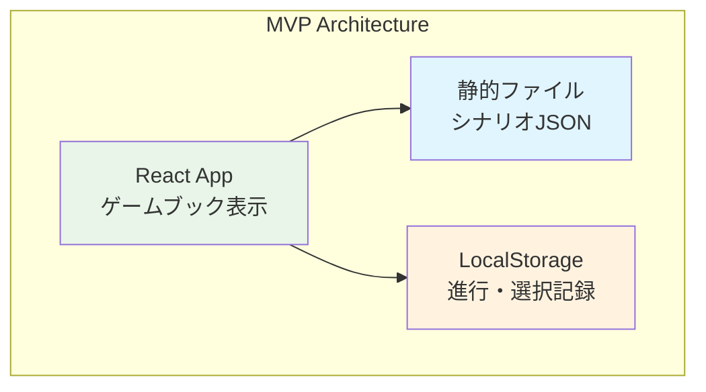
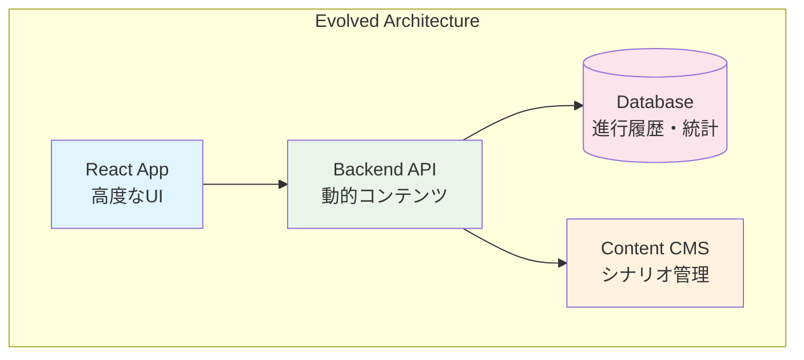

# 優先順位に基づく具体的アクションプラン

## 📋 回答サマリー

### **明確になった最重要事項**
1. **技術学習目標**: **進化的アーキテクチャ設計**の実践習得
2. **プレイヤー体験**: **自分ペースでのファンタジー冒険** + **選択・結末違いの観察**
3. **実装方針**: **1月でのMVP** + **シンプル機能優先** + **段階的発展**
4. **継続要因**: **自分が楽しめる環境維持**が最優先

### **重要な制約・方針**
- **時間制約**: 1日2時間、1月でバージョン1完成
- **参加ハードル**: ログイン不要、GMレスゲームブックから開始
- **学習スタイル**: 幅広い最新技術キャッチアップ + 技術ブログ発信
- **外部依存**: 頼れるところは積極的に頼る

---

## 🎯 1月MVP の戦略的設計

### **コア仮説: GMレス・ログイン不要ゲームブック**

#### **なぜこのアプローチが最適か**
```markdown
✅ 時間制約対応:
- GMやシナリオ作成者への依存なし
- ユーザー管理・認証システム不要
- セッション管理の複雑性回避

✅ 個人的楽しみ実現:
- すぐに自分がプレイヤーとして楽しめる
- ファンタジー泥臭冒険コンテンツを直接実装可能
- 選択・結末違いを実装しやすい

✅ 進化的設計実践:
- シンプル開始 → 段階的にTRPG要素追加
- アーキテクチャ判断の実践記録
- 技術ブログ発信しやすい
```

### **1月MVP仕様**
```typescript
interface OneMonthMVP {
  core_features: {
    // 基本ゲームブック機能
    story_progression: "テキスト表示 + 選択肢クリック";
    choice_tracking: "プレイヤーの選択履歴記録";
    multiple_endings: "選択による異なる結末";
    
    // 違い観察機能（あなたの特別な要求）
    path_comparison: "複数プレイでの選択経路比較表示";
    ending_collection: "到達した結末・獲得タグの一覧";
    replay_system: "異なる選択でのリプレイ機能";
  };
  
  content_strategy: {
    initial_scenario: "ファンタジー泥臭冒険のサンプルシナリオ 1-2本";
    scenario_format: "JSON/Markdown形式での分岐構造";
    tag_system: "選択・結果に基づくタグ獲得システム";
  };
  
  technical_foundation: {
    frontend: "React + TypeScript（最小限の状態管理）";
    data_storage: "LocalStorage（ログイン不要）";
    scenario_data: "静的JSONファイル（外部DB不要）";
  };
}
```

---

## 🏗️ 進化的アーキテクチャ実践計画

### **Phase 1: シンプル開始（1月目標）**


#### **設計判断記録のポイント**
```markdown
## なぜこの設計にしたか（技術ブログ記事候補）
1. **LocalStorageの選択理由**
   - ログイン不要の実現
   - データベース設計・運用コスト回避
   - プライバシー配慮（データがローカル完結）

2. **静的JSON形式の選択理由**
   - 開発初期のコンテンツ管理簡素化
   - バックエンドなしでの動作
   - 後の動的生成への移行容易性

3. **React状態管理の選択**
   - どの状態管理ライブラリを選ぶか
   - ゲーム進行状態のライフサイクル設計
   - リプレイ機能のための履歴管理
```

### **Phase 2: 進化的拡張（2-3月目）**


#### **段階的移行の設計判断**
```markdown
## 進化的設計の実践記録
1. **LocalStorage → Database移行**
   - どのタイミングで移行すべきか
   - データ移行戦略
   - ユーザー体験の継続性確保

2. **静的 → 動的コンテンツ**
   - CMSまたはAPI化のタイミング
   - 既存コンテンツとの互換性
   - 外部コンテンツ作成者の参加促進

3. **機能追加の判断基準**
   - 自分の楽しみ度合い
   - 技術学習価値
   - 実装コスト
```

---

## 📝 技術ブログ発信計画

### **1月MVP期間中の記事候補**

#### **Week 1: アーキテクチャ決定記録**
```markdown
タイトル: "1か月でTRPGプラットフォームMVPを作る：アーキテクチャ判断記録"

内容:
- なぜGMレス・ログイン不要から始めるのか
- LocalStorage vs Database の選択理由
- React状態管理の設計方針
- 静的コンテンツから始める理由
```

#### **Week 2: ゲームブック分岐ロジック設計**
```markdown
タイトル: "TypeScriptで実装するゲームブック分岐システム"

内容:
- JSON形式での分岐構造設計
- 選択履歴の追跡ロジック
- 複数エンディングの実装パターン
- タグシステムの設計判断
```

#### **Week 3: 選択経路比較機能の実装**
```markdown
タイトル: "プレイヤーの選択違いを可視化：経路比較機能の設計と実装"

内容:
- 選択経路の差分可視化アルゴリズム
- React での差分表示UI実装
- リプレイ機能との連携
- ユーザビリティ配慮事項
```

#### **Week 4: MVP振り返りと次段階設計**
```markdown
タイトル: "1か月MVP完成：学んだこと・次の進化設計"

内容:
- 実装で得られた技術的気づき
- 自分でプレイしてみての体験評価
- Phase 2での拡張方針
- 進化的設計実践の振り返り
```

---

## 🎮 コンテンツ戦略: ファンタジー泥臭冒険

### **初期シナリオ設計**

#### **シナリオ1: "酒場の依頼"**
```markdown
## 基本設定
- 新米冒険者として酒場で依頼を受ける
- ゴブリン退治 or 薬草採取 or 商人護衛の選択
- 泥臭い現実（装備不足、金欠、体力限界）を盛り込む

## 分岐例
1. **装備選択**: 剣 vs 弓 vs 杖 → 戦闘スタイル・結末に影響
2. **依頼選択**: 危険度と報酬のトレードオフ
3. **仲間**: ソロ vs パーティー → 報酬分配・安全性変化
4. **判断**: 慎重 vs 大胆 → 成功率・獲得経験値変化

## 獲得タグ例
- 戦闘スタイル: [剣闘士][射手][魔法使い]
- 性格傾向: [慎重][大胆][仲間思い][ソロプレイヤー]
- 結果: [成功][失敗][部分成功][予想外の展開]
```

#### **シナリオ2: "商人の秘密"**
```markdown
## 基本設定
- 護衛依頼中に商人の怪しい行動を発見
- 正義 vs 利益 vs 現実的判断の選択
- 冒険者の社会的立場の低さを表現

## 分岐の特徴
- 前のシナリオの獲得タグによる選択肢変化
- 道徳的ジレンマと実益の対立
- 選択の長期的影響（評判システム）
```

### **選択・結末違い観察機能**

#### **経路比較表示UI**
```typescript
interface PathComparisonView {
  // 複数プレイでの選択差分表示
  choice_differences: {
    scenario_step: number;
    choice_a: string;
    choice_b: string;
    consequence_difference: string;
  }[];
  
  // 獲得タグの違い
  tag_comparison: {
    playthrough_a: string[];
    playthrough_b: string[];
    unique_to_a: string[];
    unique_to_b: string[];
  };
  
  // 結末の違い
  ending_comparison: {
    ending_type: string;
    outcome_text: string;
    final_tags: string[];
  }[];
}
```

---

## ⏰ 1か月実装スケジュール

### **Week 1: 基盤実装**
```markdown
Day 1-2: プロジェクト初期設定・アーキテクチャ設計
- React + TypeScript環境構築
- 基本コンポーネント構造設計
- シナリオJSON形式仕様策定

Day 3-5: 基本ゲームブック機能
- テキスト表示・選択肢UI実装
- LocalStorageでの進行管理
- 基本的な分岐ロジック

Day 6-7: 最初のシナリオ実装・テスト
- "酒場の依頼"シナリオ作成
- 動作確認・デバッグ
```

### **Week 2: 履歴・比較機能**
```markdown
Day 8-10: 選択履歴システム
- プレイ履歴の記録機能
- リプレイ機能の実装
- タグ獲得システム

Day 11-14: 経路比較機能
- 複数プレイでの差分計算
- 比較表示UI実装
- タグ違いの可視化
```

### **Week 3: 体験向上・コンテンツ拡充**
```markdown
Day 15-17: UI/UX改善
- 読みやすいテキスト表示
- 選択肢のハイライト
- 進行状況の表示

Day 18-21: コンテンツ追加
- "商人の秘密"シナリオ実装
- タグ連携システム
- 結末コレクション機能
```

### **Week 4: 完成・振り返り**
```markdown
Day 22-25: 最終調整・テスト
- 全体通しテスト
- パフォーマンス最適化
- バグフィックス

Day 26-28: 自分でのプレイ・体験評価
- 実際にプレイヤーとして全シナリオ体験
- 楽しさ・使いやすさ評価
- 改善点の洗い出し

Day 29-30: 技術ブログ執筆・次フェーズ計画
- MVP振り返り記事執筆
- Phase 2計画策定
- 学習成果の整理
```

---

## 🔄 継続的な楽しみ確保戦略

### **モチベーション維持の仕組み**

#### **開発過程での楽しみ**
```markdown
1. **毎週のプレイテスト**
   - 実装した部分を自分でプレイ
   - 楽しさの実感・問題点の発見
   - 次週の改善目標設定

2. **技術学習の可視化**
   - 学んだことの技術ブログ記事化
   - アーキテクチャ判断の記録
   - 進化過程のドキュメント化

3. **小さな達成の積み重ね**
   - 機能完成毎の達成感
   - 新しい技術パターンの習得
   - 設計判断の成功体験
```

#### **完成後の楽しみ確保**
```markdown
1. **自分での継続プレイ**
   - 新しい選択での再プレイ
   - 異なる戦略での挑戦
   - 全エンディング・タグ収集

2. **他者との共有**
   - 技術的成果の発信
   - プレイ体験の共有
   - フィードバックの収集

3. **段階的拡張の楽しみ**
   - Phase 2機能の計画・実装
   - 新しいシナリオの追加
   - より高度な技術挑戦
```

---

## 📈 成功指標の具体化

### **1か月後の成功判定**
```markdown
## 技術学習面
✅ アーキテクチャ設計判断を4つ以上記録・ブログ化
✅ React + TypeScript での状態管理パターンを3つ以上習得
✅ 進化的設計の実践経験として言語化できる

## 個人的楽しみ面
✅ 自分が楽しめるプレイ体験を少なくとも5回以上実現
✅ 選択・結末違いを実際に体験・比較できる
✅ "また遊びたい"と思える完成度

## 継続性面
✅ Phase 2への具体的な拡張計画策定
✅ 外部からの興味・フィードバック獲得
✅ 燃え尽きることなく継続開発意欲維持
```

---

## 🚀 即座に開始すべきアクション

### **今週中に実行すべきこと**
1. **開発環境のセットアップ**
2. **最初のシナリオ"酒場の依頼"の詳細設計**
3. **技術ブログの開設・最初の記事構想**

### **来週から開始すべきこと**
1. **Week 1スケジュールの本格実装**
2. **毎日の進捗・学習記録の習慣化**
3. **週次での自己プレイテスト実施**

**まずはどこから始めますか？**

---

## 🏷️ メタデータ

**作成日**: 2025-08-14  
**基盤**: ユーザー回答に基づく具体的アクションプラン  
**目標**: 1か月でのMVP完成 + 進化的アーキテクチャ学習  
**次ステップ**: 開発環境構築・シナリオ詳細設計

#action-plan #mvp #evolutionary-architecture #gamebook #personal-project