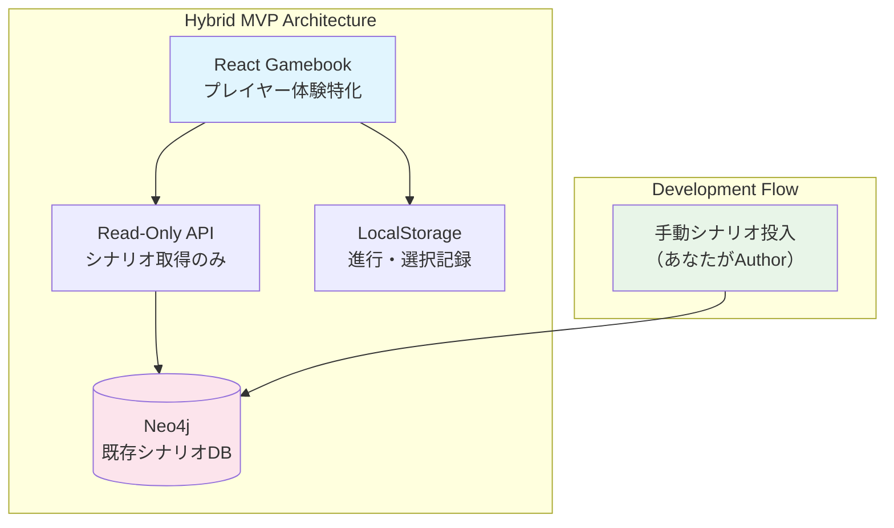

# MVP vs 既存実装の判断検討

## 📋 現状の整理

### **現在の実装状況**
- ✅ Neo4j + PostgreSQL ハイブリッドDB構成
- ✅ バックエンドAPI（Hono.js + Cloudflare Workers）
- ✅ シナリオ作成機能のバックエンド実装
- ✅ Author/GM/Player ロール別API設計
- ⚠️ フロントエンド実装は途中段階

### **MVPとして提案した方向**
- 🎯 GMレス・ログイン不要ゲームブック
- 🎯 LocalStorage + 静的JSON
- 🎯 1か月での完成目標
- 🎯 シンプル機能優先

### **判断すべき問題**
> Neo4jを触ってみたくて、シナリオ作成のバックエンドから始めてしまっている現状があります。これを投げ出して、MVPの提案したゲームブックから始めるべきか、判断に迷っています。

---

## 🤔 判断要素の分析

### **継続するメリット（既存実装活用）**

#### **技術学習面でのメリット**
```markdown
✅ Neo4j実践経験の継続:
- GraphDB特有のクエリ設計を深く学べる
- 複雑な関係性データの扱いを習得
- ハイブリッドDB構成の実装経験

✅ 既存投資の活用:
- これまでの実装時間・学習が無駄にならない
- バックエンドアーキテクチャの完成度向上
- 実際の複雑なシステム実装経験

✅ フルスタック統合学習:
- フロント・バック・DBの真の統合理解
- データフローの全体最適化
- 本格的なWebアプリケーション完成
```

#### **個人的楽しみ面でのメリット**
```markdown
✅ より豊富な機能での楽しみ:
- 複雑なシナリオ構造による多様性
- 他のシナリオ作成者による豊富なコンテンツ
- セッション機能による本格的TRPG体験

✅ プラットフォームとしての完成度:
- 単なる個人ツール → コミュニティプラットフォーム
- 継続的なコンテンツ拡充の仕組み
- より長期的な楽しみの確保
```

### **変更するメリット（MVP方向転換）**

#### **技術学習面でのメリット**
```markdown
✅ 進化的設計の実践:
- 要求変化に対する柔軟な方向転換
- MVPアプローチの実体験
- 段階的成長の設計技術

✅ 学習効率の最大化:
- 1か月での確実な成果獲得
- 技術ブログ発信のしやすさ
- ポートフォリオとしての完成度

✅ 現実的なスコープ管理:
- 時間制約に対する適切な判断
- 完璧主義からの脱却
- 継続可能な開発スタイル確立
```

#### **個人的楽しみ面でのメリット**
```markdown
✅ 早期の楽しみ実現:
- 1か月後には確実に遊べる状態
- すぐに自分がプレイヤーとして楽しめる
- ストレスなしでの開発継続

✅ 気軽な参加体験:
- ログイン不要での手軽さ
- GMレスでの気楽さ
- 時間プレッシャーなし
```

---

## 💡 第三の選択肢：ハイブリッドアプローチ

### **提案：既存実装を活かしたMVP**

#### **戦略：Neo4j + シンプル機能の組み合わせ**

```typescript
interface HybridMVP {
  backend_utilization: {
    // 既存の実装を最大限活用
    neo4j_scenarios: "作成済みのシナリオ管理機能";
    basic_api: "最小限のAPI（シナリオ取得のみ）";
    static_deployment: "認証なし・読み取り専用モード";
  };
  
  frontend_simplification: {
    // フロントエンドはシンプルに
    scenario_player: "Neo4jから取得したシナリオでのプレイ";
    local_progress: "LocalStorageでの進行管理";
    no_authentication: "ユーザー登録・ログイン不要";
  };
  
  content_strategy: {
    // あなた自身がシナリオ作成者として
    author_role: "自分でNeo4jにシナリオデータ投入";
    rich_scenarios: "GraphDBの強みを活かした複雑分岐";
    gradual_expansion: "段階的にシナリオ追加";
  };
}
```

#### **具体的な実装アプローチ**


### **このアプローチの利点**

#### **✅ 技術学習価値の最大化**
```markdown
1. Neo4j実践継続:
   - 既存実装の活用
   - GraphDB クエリの最適化学習
   - 複雑データ構造の扱い

2. 進化的設計実践:
   - シンプルな使用法から開始
   - 段階的な機能拡張
   - アーキテクチャ判断の記録

3. フルスタック統合:
   - バックエンドの価値実感
   - データフローの全体理解
   - API設計の実践評価
```

#### **✅ 個人的楽しみの早期実現**
```markdown
1. すぐに楽しめる:
   - 既存バックエンドを活用して早期完成
   - 自分でシナリオ作成・投入して即座に楽しめる
   - Neo4jの複雑分岐による豊富な体験

2. 気軽な参加:
   - ログイン不要でストレスなし
   - 自分のペースでの進行
   - リッチなシナリオ体験

3. 継続的発展:
   - 新しいシナリオの段階的追加
   - 機能の段階的拡張
   - コミュニティ参加への自然な移行
```

---

## 📊 3つの選択肢比較

### **選択肢A：既存実装継続（フル機能完成を目指す）**
| 項目 | 評価 | 理由 |
|------|------|------|
| 技術学習価値 | ★★★★★ | Neo4j + フルスタック統合 |
| 早期楽しみ実現 | ★★☆☆☆ | 完成まで3-6か月 |
| 完成可能性 | ★★★☆☆ | 時間制約で困難 |
| 継続モチベーション | ★★★☆☆ | 長期間楽しめない危険性 |

### **選択肢B：MVP方向転換（ゲームブックに転換）**
| 項目 | 評価 | 理由 |
|------|------|------|
| 技術学習価値 | ★★★☆☆ | フロントエンド中心 |
| 早期楽しみ実現 | ★★★★★ | 1か月で確実に完成 |
| 完成可能性 | ★★★★★ | 現実的なスコープ |
| 継続モチベーション | ★★★★☆ | 早期成功体験 |
| 既存投資活用 | ★☆☆☆☆ | これまでの実装が無駄に |

### **選択肢C：ハイブリッドアプローチ（提案）**
| 項目 | 評価 | 理由 |
|------|------|------|
| 技術学習価値 | ★★★★☆ | Neo4j活用 + 進化的設計 |
| 早期楽しみ実現 | ★★★★☆ | 1-2か月で完成見込み |
| 完成可能性 | ★★★★☆ | 既存資産活用で現実的 |
| 継続モチベーション | ★★★★★ | バランスの良い成功体験 |
| 既存投資活用 | ★★★★★ | 既存実装を最大限活用 |

---

## 🚀 推奨判断とその理由

### **推奨：選択肢C（ハイブリッドアプローチ）**

#### **なぜこの選択が最適か**
```markdown
✅ あなたの状況に最適:
- Neo4jを触りたい動機を満たす
- 既存実装の投資を無駄にしない
- 早期の楽しみ実現も可能

✅ 進化的設計の実践:
- 既存資産から価値を抽出
- シンプル利用から複雑利用への進化
- 実用性重視の判断実践

✅ 技術学習価値の最大化:
- Neo4jクエリ最適化の実践
- API設計の実用性評価
- フロントエンド統合の実装
```

### **具体的な実装方針**

#### **Phase 1: 読み取り専用ゲームブック（1か月）**
```markdown
Week 1-2: 既存APIのシンプル化
- 認証なしでのシナリオ取得API
- Neo4jから分岐構造の効率的取得
- 静的デプロイメント設定

Week 3-4: フロントエンド実装
- Neo4jシナリオでのゲームブック表示
- LocalStorageでの進行管理
- 選択履歴・比較機能
```

#### **Phase 2: 段階的機能拡張（2-3か月）**
```markdown
- ユーザー認証の段階的導入
- セッション機能の追加
- 他のシナリオ作成者の参加促進
```

#### **技術ブログ発信テーマ**
```markdown
1. "Neo4jで作ったシナリオDBを読み取り専用ゲームブックで活用"
2. "GraphDBクエリの最適化：複雑分岐シナリオの効率的取得"
3. "既存バックエンド資産を活かしたMVP開発戦略"
4. "進化的設計実践：フル機能からシンプル利用への方向転換"
```

---

## 🎯 判断のための追加質問

### **最終判断のために教えてください**

1. **Neo4j学習の優先度**
   - Neo4jを深く学びたい気持ちはどの程度強いですか？
   - 他の技術（React状態管理等）との優先順位は？

2. **既存実装への愛着**
   - これまでのバックエンド実装にどの程度愛着がありますか？
   - 投げ出すことへの抵抗感はありますか？

3. **完成への緊急度**
   - 1か月での何かしらの完成はどの程度重要ですか？
   - 3-6か月かけても良いものを作りたい気持ちは？

4. **学習スタイルの好み**
   - 一点集中 vs バランス型、どちらが好みですか？
   - 完璧主義 vs 反復改善、どちらが性に合いますか？

### **それぞれの選択での次ステップ**

#### **もし選択肢A（既存実装継続）を選ぶなら**
- フロントエンドの本格実装開始
- Author/GM機能の完成優先
- 長期計画での段階的完成

#### **もし選択肢B（MVP転換）を選ぶなら**
- 既存実装の一時停止・保存
- ゲームブック機能の新規開発
- 1か月集中開発の実行

#### **もし選択肢C（ハイブリッド）を選ぶなら**
- 既存APIの読み取り専用化
- フロントエンドのシンプル実装
- Neo4j活用ゲームブックの開発

---

## 💭 個人的な推薦理由

**ハイブリッドアプローチを特に推薦する理由**は、あなたの「Neo4jを触ってみたい」という動機を最大限活かしながら、「1か月での成果」も実現できるからです。

既存の投資を無駄にせず、かつ現実的なタイムラインで成果を得る。これこそ進化的設計の真髄だと思います。

**どの選択肢が一番しっくりきますか？**

---

## 🏷️ メタデータ

**作成日**: 2025-08-14  
**判断対象**: 既存実装継続 vs MVP転換 vs ハイブリッドアプローチ  
**重要な要素**: Neo4j学習動機、時間制約、既存投資活用  
**推奨**: ハイブリッドアプローチ（選択肢C）

#decision-making #mvp #neo4j #evolutionary-design #hybrid-approach