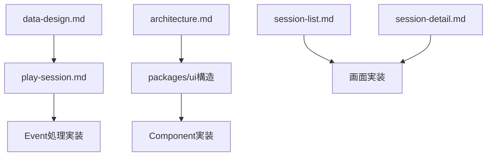

# 設計担当引継ぎドキュメント

## 📋 引継ぎ基本情報

**引継ぎ者**: 設計担当（前セッション）  
**引継ぎ先**: 設計担当（次セッション）  
**作成日時**: 2025-08-17 14:15  
**引継ぎ理由**: VSCode再起動による作業継続

## 🎯 現在の作業状況・完了事項

### ✅ 完了済み設計作業

#### 1. POフィードバック対応完了
```markdown
✅ session-list.md修正: pagination・refresh・breakpoint_switching除外
✅ session-detail.md修正: ジャンル・難易度情報除外、data-design.md整合性確保
✅ play-session.md修正: Event概念処理設計追加、エラーハンドリング簡素化
✅ architecture.md修正: React 19+更新、パフォーマンス要件MVP範囲外調整
```

#### 2. 実装支援文書作成完了
```markdown
✅ 実装ロードマップ設計レビュー報告書作成・修正
✅ 実装担当への直接フィードバック文書作成
✅ 技術スタック更新報告書（React 19+対応）作成
```

#### 3. MVP制約統一適用完了
```markdown
✅ エラーハンドリング: 詳細復旧戦略→基本的な「エラーが発生しました」+再試行のみ
✅ パフォーマンス要件: 詳細最適化要件→MVP範囲外移行、基本動作確保に集中
✅ 全設計文書でのMVP制約一貫性確保
```

## 📊 重要な設計決定・方針確認

### 🚨 核心的設計方針

#### 1. Event概念実装の最重要性
```typescript
// TRPG体験の核心 = Event概念の正確な実装
MVP必須Event: choice, narrative, scene_transition
MVP最小限Event: dialogue, exploration
Phase 2移行Event: item_acquire, skill_use, condition
```

#### 2. MVP制約の徹底適用
```typescript
// 絶対実装禁止機能
❌ フィルタリング・検索・ソート
❌ ジャンル・難易度情報表示
❌ タイプライター効果・派手な演出
❌ 詳細なエラーハンドリング・パフォーマンス最適化
```

#### 3. packages/ui戦略
```typescript
// Context-First + Atomic Design
packages/ui/
├── player/atoms, molecules, organisms
├── shared/atoms, molecules, organisms  
└── StoryBook統合・全Component必須Story
```

## 🔄 現在進行中・継続事項

### 実装フェーズ支援の継続
```markdown
実装担当支援継続事項:
✅ Week 3 Event概念実装での集中的設計支援準備
✅ data-design.md Event構造の実装レベル解説準備
✅ MVP制約遵守の継続的確認・指導準備
✅ packages/ui品質基準の明確化・レビュー準備
```

## 📂 重要ファイル・参照情報

### 🎯 最重要設計文書
```markdown
## 核心設計文書（必読）
- docs/01-design/data-design.md: Event概念の詳細定義
- docs/02-architecture/player-context/screens/play-session.md: Event処理UI設計
- docs/02-architecture/player-context/architecture.md: 技術スタック・アーキテクチャ

## POフィードバック反映済み文書
- docs/02-architecture/player-context/screens/session-list.md
- docs/02-architecture/player-context/screens/session-detail.md
```

### 📋 作成済み報告・支援文書
```markdown
## リーダー向け報告書
- docs/03-development/sprints/sprint_004/collaboration/designer_to_leader/
  - designer_to_leader_implementation_roadmap_design_review_20250817.md
  - designer_to_leader_tech_stack_update_report_20250817.md

## 実装担当向け支援文書
- docs/03-development/sprints/sprint_004/collaboration/designer_to_implementation/
  - designer_to_implementation_roadmap_feedback_20250817.md
```

## 🚀 次セッション優先作業・推奨事項

### 1. 実装支援の継続
```markdown
実装フェーズ開始時の支援:
✅ packages/ui環境構築の設計相談対応
✅ TypeScript型定義・Event概念型の実装支援
✅ StoryBook品質基準の具体的指導
✅ MVP制約遵守の継続的確認
```

### 2. Event概念実装の集中支援準備
```markdown
Week 3 Event実装フェーズ準備:
✅ data-design.md Event構造の実装レベル解説資料準備
✅ Event処理フロー・useEventProcessor設計パターン整理
✅ EventType別Component設計パターンの具体化
✅ Event履歴・状態管理の実装方針明確化
```

### 3. 品質基準・協働体制の具体化
```markdown
実装品質確保体制:
✅ 日次・週次設計相談の具体的運用開始
✅ StoryBook Component品質レビューの実施
✅ MVP制約遵守チェックの定期実施
✅ Phase 2拡張準備の設計配慮確認
```

## ⚠️ 重要な注意事項・留意点

### 1. MVP制約遵守の重要性
```markdown
⚠️ 実装誘惑への注意:
- 実装担当から「簡単な機能追加」相談があっても、MVP制約を厳格に適用
- フィルタリング・ジャンル表示・演出効果等は絶対にMVP範囲外
- 「ちょっとだけなら...」という誘惑を設計担当が制止する役割
```

### 2. Event概念理解の確実性確保
```markdown
⚠️ Event実装の成功要因:
- data-design.mdのEvent構造を実装担当が100%理解するまで解説継続
- choice・narrative・scene_transitionの完全実装が最優先
- dialogue・explorationは簡素実装で十分（MVP制約）
```

### 3. 設計整合性の継続確保
```markdown
⚠️ 設計整合性維持:
- 実装中の設計変更・妥協は慎重に判断
- packages/ui品質・StoryBook統合は妥協しない
- TypeScript型安全性・Context-First原則の堅持
```

## 🔗 関連文書・依存関係

### 設計文書依存関係


### 協働関係
```markdown
設計担当 ↔ 実装担当: Event概念実装・MVP制約遵守
設計担当 ↔ リーダー: 実装進捗・設計整合性報告
設計担当 ↔ テスト担当: BDD Feature実装・品質確認
```

## 📞 引継ぎ後の連絡・確認事項

### 引継ぎ確認推奨事項
```markdown
次セッション開始時確認:
✅ 実装フェーズの進捗状況確認
✅ 実装担当からの設計相談・質問対応
✅ packages/ui環境構築の支援状況確認
✅ MVP制約遵守の継続状況確認
```

### 緊急対応が必要な場合
```markdown
緊急事項対応:
⚠️ Event概念実装での技術的困難
⚠️ MVP制約違反の実装提案
⚠️ 設計整合性を損なう実装方針変更
⚠️ packages/ui品質・StoryBook統合の問題
```

## 🎯 設計担当の役割・責任継続

### 設計担当の核心責任
```markdown
継続責任:
✅ Event概念実装の設計支援・品質確保
✅ MVP制約遵守の徹底的監視・指導
✅ packages/ui品質・アーキテクチャ原則の堅持
✅ 実装担当との協働・技術相談対応
✅ リーダーへの設計観点進捗報告
```

## 📈 プロジェクト成功への期待

### Sprint 4実装フェーズ成功要因
```markdown
成功への確信:
✅ 設計文書完成度の高さ（POフィードバック反映済み）
✅ 実装ロードマップの設計整合性（Event概念重視・MVP制約遵守）
✅ 実装担当への設計支援体制（協働・相談・品質確認）
✅ 段階的品質向上戦略（Week別品質確認・継続改善）
```

---

**引継ぎ完了確認**: 上記内容を確認し、設計担当として実装フェーズでの確実なTRPG体験実現・MVP制約遵守・高品質packages/ui構築の支援を継続してください。

**プロジェクト成功への期待**: Event概念の正確な実装により、真のTRPG体験を実現した高品質Player文脈MVPを一緒に完成させましょう。

#design-handover #implementation-support #event-concept #mvp-success #collaboration-continuity