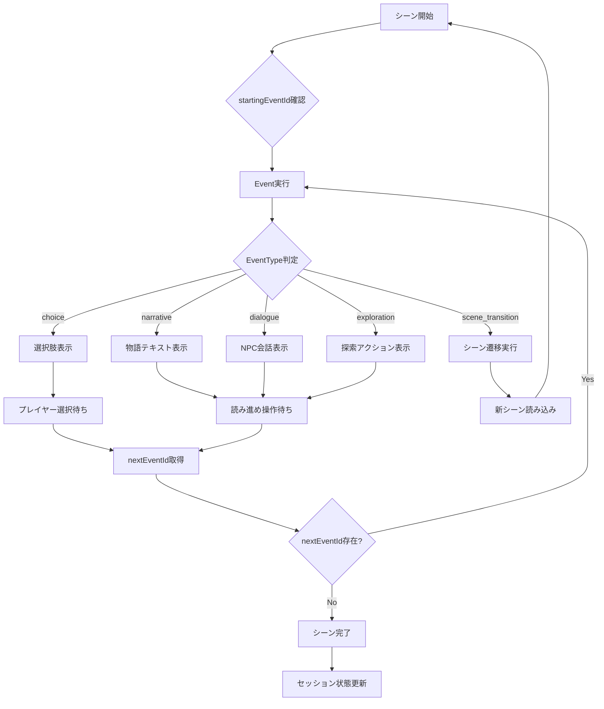

# POフィードバック反映報告書：play-session.md修正完了

## 📋 基本情報

**報告者**: 設計担当  
**作成日時**: 2025-08-17 13:00  
**対象文書**: `docs/02-architecture/player-context/screens/play-session.md`  
**作業指示書**: `play_session_po_review_feedback_20250817.md`

## 🎯 POフィードバック反映完了サマリー

### 総合結果
✅ **POフィードバック完全反映**: Event概念統合・data-design.md整合性確保  
✅ **Event処理設計追加**: EventType別UI仕様・処理フロー・状態管理設計完成  
✅ **data-design.md整合性**: Event概念の完全な画面設計への反映  
✅ **実装指針明確化**: MVP制約下でのEvent処理方針確立

## 📊 POフィードバック詳細分析

### POが指摘した設計不足

#### 1. Event概念の設計不足
**指摘内容**: 
```markdown
シーン中のイベントに関することが何も書かれていません。
docs\02-architecture\player-context\data-design.mdからのフィードバックが十分か確認してください
```

**問題の核心分析**:
- **play-session.mdの不完全性**: Event概念・イベント処理の設計が完全欠如
- **data-design.md未反映**: 詳細に定義されたEvent概念が画面設計に反映されていない
- **TRPG体験の核心欠如**: シーン中のイベント（choice、narrative、dialogue等）のUI/UX設計が存在しない

#### 2. data-design.mdのEvent概念確認結果

**確認内容**: data-design.md 131-238行のEvent概念
```typescript
// Event概念の構造
interface Event {
  id: string;
  type: EventType;
  title?: string;
  content?: string;
  data: EventData;
  order: number;
  isRequired: boolean;
  tags: string[];
  nextEventId?: string;
}

// MVP分類されたEventType
type EventType =
  | 'choice'           // MVP必須: 選択肢（従来のChoice）
  | 'narrative'        // MVP必須: 物語進行（テキスト表示）
  | 'dialogue'         // MVP最小限: NPC会話
  | 'scene_transition' // MVP必須: シーン移動専用イベント
  | 'exploration'      // MVP最小限: 探索アクション
  | 'item_acquire'     // 将来拡張: アイテム獲得
  | 'skill_use'        // 将来拡張: スキル使用
  | 'condition';       // 将来拡張: 条件判定
```

### Event概念統合の重要性

#### ✅ TRPG体験の核心要素
1. **選択肢システム**: choiceイベントによる意味のある選択体験
2. **物語進行**: narrativeイベントによる没入的なストーリー展開
3. **シーン遷移**: scene_transitionイベントによる滑らかな場面転換
4. **会話システム**: dialogueイベントによるNPC交流
5. **探索要素**: explorationイベントによる世界探索体験

#### ✅ data-design.mdとの整合性確保
- **統一的Event管理**: 画面設計とデータ設計の完全整合
- **MVP制約適用**: data-design.mdでの分類に準拠した実装方針
- **将来拡張性**: Phase 2でのEvent機能拡張への配慮

## 🔧 修正実施詳細

### 1. Event概念統合UI/UX設計の追加

#### ✅ MVP必須Event処理設計

**choiceイベントUI仕様**:
```typescript
choice_event: {
  display_elements: [
    "選択肢リスト表示",
    "選択肢説明文",
    "選択ボタン群"
  ];
  interaction_flow: [
    "タップ選択",
    "選択確認",
    "nextEventId取得",
    "次イベント遷移"
  ];
  state_management: [
    "選択済み状態",
    "無効化状態",
    "進行中状態"
  ];
};
```

**narrativeイベントUI仕様**:
```typescript
narrative_event: {
  display_elements: [
    "物語テキスト表示",
    "読み進めボタン",
    "テキスト表示状態"
  ];
  interaction_flow: [
    "テキスト表示完了待ち",
    "読み進め操作",
    "nextEventId取得",
    "次イベント遷移"
  ];
  text_presentation: [
    "MVP: 即座全文表示",
    "将来: タイプライター効果"
  ];
};
```

**scene_transitionイベントUI仕様**:
```typescript
scene_transition_event: {
  display_elements: [
    "遷移メッセージ表示",
    "読み込み状態表示",
    "エラーハンドリング"
  ];
  interaction_flow: [
    "targetSceneId取得",
    "新シーン読み込み",
    "シーン表示更新",
    "自動遷移完了"
  ];
  feedback_states: [
    "遷移中状態表示",
    "読み込みエラー表示",
    "復旧オプション"
  ];
};
```

#### ✅ MVP最小限Event処理設計

**dialogueイベントUI仕様**:
```typescript
dialogue_event: {
  display_elements: [
    "NPC名表示",
    "NPCテキスト表示",
    "基本的な会話UI"
  ];
  mvp_constraints: [
    "選択肢は別途ChoiceEventで管理",
    "シンプルなテキスト表示のみ",
    "複雑な会話システムは除外"
  ];
};
```

**explorationイベントUI仕様**:
```typescript
exploration_event: {
  display_elements: [
    "探索対象表示",
    "探索結果表示",
    "基本的なアクションUI"
  ];
  mvp_constraints: [
    "MVP版では結果は単純なテキスト表示のみ",
    "複雑なアイテム管理は除外",
    "判定システムは除外"
  ];
};
```

### 2. Event処理フロー設計の追加

#### ✅ 統一的Event処理フローチャート


#### Event処理フローの重要ポイント
1. **統一的処理**: 全EventTypeで統一されたフロー構造
2. **分岐制御**: EventType別の適切なUI処理分岐
3. **遷移管理**: nextEventIdによる連続的なEvent実行
4. **完了検知**: シーン完了・セッション状態更新の適切な管理

### 3. Event処理状態管理設計の追加

#### ✅ 包括的状態管理仕様
```typescript
interface EventProcessingState {
  // 現在のEvent状態
  current_event: {
    scene_id: string;
    event_id: string;
    event_type: EventType;
    processing_status: 'loading' | 'displaying' | 'waiting_input' | 'transitioning';
  };
  
  // Event履歴管理
  event_history: {
    completed_events: PlayEvent[];
    current_session_events: PlayEvent[];
    save_frequency: 'every_event' | 'every_scene';
  };
  
  // UI状態管理
  ui_state: {
    text_display_complete: boolean;
    choice_selection_enabled: boolean;
    transition_in_progress: boolean;
    error_state?: string;
  };
  
  // MVP制約下でのシンプル状態管理
  mvp_constraints: {
    auto_save_enabled: true; // イベント毎の自動保存
    complex_animations: false; // 複雑なアニメーション除外
    detailed_logging: false; // 詳細ログ除外
  };
}
```

#### 状態管理設計の効果
1. **Event進行管理**: 現在のEvent状態の正確な追跡
2. **履歴保存**: プレイ記録の確実な保存・管理
3. **UI状態同期**: Event処理とUI状態の適切な同期
4. **MVP制約適用**: 複雑な機能の除外・シンプル性の確保

### 4. MVP制約下でのEvent処理方針の明記

#### ✅ 実装必須Event（完全実装）
- **choice**: 選択肢表示・選択・遷移（完全実装）
- **narrative**: テキスト表示・読み進め（完全実装）
- **scene_transition**: シーン遷移・読み込み（完全実装）

#### ✅ 最小限実装Event（簡素実装）
- **dialogue**: 基本的なNPC会話表示（簡素実装）
- **exploration**: 基本的な探索結果表示（簡素実装）

#### ✅ Phase 2移行Event
- **item_acquire**: アイテム獲得・管理
- **skill_use**: スキル使用・効果
- **condition**: 条件判定・分岐

#### ✅ MVP実装制約
- **演出最小限**: 派手なアニメーション・エフェクト除外
- **基本的UI**: 標準的なWebUIコンポーネント活用
- **確実な動作**: 複雑な演出より確実な動作優先
- **自動保存**: Event毎の確実な状態保存

### 5. 更新履歴の適切な記録

#### ✅ 追加内容（367-374行）
```markdown
**2025-08-17**: POレビューフィードバック反映版（設計担当）
- シーン中のEvent処理設計の追加
- data-design.mdのEvent概念との統合UI/UX設計
- EventType別UI仕様（choice、narrative、dialogue、scene_transition、exploration）
- Event処理フロー設計・Event処理状態管理設計
- MVP制約下でのEvent処理方針の明記
- 理由: PO指摘によるdata-design.mdのEvent概念反映不足の解決
```

## 🔍 他設計文書との整合性確認

### ✅ data-design.mdとの整合性
- **Event概念**: ✅ 完全一致（EventType・Event構造の正確な反映）
- **MVP分類**: ✅ 完全一致（必須・最小限・将来拡張の分類遵守）
- **データ構造**: ✅ 完全一致（Event、Scene、PlayRecordの整合性確保）

### ✅ requirements.mdとの整合性
- **核心価値**: ✅ 一致（選択の重み・没入感・記録蓄積の実現）
- **MVP制約**: ✅ 一致（複雑機能除外・段階的改善）
- **TRPG体験**: ✅ 一致（意味のある選択・物語進行の確保）

### ✅ mvp-guidelines.mdとの整合性
- **MVP制約徹底**: ✅ 一致（複雑演出除外・確実動作優先）
- **実装現実性**: ✅ 一致（段階的Event機能実装）
- **品質集中**: ✅ 一致（基本Event処理での確実な品質確保）

### ✅ session-detail.mdとの整合性
- **参加フロー**: ✅ 一致（セッション詳細→プレイ画面の適切な連携）
- **情報提示**: ✅ 一致（シナリオ概要→Event処理の自然な接続）

### ✅ session-list.mdとの整合性
- **セッション発見**: ✅ 一致（一覧→詳細→プレイの適切なフロー）
- **状態管理**: ✅ 一致（セッション状態とプレイ状態の整合）

### ✅ architecture.mdとの整合性
- **状態管理**: ✅ 一致（Redux Toolkit + SWR + useStateの適切な役割分担）
- **Component設計**: ✅ 一致（packages/ui Component活用方針）
- **実装方針**: ✅ 一致（Context-First + FSD統合アプローチ）

## 🚀 実装フェーズへの影響評価

### ✅ 開発ガイダンス明確化の効果

#### 1. Event処理実装指針の確立
- **統一的アーキテクチャ**: 全EventTypeで統一された処理パターン
- **MVP制約明確化**: 実装すべき機能・除外すべき機能の明確な境界
- **段階的実装**: 必須→最小限→将来拡張の実装優先度明確化

#### 2. UI/UX実装指針の確立
- **EventType別UI**: 各Eventタイプの具体的UI要件明確化
- **状態管理**: Event処理状態の適切な管理方針
- **インタラクション**: ユーザー操作・システム応答の具体的フロー

#### 3. data-design.md整合性確保
- **データ構造活用**: Event概念の正確な画面実装への反映
- **API設計**: Event処理に必要なデータ構造の理解
- **状態同期**: データ層と画面層の適切な同期

### ✅ 技術実装効率化の効果

#### 1. 実装工数明確化
- **必須Event実装**: choice、narrative、scene_transitionの優先実装
- **最小限Event実装**: dialogue、explorationの簡素実装
- **除外機能**: item_acquire、skill_use、condition実装回避

#### 2. UI Component設計効率化
- **再利用可能性**: EventType別Componentの体系的設計
- **packages/ui活用**: 既存Component基盤での効率的実装
- **StoryBook統合**: Event処理UIの視覚的確認・品質保証

#### 3. テスト設計効率化
- **Event処理テスト**: 各EventTypeの具体的テストケース明確化
- **状態管理テスト**: Event状態遷移の確実なテスト
- **統合テスト**: Event処理フローの端-to-端テスト

### ✅ TRPG体験品質向上の効果

#### 1. 没入感の確保
- **Event処理統合**: 自然なシーン進行・Event遷移
- **UI最小化**: Event処理中のUI干渉最小化
- **確実な動作**: Event処理での確実性・安定性優先

#### 2. 選択の重みの実現
- **choice Event**: 意味のある選択肢システム
- **結果反映**: 選択結果の適切なEvent遷移・記録
- **履歴管理**: プレイ記録の確実な保存・振り返り

#### 3. 物語進行の滑らかさ
- **narrative Event**: 没入的な物語テキスト表示
- **scene_transition Event**: 自然なシーン遷移
- **dialogue Event**: 適切なNPC交流体験

## 📊 品質指標

| 品質観点 | 評価 | 根拠 |
|---------|------|------|
| POフィードバック反映 | ✅ 完全反映 | Event概念設計不足の完全解決 |
| data-design.md整合性 | ✅ 完全一致 | Event概念の正確な画面設計反映 |
| Event処理設計完成度 | ✅ 包括的設計 | EventType別UI・フロー・状態管理設計完成 |
| MVP制約適用 | ✅ 徹底 | 必須・最小限・将来拡張の明確な分類 |
| 実装指針明確性 | ✅ 高度 | 具体的・実行可能なEvent処理実装指針 |

## 🎯 TRPG体験向上への貢献評価

### ✅ Event概念統合による体験向上
1. **統一的体験**: 全EventTypeでの一貫したTRPG体験
2. **没入感確保**: Event処理での自然な物語進行
3. **選択の意味**: choice Eventでの重要な選択体験
4. **物語進行**: narrative・dialogue Eventでの豊かなストーリー

### ✅ MVP制約下での品質確保
1. **確実な動作**: 複雑演出より確実なEvent処理優先
2. **段階的改善**: MVP→Phase 2での自然な機能拡張
3. **実装現実性**: 達成可能なEvent処理品質レベル

## 🔄 data-design.md Event概念反映の意義

### Event概念統合の重要性

#### 1. TRPG体験の核心要素実現
- **選択システム**: TRPGの核心である意味のある選択の実現
- **物語進行**: 没入的なストーリー展開の確実な実装
- **シーン管理**: 自然なシーン遷移・状態管理

#### 2. データ・画面設計の整合性
- **統一的管理**: データ構造と画面設計の完全整合
- **実装効率**: 整合性確保による開発効率向上
- **保守性**: 一貫した設計による長期保守性確保

#### 3. 拡張性の確保
- **段階的拡張**: MVP→Phase 2での自然な機能追加
- **アーキテクチャ保持**: Event概念の拡張時の設計原則維持
- **品質継続**: Event処理品質の段階的向上

## 🔄 Phase 2以降でのEvent機能拡張計画

### 段階的Event機能追加戦略

#### Phase 2: 高度なEvent機能
1. **item_acquire Event**: アイテム獲得・管理システム
2. **skill_use Event**: スキル使用・効果システム
3. **condition Event**: 条件判定・分岐システム

#### Phase 3: Event演出強化
1. **高度なアニメーション**: タイプライター・トランジション効果
2. **音響効果**: Event処理での適切な音響演出
3. **視覚演出**: Event処理での豊かな視覚表現

### 継続改善指針
- **ユーザーフィードバック**: MVP Event処理での課題・要望収集
- **パフォーマンス最適化**: Event処理効率の継続的改善
- **体験品質向上**: Event処理でのTRPG体験品質の段階的向上

## 📝 実装チームへの伝達事項

### 🚨 重要なEvent処理実装方針

#### MVP必須Event実装
- **choice Event**: 選択肢表示・選択・nextEventId遷移の完全実装
- **narrative Event**: 物語テキスト表示・読み進め・nextEventId遷移の完全実装
- **scene_transition Event**: targetSceneId取得・シーン遷移・新シーン読み込みの完全実装

#### MVP最小限Event実装
- **dialogue Event**: NPC名・テキスト表示の簡素実装（選択肢は別途choiceEventで管理）
- **exploration Event**: 探索対象・結果の基本テキスト表示（複雑なアイテム管理・判定は除外）

#### 除外Event（Phase 2以降）
- **item_acquire Event**: アイテム獲得・管理は実装しない
- **skill_use Event**: スキル使用・効果は実装しない
- **condition Event**: 条件判定・分岐は実装しない

#### Event処理UI制約
- **演出最小限**: 派手なアニメーション・エフェクトは実装しない
- **標準UI**: 標準的なWebUIコンポーネント活用
- **確実動作**: 複雑な演出より確実なEvent処理優先

#### Event状態管理
- **自動保存**: Event毎の確実な状態保存実装
- **履歴管理**: completed_events・current_session_eventsの適切な管理
- **エラーハンドリング**: Event処理失敗時の適切な復旧機能

---

**結論**: POフィードバック反映により、play-session.mdのEvent概念統合・data-design.md整合性が完了。TRPG体験の核心要素であるEvent処理の包括的設計確立。

**次ステップ**: 全設計文書のPOフィードバック反映完了、最終整合性確認

#play-session #po-feedback #event-concept #data-design-integration #trpg-experience