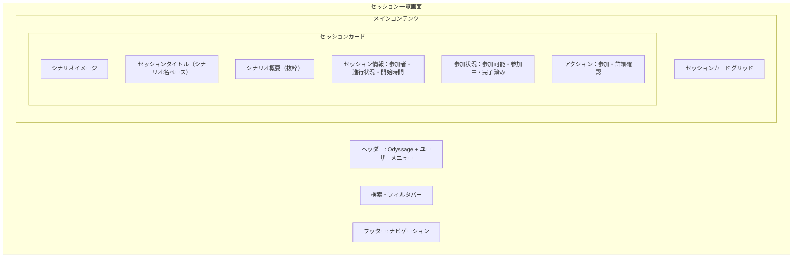
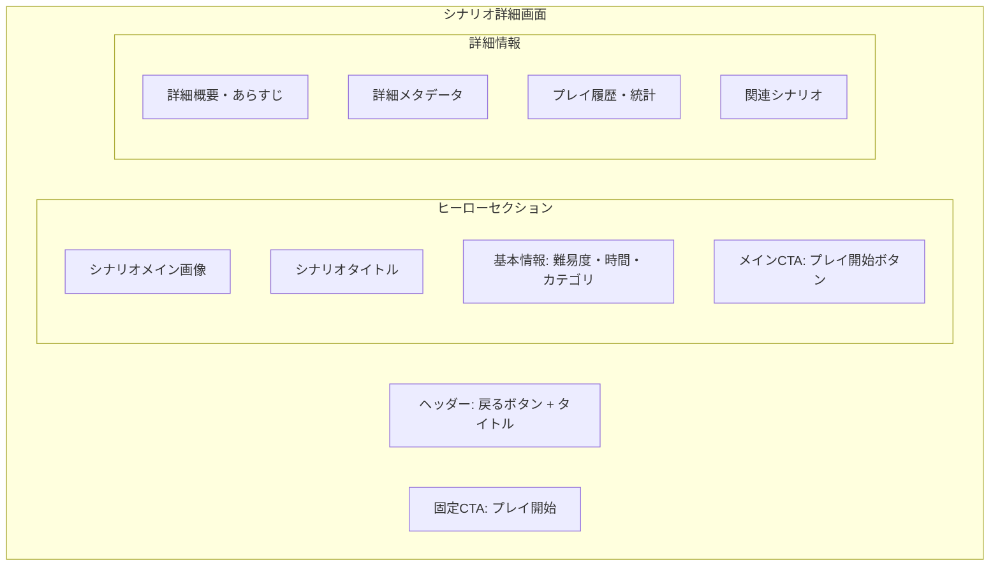
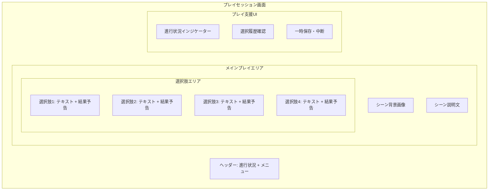
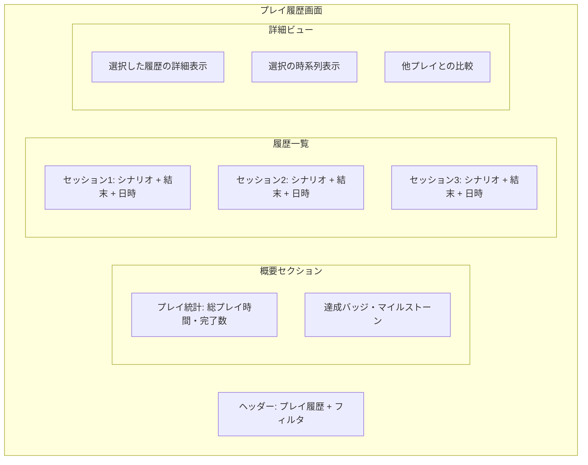
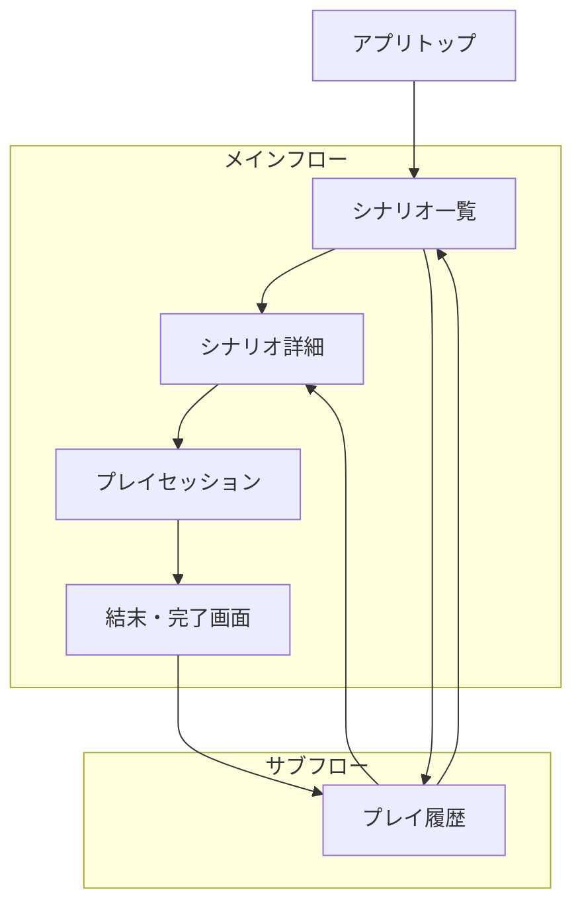

# Player文脈UI/UX設計書

## 📅 設計概要

**作成日**: 2025-08-16  
**対象範囲**: Player文脈MVP UI/UX設計  
**デザインシステム**: Tailwind CSS + @odyssage/ui  
**レスポンシブ対応**: モバイルファースト + デスクトップ最適化

## 🎯 UI/UX設計理念

### Player体験中心の設計原則

```markdown
## デザイン原則
1. **没入感の重視**: TRPGの物語世界への没入を妨げない
2. **選択の明確化**: 重要な決断を直感的に理解できる
3. **進行の可視化**: プレイ状況・進行度を常に把握可能
4. **記録の価値化**: プレイ履歴を魅力的に表示・振り返り可能

## 体験設計の核心
- **発見の楽しさ**: シナリオ選択が楽しい体験
- **没入のスムーズさ**: プレイ開始から物語への自然な入り込み
- **選択の重み**: 決断の重要性を感じられるUI
- **達成の満足感**: 完了時の達成感・振り返りの価値
```

### レスポンシブ設計戦略

```typescript
interface ResponsiveStrategy {
  mobile_first: {
    primary_use_case: "移動中・隙間時間でのプレイ";
    key_features: ["片手操作", "読みやすいテキスト", "明確なタッチターゲット"];
    constraints: ["画面サイズ制約", "通信環境考慮", "バッテリー消費"];
  };
  
  desktop_enhancement: {
    enhanced_features: ["より詳細な情報表示", "複数情報の同時表示", "キーボードショートカット"];
    layout_optimization: ["サイドバー活用", "複数カラム表示", "ホバー状態の活用"];
  };
  
  responsive_breakpoints: {
    mobile: "< 768px";
    tablet: "768px - 1024px";
    desktop: "> 1024px";
  };
}
```

## 📱 3つの主要画面設計（承認済み概要設計準拠）

### 1. セッション一覧画面（Session List）

#### 画面構成・レイアウト



#### 詳細仕様

```typescript
interface ScenarioListUISpec {
  layout: {
    mobile: "1カラム、カードリスト形式";
    tablet: "2カラムグリッド";
    desktop: "3-4カラムグリッド + サイドバーフィルタ";
  };
  
  scenario_card: {
    size: "mobile: 全幅、desktop: 320px固定幅";
    content: [
      "サムネイル画像（16:9）",
      "タイトル（最大2行）",
      "概要（最大3行、省略対応）",
      "メタ情報バッジ（難易度・時間・カテゴリ）",
      "アクションボタン（詳細・プレイ開始）"
    ];
    states: ["default", "hover", "loading", "unavailable"];
  };
  
  filtering_system: {
    mobile: "展開式フィルタパネル";
    desktop: "サイドバー固定フィルタ";
    filters: ["カテゴリ", "難易度", "プレイ時間", "タグ"];
    search: "タイトル・概要のテキスト検索";
  };
  
  performance: {
    virtual_scrolling: "大量シナリオでの仮想化対応";
    lazy_loading: "画像遅延読み込み";
    skeleton_loading: "読み込み中のスケルトン表示";
  };
}
```

#### ユーザーフロー

```markdown
## シナリオ発見フロー
1. **画面アクセス**
   - 利用可能シナリオの一覧表示（カード形式）
   - ローディング状態 → スケルトン → 実際のコンテンツ
   
2. **閲覧・絞り込み**
   - スクロールによる一覧閲覧
   - フィルタ・検索による絞り込み
   - カテゴリバッジクリックでの関連シナリオ表示
   
3. **シナリオ選択**
   - 「詳細」ボタン → シナリオ詳細画面
   - 「プレイ開始」ボタン → 直接プレイ開始
   - カードクリック → 詳細画面（モバイル）
```

### 2. シナリオ詳細画面（Scenario Detail）

#### 画面構成・レイアウト



#### 詳細仕様

```typescript
interface ScenarioDetailUISpec {
  hero_section: {
    mobile: "縦型レイアウト、画像上にテキストオーバーレイ";
    desktop: "横型レイアウト、左画像・右情報";
    cta_prominence: "高コントラスト、大きなボタン";
    breadcrumb: "一覧へ戻る、ナビゲーション表示";
  };
  
  content_sections: {
    overview: {
      format: "マークダウン形式対応";
      length: "モバイル: 初期折りたたみ、展開可能";
      typography: "読みやすいタイポグラフィ";
    };
    metadata: {
      play_time: "推定プレイ時間の表示";
      difficulty: "難易度の詳細説明";
      ending_count: "到達可能結末数の表示";
      tags: "関連タグ・キーワード";
    };
    play_statistics: {
      personal_history: "自分のプレイ履歴表示";
      completion_paths: "到達した結末の表示";
      replay_suggestions: "未到達ルートの示唆";
    };
  };
  
  cta_strategy: {
    primary_cta: "プレイ開始（新規セッション）";
    secondary_cta: "続きから再開（既存セッション）";
    floating_cta: "スクロール時の固定ボタン";
  };
}
```

### 3. プレイセッション画面（Play Session）

#### 画面構成・レイアウト



#### 詳細仕様

```typescript
interface PlaySessionUISpec {
  immersive_design: {
    full_screen: "没入感のためのフルスクリーン表示";
    minimal_chrome: "UIクロームの最小化";
    story_focus: "物語コンテンツを中心とした配置";
  };
  
  scene_presentation: {
    background_image: "シーンに応じた背景画像";
    text_overlay: "読みやすいテキスト表示";
    animation: "シーン遷移の滑らかなアニメーション";
    typography: "物語に適したフォント・サイズ";
  };
  
  choice_interface: {
    layout: "縦積み、十分なタッチターゲット";
    visual_hierarchy: "選択肢の重要度・危険度の視覚化";
    feedback: "選択時の即座のフィードバック";
    confirmation: "重要な選択での確認ダイアログ";
  };
  
  progress_tracking: {
    save_states: "自動保存・手動保存の状態表示";
    // MVP範囲外: 没入感重視のため以下は除外
    // scene_counter: "現在シーン / 総シーン数";
    // chapter_progress: "チャプター進行度"; 
    // time_tracking: "プレイ時間の表示";
  };
  
  accessibility: {
    text_scaling: "テキストサイズの調整機能";
    high_contrast: "高コントラストモード";
    keyboard_navigation: "キーボード操作対応";
    screen_reader: "スクリーンリーダー対応";
  };
}
```

#### ユーザーインタラクション設計

```markdown
## プレイフロー設計
1. **シーン表示**
   - 背景画像のロード・表示
   - シーン説明の段階的表示（タイプライター効果）
   - 選択肢の表示（アニメーション付き）
   
2. **選択インタラクション**
   - 選択肢のホバー・タップフィードバック
   - 選択確認（重要な場面）
   - 選択結果の即座表示
   
3. **シーン遷移**
   - 選択後の即座の次シーン遷移（中間メッセージなし）
   - 次シーンへの滑らかな遷移
   - ローディング状態の最小化
   
4. **プレイ支援機能**
   - 一時停止・保存機能
   - 設定・オプションへのアクセス
   // MVP範囲外: 選択履歴の明示的確認（内部保持のみ）
```

### 4. プレイ履歴画面（Play History）

#### 画面構成・レイアウト



#### 詳細仕様

```typescript
interface PlayHistoryUISpec {
  overview_section: {
    statistics: {
      total_play_time: "累計プレイ時間";
      completed_scenarios: "完了シナリオ数";
      unique_endings: "到達した結末数";
      favorite_genres: "よくプレイするジャンル";
    };
    achievements: {
      completion_badges: "完了達成バッジ";
      exploration_badges: "探索系バッジ";
      time_based_badges: "継続プレイバッジ";
    };
  };
  
  session_list: {
    card_design: {
      scenario_thumbnail: "シナリオサムネイル";
      basic_info: "シナリオタイトル・完了日時";
      outcome_summary: "到達結末・主要選択";
      // MVP範囲外: 再プレイ機能（セッション完了後は再プレイ不可）
      // replay_cta: "再プレイ・続きから";
    };
    filtering: {
      by_scenario: "シナリオ別";
      by_completion: "完了状態別";
      by_date: "日付別";
      by_outcome: "結末別";
    };
    sorting: {
      chronological: "時系列順";
      scenario_name: "シナリオ名順";
      play_time: "プレイ時間順";
    };
  };
  
  detailed_view: {
    choice_timeline: {
      visual_representation: "選択の時系列グラフィカル表示";
      critical_decisions: "重要な選択ポイントのハイライト";
      alternative_paths: "他の選択肢の示唆";
    };
    comparison_features: {
      multiple_playthroughs: "同シナリオ複数プレイの比較";
      decision_analysis: "選択傾向の分析";
      completion_rate: "ルート別完了率表示";
    };
  };
}
```

## 🎨 デザインシステム・UI組み換え

### カラーパレット（Player文脈）

```typescript
interface PlayerColorPalette {
  primary: {
    main: "#2563eb"; // Blue-600 - 信頼感・安定感
    light: "#3b82f6"; // Blue-500
    dark: "#1d4ed8"; // Blue-700
    contrast: "#ffffff";
  };
  
  secondary: {
    main: "#7c3aed"; // Violet-600 - 冒険・神秘
    light: "#8b5cf6"; // Violet-500
    dark: "#5b21b6"; // Violet-700
    contrast: "#ffffff";
  };
  
  accent: {
    success: "#059669"; // Green-600 - 完了・成功
    warning: "#d97706"; // Amber-600 - 注意・重要
    danger: "#dc2626"; // Red-600 - 危険・失敗
    info: "#0284c7"; // Sky-600 - 情報・ヒント
  };
  
  neutral: {
    background: "#f8fafc"; // Slate-50
    surface: "#ffffff";
    border: "#e2e8f0"; // Slate-200
    text_primary: "#0f172a"; // Slate-900
    text_secondary: "#475569"; // Slate-600
    text_disabled: "#94a3b8"; // Slate-400
  };
  
  story_atmosphere: {
    fantasy: "#6366f1"; // Indigo-500
    scifi: "#06b6d4"; // Cyan-500
    horror: "#ef4444"; // Red-500
    mystery: "#8b5cf6"; // Violet-500
    adventure: "#f59e0b"; // Amber-500
  };
}
```

### タイポグラフィ階層

```typescript
interface PlayerTypographyScale {
  display: {
    size: "clamp(2rem, 5vw, 3rem)";
    weight: "800";
    line_height: "1.1";
    use_case: "シナリオタイトル・メインヘッダー";
  };
  
  heading_1: {
    size: "clamp(1.5rem, 3vw, 2rem)";
    weight: "700";
    line_height: "1.2";
    use_case: "ページタイトル・セクションヘッダー";
  };
  
  heading_2: {
    size: "clamp(1.25rem, 2.5vw, 1.5rem)";
    weight: "600";
    line_height: "1.3";
    use_case: "サブセクション・カードタイトル";
  };
  
  body_large: {
    size: "clamp(1rem, 2vw, 1.125rem)";
    weight: "400";
    line_height: "1.6";
    use_case: "シーン説明・重要な本文";
  };
  
  body: {
    size: "clamp(0.875rem, 1.5vw, 1rem)";
    weight: "400";
    line_height: "1.5";
    use_case: "一般的な本文・説明文";
  };
  
  caption: {
    size: "clamp(0.75rem, 1.25vw, 0.875rem)";
    weight: "500";
    line_height: "1.4";
    use_case: "メタ情報・補足情報";
  };
  
  story_text: {
    font_family: "Georgia, serif"; // 物語テキスト専用
    size: "clamp(1rem, 2vw, 1.125rem)";
    weight: "400";
    line_height: "1.7"; // 読みやすさ重視
    use_case: "シーン描写・物語本文";
  };
}
```

### コンポーネント設計パターン

```typescript
// 共通Buttonコンポーネントの拡張
interface PlayerButtonVariants {
  primary: "メインアクション（プレイ開始等）";
  secondary: "サブアクション（詳細確認等）";
  choice: "選択肢ボタン（特別スタイル）";
  danger: "危険な選択・削除操作";
  ghost: "ミニマルアクション";
}

// Player専用カードコンポーネント
interface ScenarioCardProps {
  scenario: Scenario;
  variant: 'list' | 'grid' | 'featured';
  showPlayHistory?: boolean;
  onSelect: (scenario: Scenario) => void;
  onPlayStart: (scenario: Scenario) => void;
}

// プレイ専用選択肢コンポーネント
interface ChoiceButtonProps {
  choice: Choice;
  isSelected?: boolean;
  isDisabled?: boolean;
  dangerLevel?: 'safe' | 'risky' | 'dangerous';
  onSelect: (choice: Choice) => void;
}
```

## 📱 画面遷移・ナビゲーション設計

### ナビゲーション階層



### ナビゲーションUI設計

```typescript
interface NavigationUISpec {
  primary_navigation: {
    mobile: "タブバー（下部固定）";
    desktop: "ヘッダーナビゲーション";
    items: [
      {
        label: "シナリオ";
        icon: "BookOpen";
        route: "/player/scenarios";
      },
      {
        label: "履歴";
        icon: "History";
        route: "/player/history";
      },
      {
        label: "設定";
        icon: "Settings";
        route: "/player/settings";
      }
    ];
  };
  
  contextual_navigation: {
    breadcrumb: "階層の深い画面でのパンくずリスト";
    back_button: "前画面への戻る機能";
    close_button: "モーダル・オーバーレイの閉じる機能";
  };
  
  play_session_navigation: {
    minimal_chrome: "プレイ中はナビゲーション最小化";
    escape_hatch: "プレイ中断・設定へのアクセス";
    progress_indicator: "現在位置・進行状況の表示";
  };
}
```

### 画面遷移パターン

```markdown
## 主要遷移パターン

### 1. 発見→プレイフロー
シナリオ一覧 → 詳細画面 → プレイ開始 → プレイ画面 → 完了画面 → 履歴

### 2. 継続プレイフロー  
履歴画面 → セッション詳細 → プレイ再開 → プレイ画面

### 3. 探索フロー
シナリオ一覧 → フィルタリング → 詳細確認 → 他シナリオ探索

### 4. 振り返りフロー
履歴画面 → セッション詳細 → 選択比較 → 再プレイ検討

## 遷移アニメーション
- **スライド遷移**: 階層の深い移動（一覧→詳細）
- **フェード遷移**: モーダル表示・オーバーレイ
- **ズーム遷移**: 重要なアクション（プレイ開始）
- **なし**: プレイ中のシーン遷移（没入感優先）
```

## 🎮 インタラクション設計詳細

### マイクロインタラクション

```typescript
interface PlayerMicroInteractions {
  scenario_card_hover: {
    transform: "scale(1.02)";
    shadow: "elevation増加";
    duration: "200ms";
    easing: "ease-out";
  };
  
  choice_selection: {
    feedback: "即座のハイライト変化";
    confirmation: "重要選択時の確認アニメーション";
    processing: "選択処理中のローディング状態";
    result: "選択結果の段階的表示";
  };
  
  scene_transition: {
    fade_out: "現在シーンのフェードアウト";
    loading: "次シーン読み込み表示";
    fade_in: "新シーンのフェードイン";
    text_reveal: "テキストの段階的表示";
  };
  
  progress_updates: {
    step_completion: "進行ステップ完了のアニメーション";
    milestone_achievement: "マイルストーン到達の演出";
    completion_celebration: "シナリオ完了時の祝福演出";
  };
}
```

### フィードバック・状態表示

```markdown
## 状態表示パターン

### ローディング状態
- **シナリオ読み込み**: スケルトンカード表示
- **シーン遷移**: プログレスバー + ローディングテキスト
- **選択処理**: ボタン内スピナー + テキスト変更

### エラー状態
- **ネットワークエラー**: 再試行ボタン付きメッセージ
- **データ破損**: 復旧オプション提示
- **セッション喪失**: セーフモード移行

### 成功状態
- **セッション保存**: 一時的な成功メッセージ
- **マイルストーン到達**: バッジ表示 + アニメーション
- **シナリオ完了**: 祝福メッセージ + 統計表示

### 空状態
- **履歴なし**: プレイ促進メッセージ + CTA
- **検索結果なし**: 検索条件リセット + おすすめ表示
- **進行中セッションなし**: 新規プレイ促進
```

## 🔧 実装優先度・段階設計

### Phase 1: MVP実装（必須）

```markdown
## 最優先実装画面
✅ シナリオ一覧画面（基本機能）
✅ シナリオ詳細画面（基本情報）
✅ プレイセッション画面（コア体験）
✅ 基本的なナビゲーション

## MVP必須機能
- シナリオの閲覧・選択
- 基本的なプレイフロー
- 選択肢の表示・選択
- 簡単なプレイ記録保存
```

### Phase 2: 体験向上（推奨）

```markdown
## 体験向上機能
✅ プレイ履歴画面（詳細版）
✅ 高度なフィルタリング
✅ アニメーション・マイクロインタラクション
✅ レスポンシブ最適化

## 追加UI要素
- 進行状況の詳細表示
- 達成システム・バッジ
- 比較機能・統計表示
- 設定・カスタマイズ機能
```

### Phase 3: 洗練・最適化（理想）

```markdown
## 洗練機能
✅ 高度なアニメーション・演出
✅ アクセシビリティ完全対応
✅ パフォーマンス最適化
✅ A/Bテスト機能

## 上級UI要素
- カスタムテーマ・デザイン
- 高度な検索・発見機能
- ソーシャル要素のUI
- 分析・insights表示
```

## 📊 ユーザビリティ検証計画

### 検証項目・指標

```markdown
## 主要ユーザビリティ指標

### 発見性（Discoverability）
- シナリオ発見までの時間: 目標30秒以内
- 興味のあるシナリオ特定: 目標1分以内
- フィルタ機能の理解・活用率: 目標60%以上

### 没入感（Immersion）
- プレイ開始から物語への没入時間: 目標15秒以内
- UI要素によるプレイ中断: 目標最小化
- 物語理解度: 主観評価で高評価

### 操作性（Usability）
- 選択肢選択の直感性: エラー率5%以下
- ナビゲーションの理解度: 迷子率10%以下
- レスポンシブ対応満足度: 各デバイスで高評価

### 継続性（Retention）
- セッション完了率: 目標80%以上
- 再プレイ意向: 目標70%以上
- 他シナリオ探索率: 目標50%以上
```

### テスト手法

```markdown
## 段階的ユーザビリティテスト

### 1. 自己検証（Week 1）
- 設計者自身による操作テスト
- 基本的なユーザーフローの確認
- 明らかなUI問題の特定・修正

### 2. 内部検証（Week 2）
- 開発チーム内でのテスト
- 技術的観点からの使いやすさ評価
- パフォーマンス・レスポンシブ確認

### 3. 外部検証（Week 3以降）
- 知人・友人による実際のプレイテスト
- 観察・インタビューによる課題特定
- 改善提案の収集・優先度付け
```

## 🎯 成功指標・品質基準

### UI/UX成功指標

```markdown
## プライマリ指標（必須達成）
✅ **直感性**: 初回利用時に説明なしで基本操作可能
✅ **没入感**: プレイ中にUIが物語体験を阻害しない
✅ **満足感**: プレイ完了時に達成感・満足感を得られる

## セカンダリ指標（推奨達成）
✅ **発見性**: 新しいシナリオを見つけるのが楽しい
✅ **継続性**: 複数回利用したくなる魅力
✅ **推奨性**: 他者にも試してもらいたい品質
```

### 技術品質基準

```markdown
## パフォーマンス基準
- 初回ページロード: 2秒以内（3G環境）
- 画面遷移: 300ms以内
- インタラクション応答: 100ms以内

## アクセシビリティ基準（MVP範囲外）
- MVP: 基本的なマウス・タッチ操作のみ対応
- 将来拡張: WCAG 2.1 AA準拠・キーボード操作・スクリーンリーダー対応

## レスポンシブ基準
- Mobile（320px-768px）: 完全対応
- Tablet（768px-1024px）: 最適化済み
- Desktop（1024px+）: 機能拡張版
```

---

## 📝 メタデータ

**作成者**: 設計担当Claude Code  
**承認者**: リーダー（承認待ち）  
**関連文書**: 
- [player-context-requirements.md](player-context-requirements.md)
- [player-context-architecture.md](player-context-architecture.md)
- [PROJECT_VISION.md](../../PROJECT_VISION.md)

**更新履歴**:
- 2025-08-16: 初版作成（設計担当）
- 2025-08-16: play-experience.feature BDDレビューフィードバック反映
  - 進行状況インジケーター・プレイ時間表示をMVP範囲外に変更（没入感重視）
  - 選択後の中間メッセージ除去（即座の次シーン遷移）
  - 再プレイ機能をMVP範囲外に変更（セッション完了後は再プレイ不可）
  - 選択履歴の明示的確認をMVP範囲外に変更（内部保持のみ）

#player-context #ui-ux-design #responsive-design #user-experience #mvp-design #trpg-interface