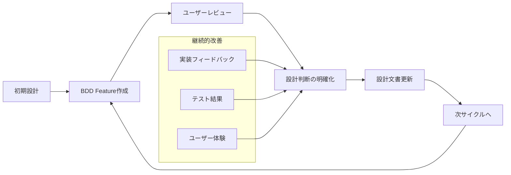

# 進化的設計アプローチ・指針書

## 📅 基本情報

**作成日**: 2025-08-16  
**対象**: 設計担当・テスト担当・実装担当  
**適用範囲**: Odyssage プロジェクト全体

## 🎯 進化的設計の基本理念

### 設計は生きている
**設計は一度作って終わりではなく、継続的に進化させるもの**

```markdown
## 従来の設計アプローチ vs 進化的設計アプローチ

### 従来の設計（ウォーターフォール型）
1. 要件定義 → 設計完成 → 実装 → テスト
2. 設計変更は「失敗」として扱われる
3. 文書は「完成」後は固定される

### 進化的設計（アジャイル型）
1. 要件定義 → 設計 → 実装 → テスト → **設計改善**
2. 設計変更は「学習」として歓迎される
3. 文書は「生きたドキュメント」として継続更新
```

### Sprint 4での実践例

#### BDD Feature作成で得られた学習
**ユーザーレビューから得られた重要な設計判断**:

1. **没入感重視の学習**: 進行状況・時間表示は没入感を阻害する
2. **シンプル性の価値**: 中間メッセージより直接遷移が良い
3. **セッション完了の意味**: 再プレイではなく記録として保存

**これらの学習を設計文書に即座に反映** → 進化的設計の実践

## 🔄 進化的設計のプロセス

### 1. 設計 → 検証 → 学習 → 改善サイクル



### 2. フィードバックループの種類

#### 即座のフィードバック（当日〜数日）
- **BDDレビュー**: ユーザー価値観・優先度の確認
- **設計レビュー**: 技術的整合性・実装可能性の確認
- **プロトタイプ**: 早期のUI/UX検証

#### 短期フィードバック（1-2週間）
- **実装開始**: 設計の実装可能性・技術的課題の発見
- **単体テスト**: 設計の詳細部分の検証
- **統合テスト**: コンポーネント間連携の確認

#### 中期フィードバック（1-2ヶ月）
- **E2Eテスト**: 全体フローの検証
- **ユーザビリティテスト**: 実際の使用感の確認
- **パフォーマンステスト**: 非機能要件の検証

## 📋 進化的設計の実践ガイド

### 設計担当の心構え

#### ✅ 推奨する態度
1. **学習への開放性**: 設計変更を歓迎する
2. **ユーザー中心**: 技術的完璧性よりユーザー価値を優先
3. **継続的更新**: 設計文書を生きたドキュメントとして扱う
4. **透明性**: 設計判断の理由と経緯を明確に記録

#### ❌ 避けるべき態度
1. **設計固執**: 初期設計への過度な執着
2. **完璧主義**: 最初から完璧な設計を目指す
3. **文書化怠慢**: 変更を文書に反映しない
4. **独断専行**: フィードバックを軽視する

### テスト担当の心構え

#### ✅ 推奨する態度
1. **質問力**: 設計の曖昧さを積極的に質問する
2. **ユーザー代弁**: エンドユーザーの立場で設計を評価
3. **現実性**: 理想と現実のギャップを指摘する
4. **改善提案**: 問題指摘だけでなく代案を提示

#### ❌ 避けるべき態度
1. **設計丸呑み**: 設計に対する無批判な受容
2. **完璧要求**: MVP範囲を超えた過度な品質要求
3. **変更拒否**: 設計変更への過度な抵抗
4. **責任転嫁**: 問題を他者の責任にする

## 🛠️ 具体的な実践手法

### 1. BDD Driven Design（BDD駆動設計）

```markdown
## BDD駆動設計のフロー
1. **設計仮説**: 初期設計を仮説として作成
2. **BDD Feature**: 設計をBDDで具体化
3. **ユーザーレビュー**: 実際のユーザー視点で検証
4. **設計修正**: レビューフィードバックを設計に反映
5. **文書更新**: 学習内容を設計文書に記録
```

**Sprint 4での成功例**:
- scenario-discovery.feature → 参加者数・フィルタ機能のMVP適合性確認
- session-joining.feature → キーボード操作のMVP範囲外判定
- play-experience.feature → 没入感重視による進行表示除去

### 2. ドキュメント進化管理

#### 更新履歴の記録例
```markdown
**更新履歴**:
- 2025-08-16: 初版作成（設計担当）
- 2025-08-16: play-experience.feature BDDレビューフィードバック反映
  - 進行状況インジケーター・プレイ時間表示をMVP範囲外に変更（没入感重視）
  - 選択後の中間メッセージ除去（即座の次シーン遷移）
  - 再プレイ機能をMVP範囲外に変更（セッション完了後は再プレイ不可）
  - 選択履歴の明示的確認をMVP範囲外に変更（内部保持のみ）
```

#### 設計判断の記録例
```typescript
progress_tracking: {
  save_states: "自動保存・手動保存の状態表示";
  // MVP範囲外: 没入感重視のため以下は除外
  // scene_counter: "現在シーン / 総シーン数";
  // chapter_progress: "チャプター進行度"; 
  // time_tracking: "プレイ時間の表示";
};
```

### 3. チーム間の設計コミュニケーション

#### 設計変更の共有プロセス
1. **変更検討**: 問題発見・改善案検討
2. **チーム議論**: 設計担当・テスト担当・リーダーでの検討
3. **変更実施**: 設計文書・BDDファイルの同期更新
4. **記録保存**: 変更理由・経緯の明確な記録
5. **次フェーズ反映**: 実装担当への変更内容の確実な伝達

#### 効果的なコミュニケーション手法
- **Why重視**: 何を変更したかより、なぜ変更したかを重視
- **具体例提示**: 抽象的な議論より具体的なユーザーシナリオで議論
- **選択肢比較**: 1つの案ではなく複数の選択肢を比較検討
- **影響範囲明確化**: 変更による他部分への影響を明確にする

## 📊 進化的設計の効果測定

### 定量的指標
- **設計変更回数**: 学習活動の活発さの指標
- **フィードバック反映率**: チーム連携の効果性
- **文書更新頻度**: 生きたドキュメントの維持状況
- **実装時の設計変更**: 事前検証の効果性

### 定性的指標
- **チーム満足度**: 設計プロセスへの満足度
- **ユーザー価値**: 最終的なユーザー体験の品質
- **技術品質**: 実装・保守性の向上
- **学習速度**: チーム全体の学習・改善速度

## 🚀 将来への適用拡張

### Phase 2（実装フェーズ）での進化的設計

#### 実装担当オンボーディング時の重要事項
1. **設計は変更される前提**: 実装中の設計変更を歓迎する文化
2. **フィードバック歓迎**: 実装観点からの設計改善提案を推奨
3. **文書同期**: 実装中に発見した問題・改善を設計文書に反映
4. **継続的改善**: MVP完成後も継続的な設計改善を実施

#### 実装フィードバックループの設計
```markdown
## 実装からの設計フィードバック
1. **技術的制約の発見**: 設計の実装困難性・技術的問題
2. **パフォーマンス問題**: 設計の性能面での課題
3. **保守性の観点**: コードの可読性・拡張性の観点
4. **セキュリティ観点**: 設計のセキュリティリスク
```

### Author・GM文脈拡張時の進化的設計

#### Player文脈での学習の活用
- **没入感重視**: Player体験で学習した没入感の価値
- **MVP優先**: 機能過多よりも核心価値への集中
- **ユーザーレビュー**: 人間によるレビューの不可欠性
- **設計文書進化**: 継続的な文書更新の重要性

## 💡 成功要因・重要原則

### 1. 心理的安全性
**設計変更は失敗ではなく学習** - チーム全体での共通認識

### 2. ユーザー中心主義
**技術的美しさよりユーザー価値** - 常にエンドユーザーを意識

### 3. 透明性・記録性
**全ての判断に理由と記録** - 将来の振り返り・改善のために

### 4. 継続性・持続性
**一度きりではなく継続的改善** - 長期的な品質向上のために

---

## 📝 メタデータ

**作成者**: 設計担当・テスト担当（Claude Code）  
**承認者**: リーダー（承認待ち）  
**関連文書**: 
- [collaboration-record.md](./collaboration-record.md)
- [bdd-feature-creation-plan.md](./bdd-feature-creation-plan.md)
- [player-ui-ux-design.md](./design/player-ui-ux-design.md)

**適用対象**:
- Sprint 4 Phase 2（実装フェーズ）
- Sprint 5以降（Author・GM文脈拡張）
- プロジェクト全体（継続的品質改善）

**重要メッセージ**:
> 設計は完成品ではなく、継続的に進化させる生きた指針です。
> チーム全体で学習し、改善し続けることで、本当にユーザーに価値を提供できる製品を作り上げていきましょう。

#evolutionary-design #continuous-improvement #team-collaboration #user-centered-design #mvp-approach