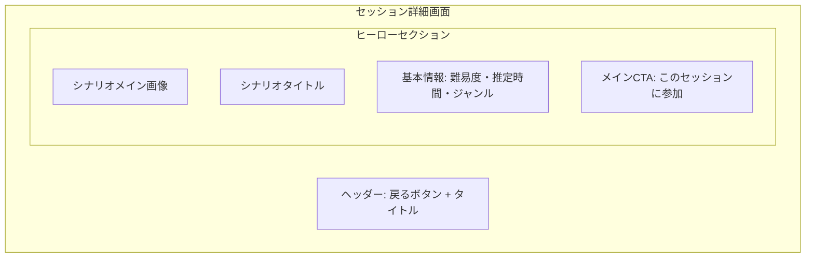

docs\02-architecture\player-context\screens\session-detail.md

### 全体構造



docs\02-architecture\player-context\data-design.md からジャンルの情報や難易度の情報は削ったはずです。 MVPのやらないことが反映されていません。反映してください。

### ヒーローセクション

```typescript
interface HeroSectionSpec {
  image_display: {
    aspect_ratio: '16:9（デスクトップ）、4:3（モバイル）';
    fallback: 'シナリオジャンルに応じたデフォルト画像';
    loading: 'プログレッシブ画像読み込み';
  };
}
```

ここも、ジャンルはMVPから削っています

### セッション状態表示

```typescript
interface SessionStatusDisplay {
  additional_info: {
    estimated_time: '推定プレイ時間の表示';
    scenario_genre: 'シナリオジャンル・カテゴリ';
    difficulty_level: '難易度レベル表示';
    // MVP範囲外: participant_count: "参加者数情報";
  };
}
```

難易度やジャンルもMVP範囲外です

### 確認ダイアログ仕様

```typescript
interface ParticipationConfirmationSpec {
  dialog_content: {
    commitment_info: "推定プレイ時間・参加への責任";
  };
```

推定プレイ時間もMVPから削っています。

### 読み込み最適化

下記はMVPではやらないことにしてください

```typescript
interface PerformanceOptimization {
  image_loading: {
    hero_image: 'プライオリティ読み込み';
    progressive: 'プログレッシブJPEG対応';
    webp_support: 'WebP形式での配信';
  };
}
```
