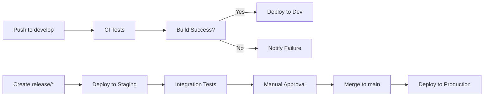

# デプロイメント・運用

Odyssage の環境構築・デプロイ・インフラ運用に関するガイド

## 📋 概要

本ディレクトリは、Odyssage の開発環境構築から本番運用まで、インフラ・デプロイメント関連の包括的な情報を提供します。

### 運用哲学
1. **Infrastructure as Code**: 設定の再現性・バージョン管理
2. **自動化優先**: 手動作業の最小化・ヒューマンエラー防止
3. **監視・可観測性**: 問題の早期発見・根本原因分析
4. **セキュリティファースト**: 多層防御・最小権限原則

## 🚀 環境構成

### 環境分離戦略
```
本番環境 (Production)
    ↑ 自動デプロイ
ステージング環境 (Staging) 
    ↑ 自動デプロイ
開発環境 (Development)
    ↑ 手動デプロイ/ローカル
ローカル環境 (Local)
```

### インフラ概要
- **Cloudflare**: CDN・DNS・Pages（フロントエンド）・Workers（バックエンド）
- **Firebase**: Authentication・Cloud Functions
- **マネージドDB**: Neon PostgreSQL・Neo4j Aura
- **監視**: Cloudflare Analytics・Firebase Console

## 📚 主要ドキュメント

### [[local-environment]] - ローカル開発環境
開発者の機械での完全な開発環境構築手順

#### カバー内容
- **Docker環境**: PostgreSQL・Neo4j・Firebase Emulator
- **依存関係**: Node.js・Bun・VS Code設定
- **環境変数**: .env設定・秘密情報管理
- **動作確認**: 各サービスの起動・接続テスト

### [[production]] - 本番環境運用
本番環境のデプロイ・運用・監視・トラブルシューティング

#### カバー内容
- **CI/CD**: GitHub Actions・自動デプロイパイプライン  
- **環境設定**: Cloudflare・Firebase・DB設定
- **監視**: メトリクス・ログ・アラート設定
- **運用手順**: デプロイ・ロールバック・メンテナンス

## 🏗️ インフラ構成詳細

### Cloudflare Pages (フロントエンド)
```yaml
Production:
  Domain: odyssage.com
  Source: main branch
  Build: "bun run build"
  
Staging:  
  Domain: staging.odyssage.com
  Source: release/* branches
  Build: "bun run build"
```

### Cloudflare Workers (バックエンド)
```yaml
API Endpoints:
  - /api/auth/*      # Firebase認証連携
  - /api/scenarios/* # シナリオ管理
  - /api/scenes/*    # シーン管理  
  - /api/graph-*     # GraphDB操作

Environment Variables:
  - DATABASE_URL     # PostgreSQL接続
  - NEO4J_URI       # Neo4j接続
  - FIREBASE_CONFIG # Firebase設定
```

### データベース構成
```yaml
PostgreSQL (Neon):
  Purpose: 構造化データ・ACID特性重要
  Tables: users, sessions, scenarios_meta
  
Neo4j (Aura):  
  Purpose: グラフ構造・関係性探索
  Nodes: Scenario, Scene, Character, Choice
  Relationships: CONTAINS, LEADS_TO, INVOLVES
```

## 🔄 デプロイフロー

### 自動デプロイパイプライン


### デプロイ手順
1. **開発**: `develop` ブランチへのpush → 開発環境デプロイ
2. **ステージング**: `release/X.X.X` 作成 → ステージング環境デプロイ
3. **本番**: `main` へのマージ → 本番環境デプロイ + タグ付け

### ロールバック戦略
- **即座ロールバック**: Cloudflare Pagesでの前バージョン復元
- **データベース**: マイグレーション逆適用・バックアップ復元
- **監視**: デプロイ後メトリクス監視・自動アラート

## 🛠️ 開発環境構築

### クイック セットアップ
```bash
# リポジトリクローン
git clone https://github.com/hibohiboo/odyssage.git
cd odyssage

# 依存関係インストール  
bun install

# ローカル環境起動（Docker必要）
bun run local:all
```

### 詳細な環境構築
詳細手順は [[local-environment]] を参照

### よくある問題
- **Docker起動失敗**: WSL2・Hyper-V設定確認
- **ポート衝突**: 3000, 8787, 5432, 7687ポート確認
- **環境変数**: .env.local 設定・Firebase設定確認

## 🔍 監視・可観測性

### メトリクス監視
```yaml
Cloudflare Analytics:
  - Request Count / Response Time
  - Error Rate / Status Code Distribution
  - Geographic Distribution
  
Database Monitoring:
  - Connection Pool Usage
  - Query Execution Time  
  - Slow Query Detection

Application Metrics:
  - User Registration / Authentication
  - API Endpoint Usage
  - Feature Adoption
```

### ログ管理
- **Cloudflare Logs**: リクエストログ・エラーログ
- **Application Logs**: 構造化JSON・レベル分け
- **Database Logs**: スロークエリ・デッドロック検出

### アラート設定
- **High Error Rate**: 5%超過時アラート  
- **Response Time**: 2秒超過時アラート
- **Database**: 接続失敗・容量80%超過

## 🔐 セキュリティ

### アクセス制御
- **Cloudflare**: WAF・DDoS Protection・Bot Management
- **Firebase**: Identity管理・JWT検証
- **Database**: VPC・IP制限・SSL/TLS必須

### 秘密情報管理
- **環境変数**: Cloudflare Pages Environment Variables
- **API Keys**: Firebase Project Settings
- **Database**: Connection String・証明書管理

### セキュリティ監視
- **不正アクセス**: 異常なリクエストパターン検出
- **認証異常**: 大量ログイン失敗・アカウント列挙攻撃
- **データ保護**: PII暗号化・GDPR準拠

## 📊 パフォーマンス最適化

### CDN最適化
- **キャッシュ戦略**: 静的アセット・API レスポンス
- **圧縮**: Gzip・Brotli・画像最適化  
- **HTTP/3**: 最新プロトコル対応

### データベース最適化
- **インデックス**: クエリパフォーマンス向上
- **接続プール**: コネクション効率化
- **読み取りレプリカ**: 参照処理の負荷分散

### API最適化
- **レスポンス最適化**: 必要データのみ返却
- **バッチ処理**: 複数操作の一括実行
- **キャッシュ**: Redis・メモリキャッシュ活用

## 🔄 バックアップ・災害復旧

### データバックアップ
- **PostgreSQL**: 日次自動バックアップ・Point-in-Time Recovery
- **Neo4j**: 週次フルバックアップ・増分バックアップ
- **設定**: Infrastructure as Code・Git管理

### 災害復旧計画
- **RTO**: 4時間以内（Recovery Time Objective）
- **RPO**: 1時間以内（Recovery Point Objective）
- **手順**: 自動化スクリプト・運用手順書

---

## 📖 関連リソース

### 環境構築
- [[local-environment]] - ローカル開発環境詳細
- [[../01-getting-started/setup]] - 基本セットアップ
- `infra/local/` - Docker・設定ファイル

### 運用・監視
- [[production]] - 本番環境運用手順
- `docs/redocly/` - API仕様書・監視対象
- `docs/dbdoc/` - データベース監視・スキーマ

### 開発プロセス連携
- [[../03-development/process]] - 開発フロー・品質保証
- [[../03-development/sprints/README]] - リリース・デプロイ頻度

#deployment #infrastructure #operations #devops