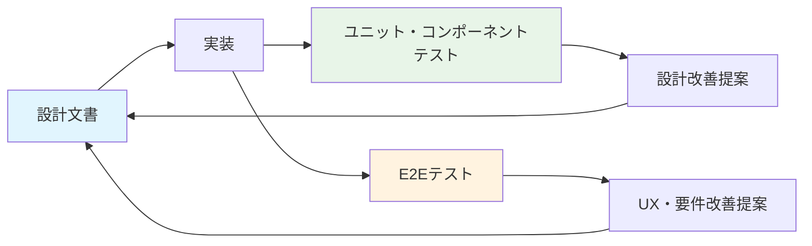

# テスト責任境界・進化的設計連携プロセス

## 📋 文書概要

**作成日**: 2025-08-17  
**対象範囲**: Player文脈MVP開発での品質保証体制  
**目的**: テスト分担境界の明確化・進化的設計連携プロセスの確立

## 🎯 テスト責任境界

### ユニットテスト・コンポーネントテスト

**担当**: 実装担当  
**責任範囲**:

#### ユニットテスト
- **エンティティクラス**: ビジネスロジック・ドメインルール検証
- **ユーティリティ関数**: 入出力・境界値・エラーハンドリング
- **Repository層**: データアクセス・永続化ロジック
- **カスタムフック**: React Hook・状態管理ロジック

#### コンポーネントテスト
- **UIコンポーネント**: React Testing Library・レンダリング検証
- **ユーザーインタラクション**: クリック・入力・フォーム操作
- **アクセシビリティ**: ARIA属性・キーボード操作・スクリーンリーダー
- **状態管理統合**: Component-Hook-Store連携

**品質基準**:
- **カバレッジ**: 重要ビジネスロジック90%以上
- **実行速度**: 全ユニットテスト2秒以内
- **独立性**: テスト間の依存関係なし
- **可読性**: テスト目的・期待値の明確化

### E2Eテスト

**担当**: テスト担当  
**責任範囲**:

#### BDDシナリオテスト
- **ユーザージャーニー**: エンドツーエンドの体験フロー
- **受入れ基準**: MVP要件・POレビューフィードバック準拠
- **Feature定義**: Gherkin記法・Given/When/Then構造
- **Step実装**: Playwright + Cucumber自動化

#### **⚠️ 重要: 段階的実行原則（必須遵守）**
```markdown
🚨 絶対禁止事項:
❌ 複数のBDD Featureファイルを同時実行
❌ 複数のテストケースを一度に実行
❌ 「全部まとめて確認」の発想・行動
❌ 時間短縮を狙った一括処理・バッチ実行

✅ 必須実行原則:
✓ 必ず1つのテストのみ実行・結果確認
✓ 成功確認後のみ次のテスト検討・実行
✓ 失敗時は即座停止・個別問題解決
✓ 小さな成功の積み重ね・段階的進行
```

#### 品質保証戦略
- **要件適合性**: MVP制約・BDDレビューフィードバック反映確認
- **ユーザー体験**: 実際のPlayer体験に基づく品質評価
- **統合動作**: 複数機能・画面間の連携確認（段階的実行による）
- **環境確認**: Chrome最新版での動作保証（MVP制約）

**品質基準**:
- **カバレッジ**: MVP必須ユーザーシナリオ100%（段階的達成）
- **実行安定性**: CI/CD環境で95%以上成功率（1つずつ確実な実行による）
- **保守性**: 仕様変更時の修正コスト最小化
- **可読性**: ビジネス関係者理解可能な記述

## 🔄 進化的設計・生きたドキュメント連携

### 実装→設計フィードバックループ

**連携**: 実装担当 ↔ 設計担当

#### フィードバック観点
- **実装困難性**: 設計仕様の実装可能性・技術制約
- **パフォーマンス**: 設計判断によるパフォーマンス影響
- **保守性**: 長期的な保守・拡張への影響
- **技術的負債**: 設計判断による将来リスク

#### 連携プロセス
1. **課題発見**: 実装担当がユニット・コンポーネントテスト実装中に設計課題を発見
2. **問題報告**: `collaboration/implementer_to_designer/` で改善提案・課題報告作成
3. **設計改善**: 設計担当が設計文書更新・改善実施・影響範囲評価
4. **修正通知**: `collaboration/designer_to_implementer/` で修正通知・実装ガイダンス提供
5. **改善確認**: 実装担当が修正内容確認・実装調整・テスト更新

### テスト→設計フィードバックループ

**連携**: テスト担当 ↔ 設計担当

#### フィードバック観点
- **ユーザー体験**: BDDテストで発見されるUX・操作性課題
- **要件適合**: MVP要件・受入れ基準との不整合
- **機能統合**: 複数機能間の連携・整合性課題
- **品質基準**: テスト実行での品質・安定性課題

#### 連携プロセス
1. **体験課題発見**: テスト担当がBDD・E2Eテスト実行中にUX・要件課題を発見
2. **改善提案**: `collaboration/tester_to_designer/` で体験改善提案・要件修正提案作成
3. **要件改善**: 設計担当が要件定義・UX設計更新・改善実施・影響評価
4. **修正通知**: `collaboration/designer_to_tester/` で修正通知・テスト更新依頼提供
5. **テスト更新**: テスト担当が修正内容確認・BDD Feature更新・再テスト実行

## 📊 生きたドキュメント原則

### テスト駆動設計
- **継続的入力**: テスト結果を設計改善の継続的フィードバック源とする
- **早期発見**: 実装前・テスト段階での設計課題の早期発見・修正
- **品質向上**: テスト観点による設計品質・実装品質の継続向上

### フィードバックループ最適化


### ドキュメント同期戦略
- **一貫性維持**: 全設計文書の制約・方針・判断の一貫性確保
- **最新性保証**: テスト結果による設計文書の継続的更新
- **トレーサビリティ**: テスト課題→設計変更→実装影響の追跡可能性

## 🚨 エスカレーション・協議基準

### 実装→設計エスカレーション
以下の場合は即座にリーダー経由でのエスカレーション：
- **重大な実装困難**: 設計仕様の根本的な実装困難
- **パフォーマンス課題**: MVP制約に影響する重大なパフォーマンス問題
- **技術的負債**: 将来拡張への重大な阻害要因
- **工数影響**: 予定工数を大幅に超過する設計変更

### テスト→設計エスカレーション
以下の場合は即座にリーダー経由でのエスカレーション：
- **要件不整合**: MVP要件・POレビューとの重大な不整合
- **体験品質**: Player体験の根本的な問題・価値毀損
- **テスト実現困難**: BDD・E2Eテストの技術的実現困難
- **品質基準未達**: MVP品質基準への重大な影響

## 🔧 協働フレームワーク統合

### ディレクトリ構造活用
```
collaboration/
├── implementer_to_designer/     # 実装→設計フィードバック
│   ├── implementation_issue_YYYYMMDD.md
│   ├── performance_concern_YYYYMMDD.md
│   └── design_improvement_YYYYMMDD.md
├── designer_to_implementer/     # 設計→実装指示・通知
│   ├── design_update_YYYYMMDD.md
│   ├── implementation_guide_YYYYMMDD.md
│   └── constraint_change_YYYYMMDD.md
├── tester_to_designer/          # テスト→設計フィードバック
│   ├── ux_improvement_YYYYMMDD.md
│   ├── requirement_issue_YYYYMMDD.md
│   └── integration_concern_YYYYMMDD.md
└── designer_to_tester/          # 設計→テスト指示・通知
    ├── requirement_update_YYYYMMDD.md
    ├── test_scenario_change_YYYYMMDD.md
    └── acceptance_criteria_YYYYMMDD.md
```

### 品質保証統合プロセス
- **段階的品質**: ユニット→コンポーネント→E2Eの段階的品質確認
- **継続的改善**: 各段階での発見課題の設計改善への反映
- **専門性活用**: 実装・テスト・設計の専門知識の最大化
- **責任明確**: 各段階での責任範囲・エスカレーション基準の明確化

## 📚 関連プロセス・文書

### 協働フレームワーク
- [複数ClaudeCode協働フレームワーク](multi-claude-collaboration-framework.md)
- [生きたドキュメント維持プロセス](../../03-development/sprints/sprint_004/living-document-process.md)

### 役割定義
- [テスト担当専用ガイド](../roles/test-specialist.md)
- [設計担当専用ガイド](../roles/design-specialist.md)

### 品質基準
- [Player文脈MVP要件定義](../../02-architecture/player-context/requirements.md)
- [Player文脈MVPガイドライン](../../02-architecture/player-context/mvp-guidelines.md)

---

**重要原則**: テスト分担境界の明確化により各担当の専門性を最大化し、進化的設計連携により継続的な品質向上を実現する。

**更新履歴**:
- 2025-08-17: 初版作成（テスト責任境界・進化的設計連携プロセス確立）

#test-boundaries #evolutionary-design #living-documents #quality-assurance #collaboration-framework