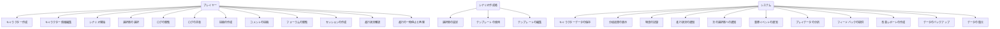

```mermaid
%% オデッサージュ ユースケース図
flowchart TB
    %% アクター定義
    Player("プレイヤー")
    ScenarioCreator("シナリオ作成者")
    System("システム")

    %% コアサブドメインのユースケース
    CreateCharacter["キャラクター作成"]
    EditCharacter["キャラクター情報編集"]
    SaveCharacterData["キャラクターデータの保存"]
    StartScenario["シナリオ開始"]
    SelectChoice["選択肢の選択"]
    ShowResult["分岐結果の表示"]
    RecordStory["物語の記録"]
    ViewLog["ログの閲覧"]
    ShareLog["ログの共有"]

    %% 一般サブドメインのユースケース
    CreatePost["投稿の作成"]
    CommentPost["コメントの投稿"]
    ViewForum["フォーラムの閲覧"]
    CreateSession["セッションの作成"]
    CheckProgress["進行状況確認"]
    PauseResumeSession["進行の一時停止と再開"]
    SetChoices["選択肢の設定"]
    UseTemplate["テンプレートの使用"]
    EditTemplate["テンプレートの編集"]

    %% 補完サブドメインのユースケース
    SendProgressNotification["進行状況の通知"]
    SendNextChoiceNotification["次の選択肢への通知"]
    SendImportantEventNotification["重要イベントの通知"]
    AnalyzeData["プレイデータの分析"]
    ProvideFeedback["フィードバックの提供"]
    CreateReport["改善レポートの作成"]
    BackupData["データのバックアップ"]
    RestoreData["データの復元"]

    %% コアサブドメインの関係
    Player --> CreateCharacter
    Player --> EditCharacter
    System --> SaveCharacterData
    Player --> StartScenario
    Player --> SelectChoice
    System --> ShowResult
    System --> RecordStory
    Player --> ViewLog
    Player --> ShareLog

    %% 一般サブドメインの関係
    Player --> CreatePost
    Player --> CommentPost
    Player --> ViewForum
    Player --> CreateSession
    Player --> CheckProgress
    Player --> PauseResumeSession
    ScenarioCreator --> SetChoices
    ScenarioCreator --> UseTemplate
    ScenarioCreator --> EditTemplate

    %% 補完サブドメインの関係
    System --> SendProgressNotification
    System --> SendNextChoiceNotification
    System --> SendImportantEventNotification
    System --> AnalyzeData
    System --> ProvideFeedback
    System --> CreateReport
    System --> BackupData
    System --> RestoreData
```

