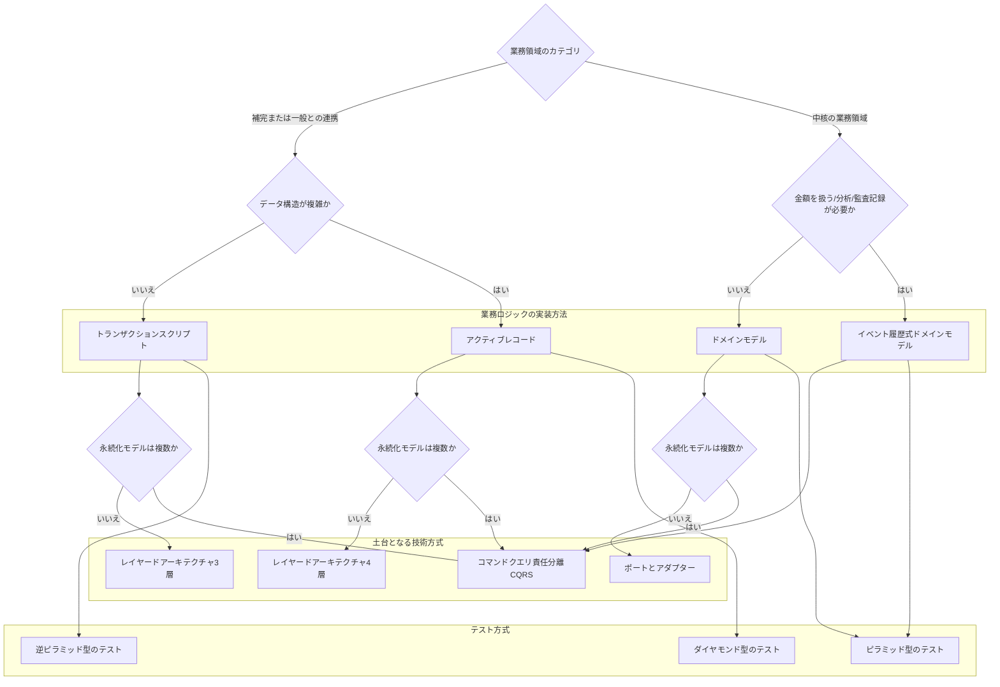

```mermaid
flowchart TB
    id1{業務領域のカテゴリ}-->|補完または一般との連携|idl{データ構造が複雑か}
    id1 -->|中核の業務領域|idr{金額を扱う/分析/監査記録が必要か}
    
    idl-->|いいえ|tran[トランザクションスクリプト]
    idl-->|はい|active[アクティブレコード]
    idr-->|いいえ| domain[ドメインモデル]
    idr-->|はい|eventdomain[イベント履歴式ドメインモデル]
    subgraph logic[業務ロジックの実装方法]
      tran
      active
      domain
      eventdomain
    end
    tran-->trandb{永続化モデルは複数か}
    trandb-->|いいえ|layerd3[レイヤードアーキテクチャ3層]
    active-->activedb{永続化モデルは複数か}
    activedb-->|いいえ|layerd4[レイヤードアーキテクチャ4層]
    domain-->domaindb{永続化モデルは複数か}
    domaindb-->|いいえ|port[ポートとアダプター]

    subgraph base[土台となる技術方式]
      layerd3
      layerd4
      port
      cqrs[コマンドクエリ責任分離 CQRS]
    end
    eventdomain--> cqrs
    trandb---|はい|cqrs
    activedb-->|はい|cqrs
    domaindb-->|はい|cqrs

    subgraph test[テスト方式]
      rpiramid[逆ピラミッド型のテスト]
      piramid[ピラミッド型のテスト]
      diamond[ダイヤモンド型のテスト]
    end
    tran---->rpiramid
    active---->diamond
    domain---->piramid
    eventdomain---->piramid

```